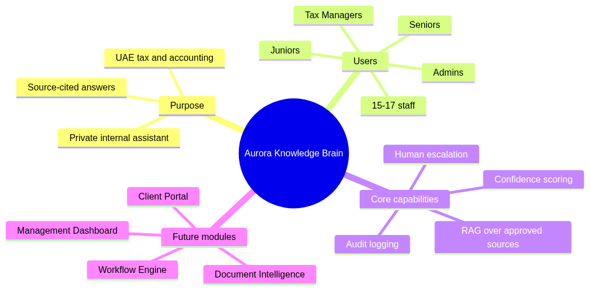
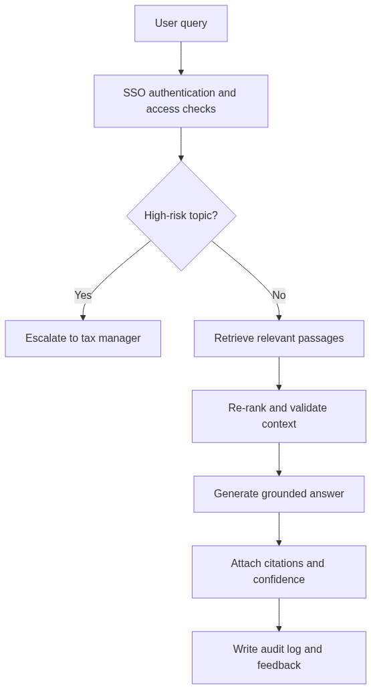
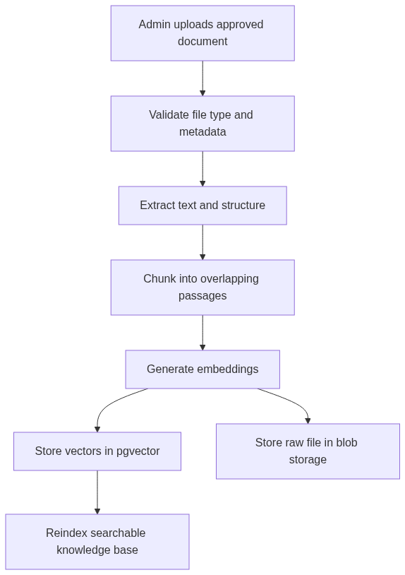
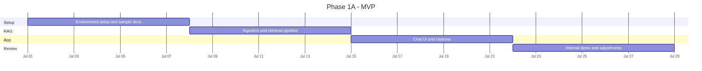
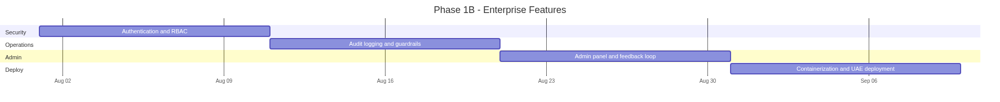
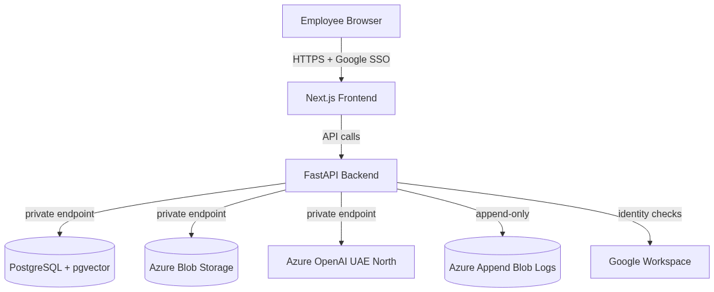
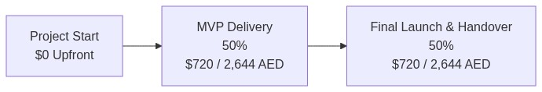

# Executive Summary

## The Vision: A Private "Tax Brain" for Aurora

* **Private, Secure AI Assistant** for Aurora's 15–17 tax professionals.
* Answers complex VAT, Corporate Tax, IFRS, and regulatory questions.
* **Grounded in UAE tax law** and Aurora's internal SOPs.
* **100% Data Sovereignty**: All data and processing stay in the UAE.

::: {.notes}
We are building a private knowledge system for Aurora to handle their daily tax operations safely and accurately.
:::

## What Makes This Proposal Different



---

# What the Team Will See

## Streamlined User Experience (Chat UI)

```
┌──────────────────────────────────────────────────────────────────┐
│  🔒 Aurora AI Assistant                                (Admin) │
│  ───────────────────────────────────────────────────────────────  │
│  👤 Can we recover VAT on a hotel invoice for a business trip?   │
│                                                                   │
│  🤖 No. Input VAT on hotel accommodation for business travel      │
│     outside the UAE is not recoverable under the UAE VAT law.     │
│                                                                   │
│     📎 Sources:                                                   │
│     [1] VAT Executive Regulations, Art. 54(1) ▸                   │
│     [2] FTA Public Clarification VATP012 ▸                        │
│                                                                   │
│     Confidence: ████████████░░ 92% (High)                         │
│     👍 Correct   👎 Incorrect   ⚠️ Needs Improvement              │
└──────────────────────────────────────────────────────────────────┘
```

## Core Client Capabilities

* **Instant Answers**: Responses generated in 3–10 seconds.
* **Mandatory Source Citations**: Links directly to laws/articles/SOPs.
* **Confidence Scoring**: Low confidence flags for human review.
* **Escalation Protocols**: High-risk topics go to senior staff.
* **Self-Service Admin Console**: Upload documents and manage users.

---

# Technical Architecture

## Retrieval-Augmented Generation (RAG) Flow



## Full System Integration


## Document Ingestion Flow (Self-Service)



## Google Workspace Integration

The system integrates directly with Aurora's Google ecosystem:

* **Single Sign-On (SSO)**: Log in using existing `@aurora.ae` accounts.
* **MFA Policies**: Google Workspace Multi-Factor Auth applies automatically.
* **Access Revocation**: Disabling Google account instantly cuts off app access.
* **Future Google Drive Sync**: Auto-ingest files from shared Drive folders.

---

# Phased Delivery Plan

## Phase 1A — MVP (Weeks 1–4)

* **Goal**: Basic Q&A on core VAT/CT, Google SSO, and source citations.



## Phase 1B — Enterprise (Weeks 5–10)

* **Goal**: Streaming answers, admin console, audit logging, and Azure deployment.



## Phase 2 — Future Expansion Roadmap


---

# Financial & Scoping Comparison

## Phase 1 Development Pricing

| Phase | Scope | Duration | Market Rate (USD) | Our Price (USD) | Our Price (AED) | Savings |
|---|---|---|:---:|:---:|:---:|:---:|
| **Phase 1A** | Core RAG, Google SSO, Citations, Escalation, MVP Demo | 4 weeks | $7,500 – $13,200 | **$720** | **2,644** | ~90–95% |
| **Phase 1B** | Streaming, Admin panel, Audit logging, Azure UAE deployment | 6 weeks | $8,000 – $14,000 | **$720** | **2,644** | ~91–95% |
| **Total** | **Complete Phase 1 Production System** | **10 weeks** | **$15,500 – $27,200** | **$1,440** | **5,288** | **~90–95%** |

::: {.callout-important}
### Note on Development Tool Expenses
These prices cover labor only. Ongoing monthly infrastructure costs and self-funded dev tools are billed directly to their respective accounts.
:::

## Phase 2 Optional Expansion Modules

| Module | Scope | Duration | Market Rate (USD) | Our Price (USD) | Our Price (AED) | Savings |
|---|---|---|:---:|:---:|:---:|:---:|
| **Phase 2A** | Arabic, Google Drive sync, consensus, advanced analytics | 6 weeks | $8,000 – $15,000 | **$670** | **2,460** | ~91–96% |
| **Phase 2B** | OCR/document processing, VAT compliance check, doc register | 8 weeks | $10,000 – $20,000 | **$890** | **3,268** | ~91–96% |
| **Phase 2C** | Client portal, workflow engine, accounting API, QA analytics | 12 weeks | $15,000 – $30,000 | **$1,340** | **4,921** | ~91–96% |
| **Total** | **Full Aurora OS Platform** | **~26 weeks** | **$33,000 – $65,000** | **$2,900** | **10,650** | **~91–96%** |

## Real Infrastructure & Monthly Costs

These are standard cloud costs paid directly to Microsoft Azure:

| Service | SKU / Details | Monthly Cost (USD) | Monthly Cost (AED) | Rationale |
|---|---|:---:|:---:|---|
| **Azure OpenAI** | GPT-4o pay-as-you-go | $30 – $90 | 110 – 331 | Based on 15 users, 30–80 queries/day |
| **Azure OpenAI** | text-embedding-3-small | <$1 | <4 | Vector search model costs |
| **Container Apps** | Compute (0.5 vCPU / 1 GiB) | $0 – $15 | 0 – 55 | Serverless, scale-to-zero |
| **Azure PostgreSQL** | B1ms server + 32 GiB storage | $15 – $20 | 55 – 73 | Burstable DB for user info and logs |
| **Azure Storage** | Blob Storage Hot tier (~1 GB) | $0.50 – $1 | 2 – 4 | raw PDFs + logs storage |
| **Domain & TLS** | custom domain TLS cert | $1 – $3 | 4 – 11 | HTTPS custom routing |
| **Total Monthly** | | **$47 – $130** | **173 – 477** | **Conservative cost estimate** |

---

# Security, Compliance & Setup

## Network Security Design



## Security Mapping Checklist

| Project Brief Requirement (§6) | Our Implementation Strategy |
|---|---|
| **No model training on Aurora data** | Azure OpenAI Enterprise terms guarantee zero data retention. |
| **Encryption in Transit & Rest** | TLS 1.3 for connections; AES-256 for PostgreSQL, Blobs, and Logs. |
| **Role-Based Access Control** | Admin, Tax Manager, Senior, Junior, Auditor roles. |
| **Tamper-Evident Audit Logs** | Implemented using Azure Immutable Blob Storage. |
| **Data Residency** | All resources hosted in Azure UAE North data center (Dubai). |
| **Immediate Revocation** | Workspace account termination disables system access instantly. |

## Current Prototype Readiness

We are starting with a **fully functional prototype**, not from scratch:

* **Backend API**: Python FastAPI (5+ routes) is ready.
* **RAG Pipeline**: LlamaIndex and pgvector indexing is functional.
* **Frontend UI**: Next.js Chat, Admin, and Audit pages are built.
* **SSO & RBAC**: Auth.js with Google login and 5 roles is wired.
* **Testing**: 7 end-to-end automated tests are passing.

---

# Next Steps

## Contract Terms & Timeline

* **IP Ownership**: 100% ownership transferred to Aurora upon final payment.
* **Support**: 2–3 months post-launch support included.
* **Payment Schedule**: 0% upfront (infra/tools direct) / 50% at MVP ($720 / 2,644 AED) / 50% at Launch ($720 / 2,644 AED).



## Action Items

1. **Approve proposal** and confirm budget ($1,440 Phase 1).
2. **Sign mutual NDA**.
3. **Provide initial 50–80 files** (PDFs/DOCXs).
4. **Provision Azure subscription** for UAE North deployment.
5. **Onboard staff list** (emails and roles).
