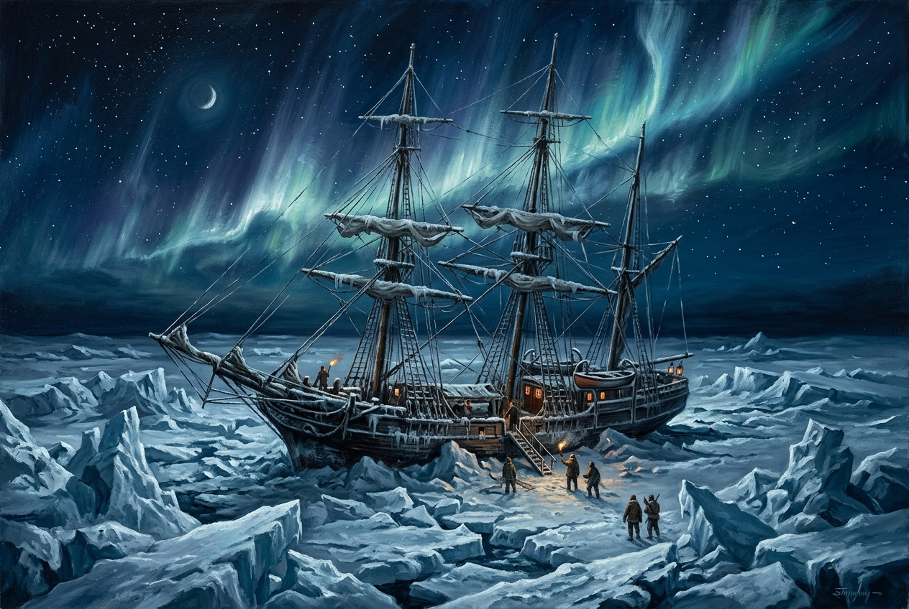

Mary Shelley's gothic masterpiece **Frankenstein; or, The Modern Prometheus** (1818) begins not with Victor Frankenstein, but with a series of letters written by Captain Robert Walton to his sister, Margaret Saville.

In **Letter I**, Walton writes from St. Petersburg, Russia, on his way to Archangel. He is preparing a dangerous, ambitious expedition to the North Pole. Excited by the prospects of scientific discovery and personal glory, Walton seeks to discover a northern passage to the Pacific, decipher the secrets of the magnetic needle, and walk on lands never before trodden by man. His letter establishes the novel's core themes of ambition, exploration, loneliness, and the pursuit of forbidden knowledge.

---

_To Mrs. Saville, England._

St. Petersburgh, Dec. 11th, 17—.

You will rejoice to hear that no disaster has accompanied the **commencement** of an **enterprise** which you have regarded with such evil **forebodings**. I arrived here yesterday, and my first task is to assure my dear sister of my welfare and increasing confidence in the success of my undertaking.

::: {.column-margin}
* **Commencement**: The beginning or start of something.
* **Enterprise**: A project, venture, or undertaking, especially one that is difficult, risky, or bold.
* **Forebodings**: Strong inner feelings or apprehensions of coming evil or misfortune.
:::

I am already far north of London, and as I walk in the streets of Petersburgh, I feel a cold northern breeze play upon my cheeks, which braces my nerves and fills me with delight. Do you understand this feeling? This breeze, which has travelled from the regions towards which I am advancing, gives me a **foretaste** of those icy climes. Inspirited by this wind of promise, my daydreams become more fervent and vivid. I try in vain to be persuaded that the pole is the seat of frost and desolation; it ever presents itself to my imagination as the region of beauty and delight. There, Margaret, the sun is forever visible, its broad disk just skirting the horizon and keeping a perpetual splendour. There—for with your leave, my sister, I will put some trust in preceding navigators—there snow and frost are banished; and, sailing over a calm sea, we may be wafted to a land surpassing in wonders and in beauty every region hitherto discovered on the habitable globe. Its productions and features may be without example, as the phenomena of the heavenly bodies undoubtedly are in those undiscovered solitudes. What may not be expected in a country of eternal light? I may there discover the wondrous power which attracts the needle and may regulate a thousand celestial observations that require only this voyage to render their seeming eccentricities consistent forever. I shall satiate my ardent curiosity with the sight of a part of the world never before visited, and may tread a land never before imprinted by the foot of man. These are my enticements, and they are sufficient to conquer all fear of danger or death and to induce me to commence this laborious voyage with the joy a child feels when he embarks in a little boat, with his holiday mates, on an expedition of discovery up his native river.

::: {.column-margin}
* **Foretaste**: A sample or brief experience of something to come.
:::

But supposing all these conjectures to be false, you cannot contest the **inestimable** benefit which I shall confer on all mankind, to the last generation, by discovering a passage near the pole to those countries, to reach which at present so many months are requisite; or by ascertaining the secret of the magnet, which, if at all possible, can only be effected by an undertaking such as mine.

::: {.column-margin}
* **Inestimable**: Too great, valuable, or intense to be calculated or measured.
:::

These reflections have dispelled the agitation with which I began my letter, and I feel my heart glow with an **enthusiasm** which elevates me to heaven, for nothing contributes so much to tranquil the mind as a steady purpose—a point on which the soul may fix its intellectual eye. This expedition has been the favourite dream of my early years. I have read with **ardour** the accounts of the various voyages which have been made in the prospect of arriving at the North Pacific Ocean through the seas which surround the pole. You may remember that a history of all the voyages made for purposes of discovery constituted the whole of our good Uncle Thomas’ library. My education was neglected, yet I was passionately fond of reading. These volumes were my study day and night, and my familiarity with them increased that regret which I had felt, as a child, on learning that my father’s dying injunction had forbidden my uncle to allow me to embark in a seafaring life.

::: {.column-margin}
* **Enthusiasm**: Intense and eager enjoyment, interest, or approval.
* **Ardour**: Great enthusiasm, passion, or warmth of feeling.
:::

These visions faded when I perused, for the first time, those poets whose effusions **entranced** my soul and lifted it to heaven. I also became a poet and for one year lived in a Paradise of my own creation; I imagined that I also might obtain a niche in the temple where the names of Homer and Shakespeare are **consecrated**. You are well acquainted with my failure and how heavily I bore the disappointment. But just at that time I inherited the fortune of my cousin, and my thoughts were turned into the channel of their earlier bent.

::: {.column-margin}
* **Entranced**: Filled with wonder and delight, holding one's entire attention.
* **Consecrated**: Declared sacred, set apart, or solemnly dedicated to a highly revered status.
:::

Six years have passed since I resolved on my present undertaking. I can, even now, remember the hour from which I dedicated myself to this great enterprise. I began by **inuring** my body to hardship. I accompanied the whale-fishermen on several expeditions to the North Sea; I voluntarily endured cold, famine, thirst, and want of sleep; I often worked harder than the common sailors during the day and devoted my nights to the study of mathematics, the theory of medicine, and those branches of physical science from which a naval adventurer might derive the greatest practical advantage. Twice I actually hired myself as an under-mate in a Greenland whaler, and acquitted myself to admiration. I must own I felt a little proud when my captain offered me the second in command in the vessel and entreated me to remain with the greatest earnestness, so valuable did he consider my services.

::: {.column-margin}
* **Inuring**: Accustoming or habituating someone to accept something undesirable (like hardship or pain).
:::

And now, dear Margaret, do I not deserve to accomplish some great purpose? My life might have been passed in ease and luxury, but I preferred glory to every **enticement** which wealth placed in my path. Oh, that some encouraging voice would answer in the affirmative! My courage and my resolution **firmly** support me, but my hopes **fluctuate**, and my spirits are often depressed. I am about to proceed on a long and difficult voyage, the emergencies of which will demand all my **fortitude**: I require to keep up my spirits, which are often prone to sink.

::: {.column-margin}
* **Enticement**: Something that attracts or tempts, particularly by offering pleasure or advantage.
* **Fluctuate**: Rise and fall irregularly in number or amount; waver.
* **Fortitude**: Courage or strength of mind in facing pain, danger, or adversity.
:::

I shall depart for Archangel in a fortnight, and my intention is to hire a ship there, which can easily be done by paying the insurance for the owner, and to engage as many sailors as I think necessary among those who are accustomed to the whale-fishery. I do not intend to sail until the month of June; and when shall I return? Ah, dear sister, how can I answer this question? If I succeed, many, many months, perhaps years, will pass before you and I may meet. If I fail, you will see me again soon, or never.

Farewell, my dear, excellent Margaret. Heaven shower down blessings on you, and save me, that I may again and again testify my gratitude for all your love and kindness.

Your affectionate brother,

R. Walton
