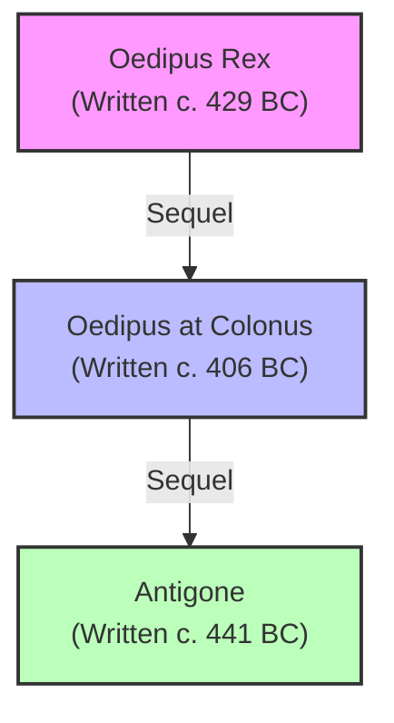

## Introduction: Who was Sophocles?

**Sophocles** (c. 497/6 BC – winter 406/5 BC) was one of the three great ancient Athenian tragedians whose plays have survived to the modern era, alongside Aeschylus and Euripides. 

Living during the Golden Age of Athens, Sophocles was not only a celebrated playwright but also an active public figure, serving as a treasurer, a military general (alongside Pericles), and a priest. 

Out of more than 120 plays he is said to have written, only **seven** have survived in their complete forms. Despite this small survival rate, his masterpieces—particularly *Oedipus Rex* and *Antigone*—are considered the pinnacle of classical dramatic art. Sophocles won the city’s prestigious dramatic competition, the City Dionysia, eighteen times, never placing lower than second in any competition he entered.

---

## 1. Structural and Theatrical Innovations

Before Sophocles, Greek tragedy was heavily dominated by Aeschylean conventions, which focused on massive, cosmic forces, long choral odes, and static staging. Sophocles revolutionized the theatre by introducing changes that remain fundamental to modern drama:

* **The Third Actor (Triagonist):** Sophocles’ most significant innovation was the introduction of a third actor on stage. Previously, only two actors could speak in a scene, which limited dialogue to direct confrontations or reporting. A third actor allowed for complex subplots, dramatic irony, and triadic character dynamics (e.g., Oedipus, Creon, and the Messenger).
* **Reduction of the Chorus's Role:** By adding a third actor, Sophocles shifted the focus from the collective commentary of the Chorus to direct, interpersonal character conflict. The Chorus was reduced in dramatic importance, acting more as a thematic echo chamber rather than a primary driver of the plot.
* **Expansion of the Chorus:** He increased the size of the Chorus from twelve to fifteen members and integrated them more closely into the scenic action.
* **Scene Painting (*Scenographia*):** Sophocles is credited with introducing painted scenery to the wooden backdrop (*skene*), providing a physical and atmospheric context for his plays.
* **Single, Standalone Plays:** Unlike Aeschylus, who wrote trilogies that told a single continuous story across three plays (like the *Oresteia*), Sophocles preferred to compete with three independent, self-contained plays. This allowed for more concentrated plots, sharper pacing, and greater character focus.

---

## 2. The Theban Plays (The Oedipus Cycle)

Sophocles' most famous works are his three plays set in Thebes. Although often grouped together as a trilogy, they were written years apart for different festivals and contain minor narrative inconsistencies.

### A. *Oedipus Rex* (Oedipus the King)
Widely regarded as the masterpiece of classical tragedy, this play is a model of dramatic economy and suspense.

* **The Plot:** King Oedipus of Thebes vows to find the murderer of the previous king, Laius, to lift a deadly plague ravaging the city. Through a series of interviews and discoveries, Oedipus uncovers the horrifying truth: he is the murderer, Laius was his biological father, and his wife, Jocasta, is his biological mother—unknowingly fulfilling the prophecy he tried his whole life to escape.
* **Key Themes:**
  * **Fate vs. Free Will:** The tension between human agency and cosmic predestination. Every action Oedipus takes to escape the oracle's prophecy brings him closer to its fulfillment.
  * **Sight and Blindness:** A heavy motif of physical vs. spiritual vision. The blind prophet Tiresias sees the truth clearly, while the physically sighted Oedipus is blind to his own identity. Upon discovering the truth, Oedipus blinds himself physically.
  * **Hubris:** Oedipus’s pride in his intellectual ability (solving the Riddle of the Sphinx) blinds him to his human limitations.

### B. *Oedipus at Colonus*
Written at the very end of Sophocles’ long life and produced posthumously, this play deals with the final days, redemption, and death of an exiled, elderly Oedipus in a sacred grove near Athens. It stands as a meditation on aging, suffering, and the transition from curse to holy blessing.

### C. *Antigone*
Written before the other two plays, *Antigone* deals with the civil war that erupted in Thebes after Oedipus’s exile, culminating in the deaths of his two sons, Polynices and Eteocles.

* **The Plot:** King Creon decrees that Eteocles (who defended the city) will receive a hero's burial, while the rebel Polynices will be left to rot in the sun. Oedipus’s daughter, Antigone, defies the royal decree to bury her brother, arguing that divine law and familial duty supersede civil laws. Creon sentences her to be buried alive, leading to a tragic chain of suicides (Creon's son Haemon, and his wife Eurydice).
* **Key Themes:**
  * **Divine Law vs. State Law:** The conflict between private conscience/religious duty (Antigone) and political order/national security (Creon).
  * **Gender Roles:** Creon feels particularly threatened by Antigone because she is a woman defying his masculine, royal authority.

---

## 3. Other Surviving Masterpieces

While the Theban Cycle dominates modern staging, Sophocles’ other four surviving plays are equally powerful studies of human psychology and morality:

1. **Ajax:** Depicts the tragic downfall of the Greek hero Ajax during the Trojan War. Driven mad by Athena after losing Achilles' armor to Odysseus, Ajax slaughters the army's livestock. Upon regaining his sanity, he commits suicide to preserve his honor, leading to a debate over whether his body should receive a proper burial.
2. **Electra:** Follows Electra and her brother Orestes as they plot and execute revenge against their mother Clytemnestra and stepfather Aegisthus for the murder of their father, Agamemnon.
3. **Philoctetes:** Tells the story of Philoctetes, a Greek warrior abandoned on a desert island because of a festering, foul-smelling wound. The Greeks must trick him into returning to Troy because an oracle declares they cannot win without his legendary bow. The play explores themes of deception, friendship, and political pragmatism.
4. **The Trachiniae (Women of Trachis):** Focuses on Deianira, the wife of Heracles. In a desperate bid to win back her husband's love, she sends him a robe dipped in what she believes is a love potion, but which is actually a deadly poison. Upon realizing her mistake, she commits suicide, and Heracles dies in agony.

---

## 4. Key Stylistic and Philosophical Themes

Sophocles’ writing is defined by several consistent thematic and stylistic patterns:

* **Sophoclean Irony (Dramatic Irony):** Sophocles is the absolute master of dramatic irony—a device where the audience knows vital information that the characters do not. In *Oedipus Rex*, Oedipus curses the murderer of Laius, unknowingly cursing himself.
* **The Tragic Flaw (*Hamartia*):** Sophocles’ heroes are not villainous, nor are they perfect. They are noble figures whose downfalls are caused by *hamartia*—often translated as a "tragic flaw," but more accurately understood as an "error in judgment" or "missing the mark" due to limited human knowledge.
* **The Isolation of the Hero:** A Sophoclean hero is typically defined by stubborn, unyielding commitment to a principle (Antigone's duty, Ajax's honor, Electra's grief). This refusal to compromise isolates them from their family, the state, and the chorus, forcing them to face their tragedy alone.
* **Noble Resignation:** Unlike the despair found in Euripides, Sophocles’ tragedies conclude with a sense of solemn, dignified acceptance of human limitations before the gods.

---

## 5. Legacy & Aristotle's *Poetics*

Sophocles' influence on the history of drama is foundational:

* **Aristotle’s Ideal Model:** In his *Poetics*, the philosopher Aristotle used Sophocles’ *Oedipus Rex* as the supreme example of tragedy. Aristotle formulated his theories of tragedy—including **Peripeteia** (reversal of fortune), **Anagnorisis** (recognition/discovery), and **Catharsis** (purging of pity and fear)—based primarily on the structure of Sophocles' masterpiece.
* **Freudian Psychoanalysis:** Sigmund Freud famously adopted the myth of Oedipus to describe his theory of psychosexual development—the **Oedipus Complex**—which posits an unconscious desire in children for the parent of the opposite sex.
* **Modern Adaptations:** Sophocles’ plays continue to be rewritten and reinterpreted. Prominent modern versions include Jean Cocteau's *The Infernal Machine*, Jean Anouilh's occupied-France adaptation of *Antigone*, and Seamus Heaney’s *The Burial at Thebes*.
