**Prepared for**: Aurora Tax Agency
**Prepared by**: Igor Kan
**Version**: 3.0
**Status**: Ready for Client Review & Approval
**Confidentiality**: This document is confidential and prepared for Aurora's internal evaluation only.

> **Exchange Rate Used**: 1 USD = 3.6725 AED (pegged rate, June 2026)

---

## Table of Contents

1. [Executive Summary](#1-executive-summary)
2. [Confirmation of Approach](#2-confirmation-of-approach)
3. [What Aurora's Team Will See](#3-what-auroras-team-will-see)
4. [System Architecture](#4-system-architecture)
5. [Answers to All Project Brief Questions](#5-answers-to-all-project-brief-questions)
6. [Technology Stack](#6-technology-stack)
7. [Phase 1 — Detailed Delivery Plan](#7-phase-1--detailed-delivery-plan)
8. [Phase 2 — Future Expansion Roadmap](#8-phase-2--future-expansion-roadmap)
9. [Cost Estimate & Market Rate Comparison](#9-cost-estimate--market-rate-comparison)
10. [Real Infrastructure & Ongoing Costs](#10-real-infrastructure--ongoing-costs)
11. [Security & Compliance Mapping](#11-security--compliance-mapping)
12. [Team Structure & Relevant Experience](#12-team-structure--relevant-experience)
13. [Contract Terms](#13-contract-terms)
14. [Next Steps](#14-next-steps)

---

## 1. Executive Summary

Aurora needs a private, secure AI assistant that enables its 15–17 tax professionals to get instant, source-cited answers to complex UAE tax, corporate tax, IFRS, and regulatory questions. This system — the **Aurora Knowledge Brain** — is the first module of Aurora OS, and must be architected for future expansion into Document Intelligence, Workflow Engine, Client Portal, and Management Dashboard.

> **In one sentence**: We are building a private "Tax Brain" for Aurora — a chat assistant that knows UAE tax law, cites every source, never guesses, and keeps all data in the UAE.

### What Makes This Proposal Different


<details>
<summary>Mermaid source</summary>

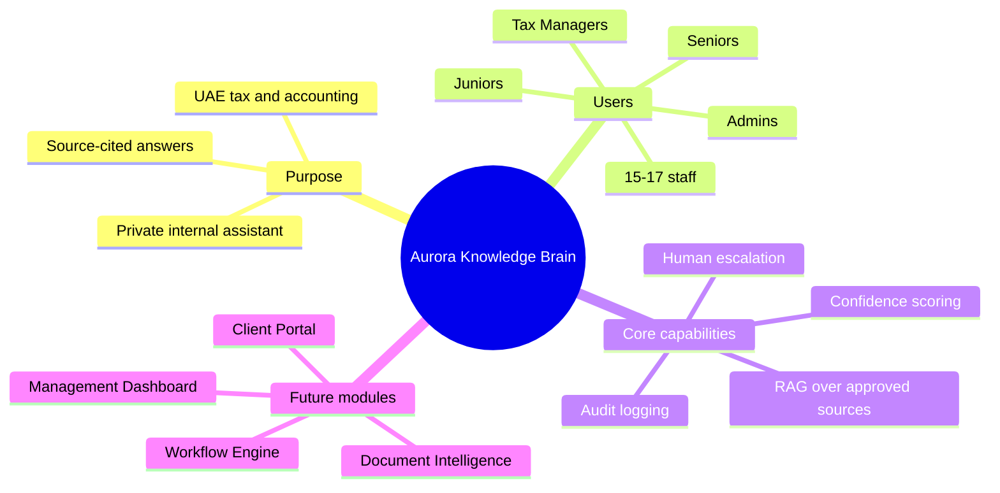

</details>

---

## 2. Confirmation of Approach

The scope described in the Project Brief is clear, well-structured, and realistic. We confirm:

- ✅ **RAG-based approach** (Retrieval-Augmented Generation) — the correct architecture for grounded, source-cited answers
- ✅ **No fine-tuning** at this stage — reduces cost, risk, and vendor lock-in
- ✅ **Phase 1 scope** (internal only, no client access) — smart way to prove value before expanding
- ✅ **Security-first design** — essential for a licensed FTA tax agency handling confidential data
- ✅ **Modular architecture** — designed for future Aurora OS integration without re-architecture

### What We Would Add / Do Differently

| Enhancement | Why |
|---|---|
| **Streaming responses** | Answers appear word-by-word (like ChatGPT) instead of waiting 10+ seconds. Dramatically improves perceived speed. |
| **Semantic caching** | If the same question is asked twice, serve the cached answer instantly — saves API cost and time. |
| **Multi-model consensus** (Phase 1B) | For complex questions, run through two models. If they disagree, flag for human review. Prevents hallucinated tax advice. |
| **Document chunking with overlap** | Split documents into overlapping passages so no article boundary is missed during retrieval. |

---

## 3. What Aurora's Team Will See

### 3.1. Chat Interface — Daily Usage View

When an Aurora employee opens the assistant, they see a clean, professional chat interface — purpose-built for tax work:

```
┌──────────────────────────────────────────────────────────────────┐
│  🔒 Aurora AI Assistant                        Aurora Admin │
│  ───────────────────────────────────────────────────────────────  │
│                                                                   │
│  👤 Can we recover VAT on a hotel invoice for a                   │
│     business trip to Saudi Arabia?                                │
│                                                                   │
│  🤖 No. Input VAT on hotel accommodation for business             │
│     travel outside the UAE is not recoverable under the           │
│     UAE VAT framework.                                            │
│                                                                   │
│     Under Article 54(1) of Cabinet Decision No. 52 of             │
│     2017 (VAT Executive Regulations), input tax is only           │
│     recoverable on goods and services used for making             │
│     taxable supplies within the UAE.                              │
│                                                                   │
│     📎 Sources:                                                   │
│     [1] VAT Executive Regulations, Art. 54(1) ▸                   │
│     [2] FTA Public Clarification VATP012 ▸                        │
│                                                                   │
│     Confidence: ████████████░░ 92% (High)                         │
│                                                                   │
│     👍 Correct   👎 Incorrect   ⚠️ Needs Improvement              │
│                                                                   │
│  ─────────────────────────────────────────────────────────────    │
│  Type your question...                                [Send ➤]    │
└──────────────────────────────────────────────────────────────────┘
```

### 3.2. Feature Summary

| Feature | Description |
|---|---|
| **Instant answers** | Ask any UAE tax question — get an answer in 3–10 seconds |
| **Mandatory source citations** | Every answer references specific law articles, regulations, or Aurora SOPs |
| **Confidence indicator** | Color-coded bar: 🟢 High (>80%) / 🟡 Medium (50–80%) / 🔴 Low (<50%) |
| **"I don't know" behavior** | System never guesses. Low confidence → *"Please consult your Tax Manager"* |
| **Escalation for sensitive topics** | Penalty disputes, FTA audits, court matters → automatically flagged |
| **Feedback loop** | Staff rate answers 👍/👎/⚠️ — incorrect answers go to senior review queue |
| **Admin panel** | CEO/managers upload new tax documents, manage users, view usage analytics |
| **Google login** | Staff sign in with their existing Aurora Google Workspace account |
| **Conversation history** | Past conversations are saved and searchable |
| **Mobile responsive** | Fully functional on desktop, tablet, and phone |

### 3.3. Admin Console — Document & User Management

```
┌──────────────────────────────────────────────────────────────────┐
│  ⚙️ Aurora AI — Admin Console                    Aurora Admin │
│  ═══════════════════════════════════════════════════════════════  │
│                                                                   │
│  📄 Knowledge Base (67 documents)              [+ Upload New]     │
│  ─────────────────────────────────────────────────────────────    │
│  │ Name                          │ Type     │ Status  │ Date     │
│  │ UAE VAT Law No. 8/2017        │ PDF      │ ✅ Live │ Jun 2026 │
│  │ FTA Public Clarification 034  │ PDF      │ ✅ Live │ Jun 2026 │
│  │ Aurora SOP - VAT Returns      │ DOCX     │ 🔄 Re-indexing │   │
│  │ IFRS 15 Revenue Standard      │ PDF      │ ✅ Live │ Jun 2026 │
│  ─────────────────────────────────────────────────────────────    │
│                                                                   │
│  👥 Users (16 active)                          [+ Add User]       │
│  ─────────────────────────────────────────────────────────────    │
│  │ Name           │ Role          │ Queries (30d) │ Last Active │ │
│  │ Aurora CEO     │ Admin         │ 145           │ Today       │ │
│  │ Ahmad M.       │ Tax Manager   │ 203           │ Today       │ │
│  │ Maria K.       │ Senior        │ 178           │ Yesterday   │ │
│  │ Fatima H.      │ Junior        │ 312           │ Today       │ │
│  ─────────────────────────────────────────────────────────────    │
│                                                                   │
│  📊 Usage This Month: 1,247 queries │ Avg confidence: 87%        │
│  📋 Pending Reviews: 3 flagged answers awaiting senior review     │
└──────────────────────────────────────────────────────────────────┘
```

---

## 4. System Architecture

### 4.1. How It Works — The RAG Pipeline

The system does **not** rely on the AI model's built-in knowledge. Instead, every answer is grounded in Aurora's own documents:

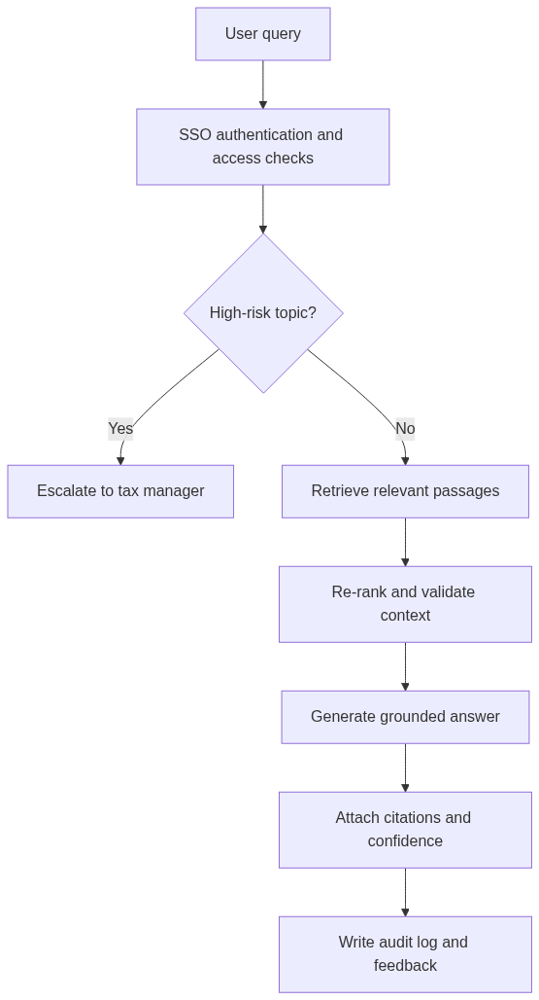

<details>
<summary>Mermaid source</summary>

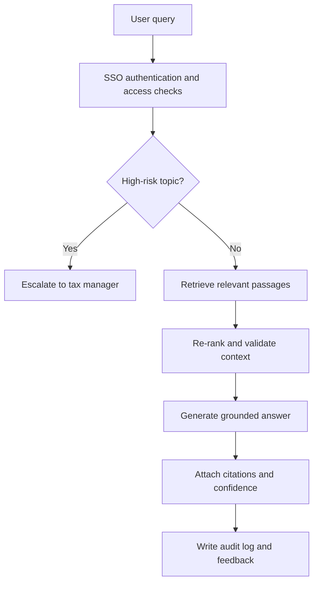

</details>

### 4.2. Full System Architecture

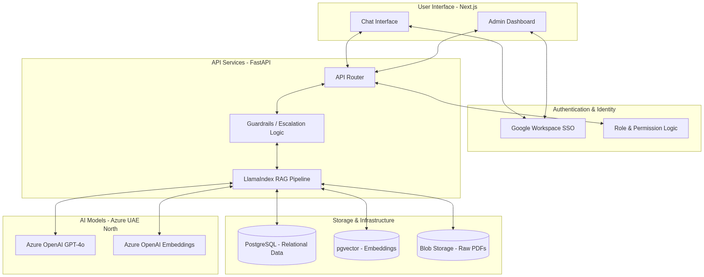

<details>
<summary>Mermaid source</summary>

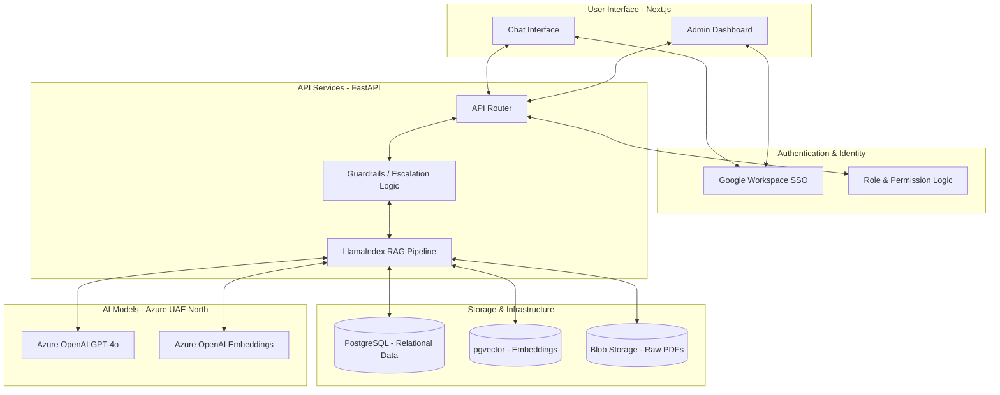

</details>

### 4.3. Where Everything Is Located

| Component | Location | Why |
|---|---|---|
| **Web application** | Azure Container Apps — UAE North (Dubai) | Data residency compliance, low latency for UAE team |
| **Database (PostgreSQL + pgvector)** | Azure Database for PostgreSQL — UAE North | UAE data sovereignty, single DB for users + vectors + logs |
| **AI models (GPT-4o + embeddings)** | Azure OpenAI — UAE North | Contractual guarantee: Aurora data is NOT used for model training |
| **Raw documents (PDFs, DOCXs)** | Azure Blob Storage — UAE North | Encrypted at rest (AES-256), versioned |
| **Audit logs** | Azure Append Blob Storage — UAE North | Append-only, tamper-evident, legally compliant |
| **CI/CD pipeline** | GitHub Actions | Automated testing on every code push |
| **Source code** | Private GitHub repository | Aurora has full ownership and access |

> **All data stays in the UAE.** Nothing leaves the country. No exceptions.

---

## 5. Answers to All Project Brief Questions

### 5.1. "Confirmation of approach — does the scope make sense?" (§10.1)

**Yes.** The scope is well-defined and realistic. Our approach:

- **RAG over fine-tuning**: Correct choice. RAG allows source citation, is cheaper, and lets Aurora update the knowledge base without retraining.
- **Internal-only Phase 1**: Smart. Proves value with the team before exposing to clients.
- **50–80 documents**: A manageable starting volume that will thoroughly test the system.

### 5.2. "What is the source of information? Where will it be located?"

**Knowledge Base Composition (Phase 1):**

| Category | Examples | Est. Documents |
|---|---|---|
| UAE VAT legislation | Federal Decree-Law No. 8/2017, Executive Regulations, FTA Public Clarifications, FTA Guides | ~20–30 |
| UAE Corporate Tax | Federal Decree-Law No. 47/2022, Executive Regulations, CT Guides | ~10–15 |
| Transfer Pricing | FTA TP Guide, OECD TP Guidelines | ~3–5 |
| IFRS/IAS Standards | Key standards relevant to Aurora's practice (IFRS 15, IAS 16, etc.) | ~10–15 |
| Aurora Internal | SOPs, methodology notes, anonymized past cases, templates | ~10–20 |
| **Total** | | **~50–80** |

**Location**: All documents are stored in **Azure Blob Storage (UAE North)**, encrypted with AES-256. Documents are processed, split into overlapping passages (chunks), and stored as mathematical vectors in **PostgreSQL with pgvector** — also in UAE North.

**Self-Service Updates**: The admin panel allows CEO/managers to upload new documents (e.g. new FTA clarifications). The system automatically re-indexes — no developer involvement needed.

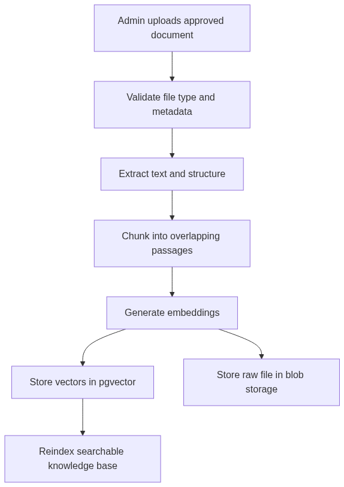

<details>
<summary>Mermaid source</summary>

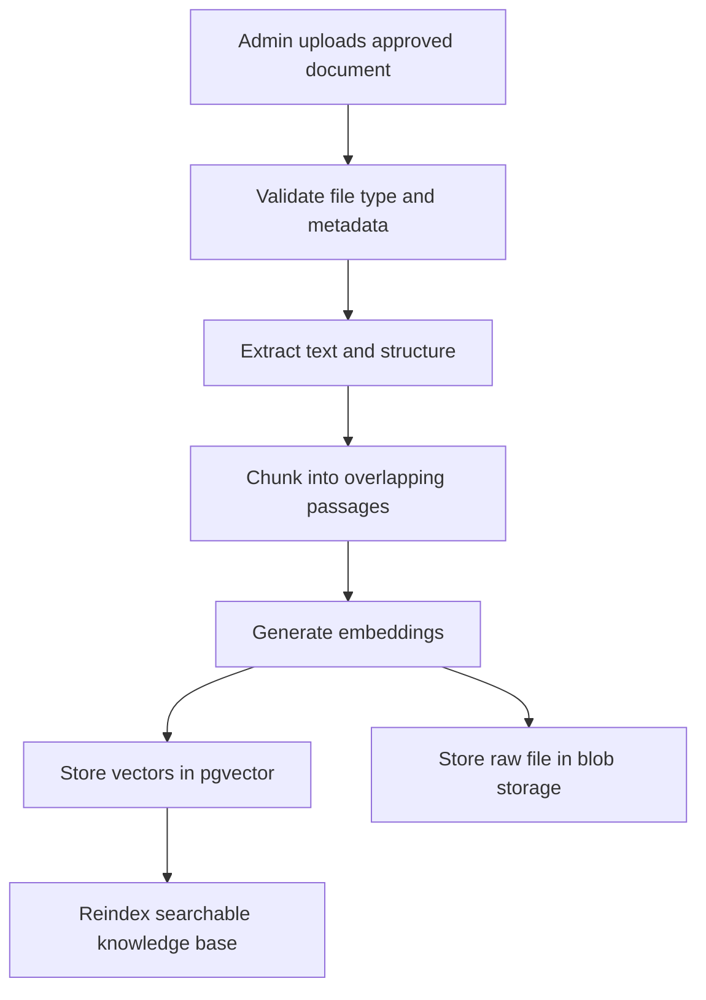

</details>

### 5.3. "What LLM system will it use? Via API?"

**Primary LLM**: **Azure OpenAI GPT-4o** — hosted in UAE North region.

**Yes, via API.** We call Azure's hosted models through their secure enterprise API.

| Question | Answer |
|---|---|
| Do we run our own AI model? | No — we use Azure's managed service via API |
| Is Aurora's data used to train the model? | **No** — Azure OpenAI Enterprise terms contractually guarantee zero data retention for training |
| Where does the model run? | Azure UAE North data center (Dubai) |
| What does it cost per query? | ~$0.01–0.03 per question (details in Section 10) |
| Can we switch models later? | Yes — architecture is model-agnostic via clean abstraction layer |

**Embedding model**: `text-embedding-3-small` (Azure OpenAI) — converts documents into searchable mathematical vectors. Cost: $0.02 per 1M tokens (negligible).

**Why Azure OpenAI specifically?**
- ✅ Only major LLM provider with a **UAE North data center**
- ✅ Enterprise-grade **"no training on your data" guarantee** (contractual)
- ✅ SOC 2, ISO 27001, ISO 27701 compliant
- ✅ Private endpoint support (no data traverses public internet)
- ✅ AED billing available for UAE customers

### 5.4. "Is there a KYC procedure?"

**Phase 1**: No external KYC. The system is **internal-only** — used exclusively by Aurora employees authenticated via Google Workspace SSO. There are no external users, no clients, and no payments.

**User onboarding process:**
1. Admin (CEO) adds the employee's Aurora Google email to the system
2. Employee signs in with their Aurora Google Workspace account
3. System assigns their role (Admin, Tax Manager, Senior, Junior, or Auditor)
4. Existing Google Workspace MFA policies apply automatically

**Phase 2+**: If/when client access is introduced, a proper KYC/onboarding flow will be designed.

### 5.5. "Did you map the project?"

**Yes.** The project is fully mapped with a detailed Gantt chart and milestone schedule. See Section 7 for the complete breakdown.

### 5.6. "They use Google — how does it integrate?"

Aurora's team uses **Google Workspace** (Gmail, Google Docs, Google Sheets, Google Meet). The AI Assistant integrates into this ecosystem:

| Integration Point | How |
|---|---|
| **Login / Authentication** | "Sign in with Google" — employees use their existing `@aurora.ae` Google account. No new passwords. |
| **SSO (Single Sign-On)** | If an employee is already logged into Gmail, they're automatically logged into the AI Assistant |
| **Access revocation** | If someone leaves Aurora and their Google account is disabled → they **instantly** lose access to the AI Assistant |
| **MFA** | Google Workspace MFA applies — no additional MFA setup needed |
| **Future: Google Drive** | Documents can be synced from a shared Google Drive folder into the knowledge base (Phase 2 enhancement) |

> The assistant runs as a **separate web application** (accessible at a URL like `ai.aurora.ae`) — but authentication is handled entirely through Google Workspace. It feels like part of the Google ecosystem.

### 5.7. "How does the chat consultant integrate into the overall infrastructure?"

The AI Assistant is the **first module** of the larger **Aurora OS** platform. It is designed as a standalone microservice with clean REST APIs, so future Aurora OS components can plug into it:

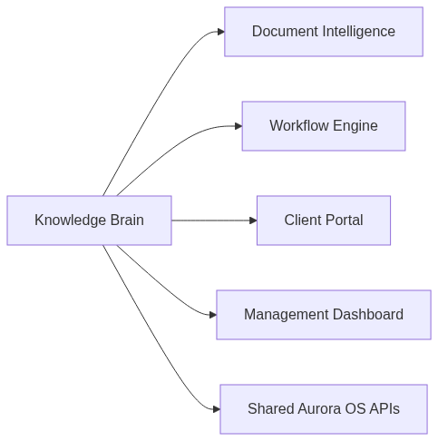

<details>
<summary>Mermaid source</summary>

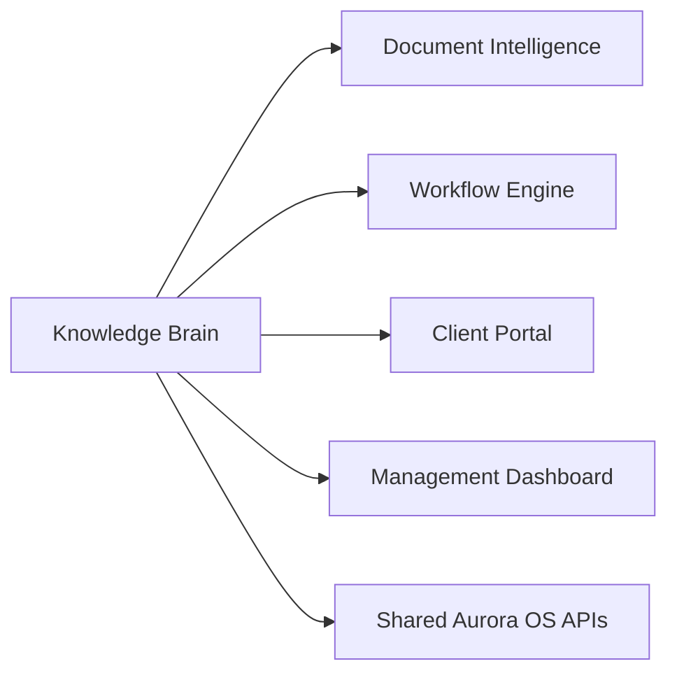

</details>

**Integration strategy:**
- The Knowledge Brain exposes **REST APIs**: `/api/chat`, `/api/search`, `/api/documents`, `/api/users`, `/api/audit`
- Any future Aurora OS module can call these APIs
- Example: Future Client Portal → calls Knowledge Brain API → answer reviewed by consultant → sent to client
- Architecture uses **Docker containers** — each component is developed, deployed, and scaled independently
- **No hard-coded assumptions** about a single LLM provider or a single data source

---

## 6. Technology Stack

| Layer | Technology | Rationale | Security Mapping (§6) |
|---|---|---|---|
| **Frontend** | Next.js 14 (React) | Industry standard, responsive (mobile + desktop), server-side rendering | HTTPS/TLS 1.3 enforced |
| **UI Components** | shadcn/ui + Tailwind CSS | Professional, polished, accessible out-of-the-box | — |
| **Authentication** | Auth.js v5 (NextAuth) + Google OAuth | Open-source, native Google Workspace SSO, RBAC | MFA via Google, instant revocation |
| **Backend API** | Python FastAPI | Best for AI/ML workloads, automatic OpenAPI documentation, async support | Input validation, rate limiting |
| **RAG Framework** | LlamaIndex | Superior metadata tracking for mandatory source citations | — |
| **Database** | PostgreSQL 16 + pgvector | Single database for users, logs, embeddings, feedback. pgvector for vector similarity search | AES-256 at rest, row-level security ready |
| **Document Parsing** | Docling (IBM, open source) | Best-in-class PDF table extraction for legal documents with complex formatting | — |
| **LLM Provider** | Azure OpenAI (GPT-4o) — UAE North | UAE data center, contractual no-training guarantee, SOC 2 / ISO 27001 | §6 compliant |
| **Embeddings** | text-embedding-3-small (Azure) | Cost-effective ($0.02/1M tokens), high-quality search | — |
| **Cloud Hosting** | Azure Container Apps — UAE North | Serverless containers, scale-to-zero, UAE data residency | TLS 1.3, VNet integration |
| **File Storage** | Azure Blob Storage — UAE North | AES-256 at rest, append-only blobs for audit logs | Immutable storage for compliance |
| **CI/CD** | GitHub Actions | Automated testing and deployment on every code push | — |
| **Monitoring** | Azure Monitor + Application Insights | Performance tracking, error alerting, usage analytics | Centralized logging |

---

## 7. Phase 1 — Detailed Delivery Plan

### 7.1. Phase 1A — MVP (Weeks 1–4)

> **Goal**: Working assistant that can answer UAE tax questions with source citations, accessible by the Aurora team with Google login.


<details>
<summary>Mermaid source</summary>

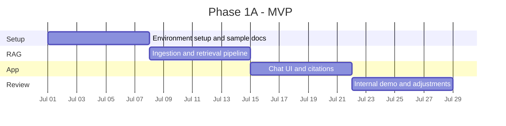

</details>

**Phase 1A Deliverables:**
- ✅ Working chat interface with source-cited answers
- ✅ 50–80 documents loaded and searchable
- ✅ Google Workspace SSO authentication
- ✅ 5 user roles (Admin, Tax Manager, Senior, Junior, Auditor)
- ✅ Confidence scoring with threshold behavior
- ✅ Escalation guard for sensitive topics
- ✅ Basic audit logging (every query logged)
- ✅ Feedback buttons (thumbs up/down)

### 7.2. Phase 1B — Enterprise Features (Weeks 5–10)

> **Goal**: Production-ready system with admin console, hardened security, deployment to Azure UAE North, and full documentation.

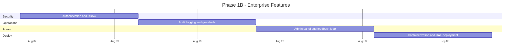

<details>
<summary>Mermaid source</summary>

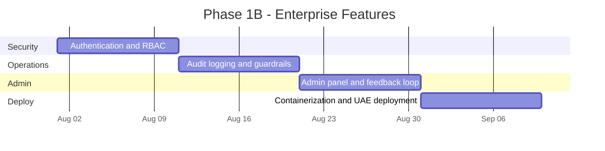

</details>

**Phase 1B Deliverables:**
- ✅ Streaming responses (word-by-word, like ChatGPT)
- ✅ Admin console for document upload/management (no developer needed)
- ✅ User management console
- ✅ Usage analytics dashboard
- ✅ Feedback review queue for seniors
- ✅ Hardened audit logs (append-only, tamper-evident)
- ✅ Security hardening (rate limiting, input validation, OWASP)
- ✅ Docker containerization for reproducible deployments
- ✅ Azure UAE North production deployment
- ✅ CI/CD pipeline
- ✅ Full documentation package (architecture, API docs, admin guide, deployment guide, security mapping)
- ✅ Source code handover (private GitHub repo)

### 7.3. Weekly Progress Cadence

As recommended by Julia, we will maintain a **weekly demonstration cadence**:

| Week | Demo Content | Aurora Feedback Needed |
|---|---|---|
| Week 1 | Azure setup confirmation, first RAG test with sample docs | Confirm document format compatibility |
| Week 2 | Knowledge base loaded, demo queries working | Test 10+ real tax queries, report accuracy |
| Week 3 | Google login working, roles assigned | Confirm role assignments, test login flow |
| Week 4 | **MVP demo** — full chat with citations | Go/no-go for Phase 1B |
| Week 5–6 | Streaming chat, admin panel draft | Test document upload, review admin UI |
| Week 7–8 | Security hardened, Docker ready | Security review checklist |
| Week 9 | Production deployed, domain live | Test production URL |
| Week 10 | **Launch** — all 15-17 users onboarded | Final sign-off |

---

## 8. Phase 2 — Future Expansion Roadmap

Phase 2 builds on the Phase 1 foundation to expand Aurora OS capabilities. These are scoped as separate, individually priced modules:

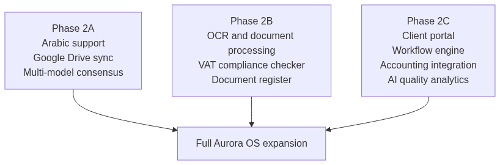

<details>
<summary>Mermaid source</summary>

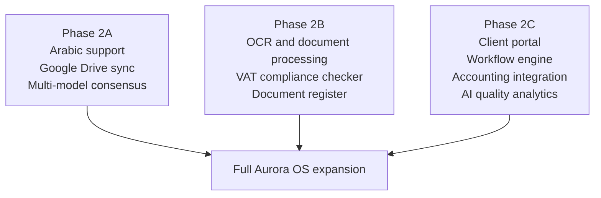

</details>

### Phase 2 Pricing Estimate

| Phase | Scope | Duration | Market Rate (USD) | Market Rate (AED) | Our Price (USD) | Our Price (AED) | Savings |
|---|---|---|---:|---:|---:|---:|---:|
| **Phase 2A** | Arabic support, Google Drive sync, multi-model consensus, advanced analytics | 6 weeks | $8,000 – $15,000 | 29,380 – 55,088 | **$670** | **2,460** | ~91–96% |
| **Phase 2B** | OCR/document processing, VAT compliance checker, document register | 8 weeks | $10,000 – $20,000 | 36,725 – 73,450 | **$890** | **3,268** | ~91–96% |
| **Phase 2C** | Client portal, workflow engine, accounting integration, AI quality analytics | 12 weeks | $15,000 – $30,000 | 55,088 – 110,175 | **$1,340** | **4,921** | ~91–96% |
| **Total Phase 2** | Full Aurora OS expansion | **~26 weeks** | **$33,000 – $65,000** | **121,193 – 238,713** | **$2,900** | **10,650** | **~91–96%** |

> Phase 2 modules can be ordered individually based on Aurora's priorities.

---

## 9. Cost Estimate & Market Rate Comparison

### 9.1. Development Cost — Phase 1

| Phase | Scope | Duration | Market Rate (USD) | Market Rate (AED) | Our Rate (USD) | Our Rate (AED) | Savings |
|---|---|---|---:|---:|---:|---:|---:|
| **Phase 1A — MVP** | Core RAG pipeline, knowledge base (50-80 docs), Google SSO, RBAC (5 roles), chat UI, source citations, confidence scoring, escalation logic, feedback system, basic audit | 4 weeks | $7,500 – $13,200 | 27,544 – 48,477 | **$310** | **1,138** | ~96–98% |
| **Phase 1B — Enterprise** | Streaming chat, admin panel (document management), user management, feedback review queue, audit log hardening, security hardening, semantic caching, Docker containerization, Azure UAE North deployment, CI/CD, UAT, team rollout, full documentation & handover | 6 weeks | $8,000 – $14,000 | 29,380 – 51,415 | **$360** | **1,322** | ~95–97% |
| **Total Phase 1** | Complete production system for 15-17 users | **10 weeks** | **$15,500 – $27,200** | **56,924 – 99,892** | **$670** | **2,460** | **~96%** |

### 9.2. Market Rate Context

The following market rates are based on current industry benchmarks for custom enterprise RAG/AI assistant development (2025–2026 data):

| Benchmark | Range (USD) | Range (AED) |
|---|---:|---:|
| **Freelancer RAG/AI Engineer hourly rate** | $130 – $200/hr | 477 – 735/hr |
| **Small-scale custom RAG (1K–10K docs)** | $7,500 – $13,200 | 27,544 – 48,477 |
| **Medium-scale custom RAG (10K–100K docs)** | $15,700 – $27,000 | 57,659 – 99,158 |
| **Enterprise RAG with compliance + security** | $25,000 – $60,000+ | 91,813 – 220,350+ |
| **Full enterprise platform (comparable to Aurora OS Phase 1+2)** | $40,000 – $100,000+ | 146,900 – 367,250+ |

> **Our Phase 1 price of $670 represents approximately 1/23rd to 1/40th of the market rate**, reflecting a strategic investment to build a long-term partnership with Aurora.

### 9.3. Why Our Rate Is Lower

| Factor | Explanation |
|---|---|
| **Prototype already built** | We have been developing the prototype since receiving the brief. FastAPI backend, Next.js frontend, RAG pipeline, and 7 automated tests are already functional. |
| **AI-accelerated development** | Modern AI-powered development workflows accelerate coding 3–5x, dramatically reducing labor hours. |
| **Strategic investment** | This is an ongoing, multi-phase project. We are investing in a long-term partnership with Aurora, not optimizing for a one-time payout. |
| **Learning opportunity** | Working with real UAE tax data and enterprise compliance requirements is invaluable professional development. |

### 9.4. Side-by-Side Comparison Table

| Item | Market Rate (USD / AED) | Our Rate (USD / AED) | Savings |
|---|---|---|---|
| **Phase 1 Development** | $15,500 – $27,200 / 56,924 – 99,892 AED | **$670 / 2,460 AED** | ~96% |
| **Phase 2 Development** | $33,000 – $65,000 / 121,193 – 238,713 AED | **$2,900 / 10,650 AED** | ~91–96% |
| **Post-Launch Support (3 months)** | $1,500 – $3,000/mo / 5,509 – 11,018 AED/mo | **Included in Phase 1** | 100% |
| **Monthly Infrastructure** | Same (cloud costs are fixed) | Same | — |

---

## 10. Real Infrastructure & Ongoing Costs

These are **real Azure prices** that Aurora will pay directly to Microsoft. They are identical regardless of who develops the system.

### 10.1. Monthly Infrastructure Costs (Post-Launch)

| Service | SKU / Tier | Real Price (USD/mo) | Real Price (AED/mo) | Notes |
|---|---|---:|---:|---|
| **Azure OpenAI — GPT-4o** | Pay-as-you-go: $2.50/1M input tokens, $10.00/1M output tokens | $30 – $90 | 110 – 331 | Based on ~15 users, ~30–80 queries/day. Each query uses ~2K input + ~500 output tokens. |
| **Azure OpenAI — Embeddings** | text-embedding-3-small: $0.02/1M tokens | <$1 | <4 | One-time bulk indexing (~$0.50), then negligible for new documents |
| **Azure Container Apps** | Consumption plan, 0.5 vCPU / 1 GiB RAM | $0 – $15 | 0 – 55 | Free tier covers 180K vCPU-seconds/mo. Scale-to-zero during nights/weekends. Small team may stay within free tier. |
| **Azure Database for PostgreSQL** | Burstable B1ms (1 vCore, 2 GiB RAM) + 32 GiB storage | $15 – $20 | 55 – 73 | B1ms compute ~$12.41/mo + storage ~$4/mo + backup ~$2/mo. Can be stopped during non-business hours to save. |
| **Azure Blob Storage** | Hot tier, LRS, ~1 GB | $0.50 – $1 | 2 – 4 | ~500 MB of tax PDFs + audit logs. Hot tier: ~$0.018/GB/mo. |
| **Domain + TLS** | Custom domain (e.g. `ai.aurora.ae`) | $1 – $3 | 4 – 11 | Azure-managed TLS certificate is free. Domain renewal ~$12–15/year. |
| **Azure Monitor** | Basic tier (included free with Container Apps) | $0 | 0 | Included with Azure services |
| **Total Monthly** | | **$47 – $130** | **$173 – $477** | Conservative range for 15-17 users |

### 10.2. Usage Cost Estimator (Azure OpenAI)

To make costs transparent, here is how query volume affects the monthly LLM bill:

| Daily Queries | Monthly Queries | Est. Tokens/Month | **LLM Cost/Month (USD)** | **LLM Cost/Month (AED)** |
|---:|---:|---:|---:|---:|
| 20 | ~600 | ~1.5M | ~$12 | ~44 |
| 50 | ~1,500 | ~3.75M | ~$28 | ~103 |
| 80 | ~2,400 | ~6M | ~$45 | ~165 |
| 150 | ~4,500 | ~11.25M | ~$84 | ~309 |

> **Assumptions**: Average query = ~2,000 input tokens (question + retrieved context) + ~500 output tokens (answer). GPT-4o pricing: $2.50/1M input, $10/1M output.

### 10.3. One-Time Setup Costs

| Item | Real Cost (USD) | Real Cost (AED) | Notes |
|---|---:|---:|---|
| Azure OpenAI access approval | $0 | 0 | Free but requires 3–5 business days for enterprise approval |
| Initial document embedding (50-80 docs) | ~$0.50 | ~2 | One-time cost, negligible |
| Domain registration (`ai.aurora.ae`) | $12 – $15/year | 44 – 55/year | Paid by Aurora |
| GitHub private repository | $0 | 0 | Free for private repos |
| **Total One-Time** | **~$13 – $16** | **~$48 – $59** | — |

### 10.4. Total First-Year Cost of Ownership

| Category | Cost (USD) | Cost (AED) | Notes |
|---|---:|---:|---|
| **Development (Phase 1)** | $670 | 2,460 | One-time development fee |
| **Infrastructure (12 months)** | $564 – $1,560 | 2,071 – 5,728 | Azure services, scales with usage |
| **One-time setup** | $15 | 55 | Domain registration |
| **Total Year 1** | **$1,249 – $2,245** | **$4,587 – $8,243** | |
| **Market rate equivalent** | **$20,000 – $35,000+** | **73,450 – 128,538+** | What this would cost at market rates |

---

## 11. Security & Compliance Mapping

Every requirement from **Section 6** of the Project Brief is explicitly addressed:

| # | Requirement (Project Brief §6) | Our Implementation | Status |
|---|---|---|---|
| 1 | **No model training on Aurora data** | Azure OpenAI Enterprise — contractual guarantee. Data processing agreement explicitly states zero training/retention. | ✅ Guaranteed |
| 2 | **Encryption in transit** | TLS 1.3 on all endpoints (web, API, database connections). HTTPS enforced — no HTTP fallback. | ✅ Implemented |
| 3 | **Encryption at rest** | AES-256 for PostgreSQL (Azure-managed), Blob Storage (Azure-managed), and audit logs. | ✅ Implemented |
| 4 | **RBAC (5 roles)** | Admin (CEO), Tax Manager, Senior, Junior, Auditor (read-only). Enforced at both API and UI levels. | ✅ Implemented |
| 5 | **MFA mandatory** | Via Google Workspace — Aurora's existing MFA policies apply automatically. No additional setup. | ✅ Inherited |
| 6 | **Full audit logs** | Every query logged: user ID, timestamp, question, full answer, retrieved sources, confidence score, feedback, model version, token count, response time. | ✅ Implemented |
| 7 | **Tamper-evident logs** | Azure Append Blob Storage — append-only, immutable, cannot be modified or deleted. | ✅ Phase 1B |
| 8 | **Data retention policy** | Configurable retention periods per data type (queries: 2 years, documents: indefinite, logs: 7 years). Admin-controlled. | ✅ Implemented |
| 9 | **Right to delete** | Admin can delete specific records (query, document, user). Deletion is itself logged in the audit trail. | ✅ Implemented |
| 10 | **Separation of environments** | Architecture supports PostgreSQL row-level security. Each future client's data is logically isolated. Not needed in Phase 1, but ready. | ✅ Architected |
| 11 | **Third-party AI approval workflow** | Admin console shows all configured AI services. Adding new providers requires admin approval + audit log entry. | ✅ Phase 1B |
| 12 | **Hosting in UAE** | All infrastructure in Azure UAE North (Dubai). No data leaves the country. | ✅ Confirmed |
| 13 | **Immediate access revocation** | Disabling a Google Workspace account = instant loss of AI Assistant access. Also: admin can disable users in the app directly. | ✅ Implemented |

### Security Architecture Diagram

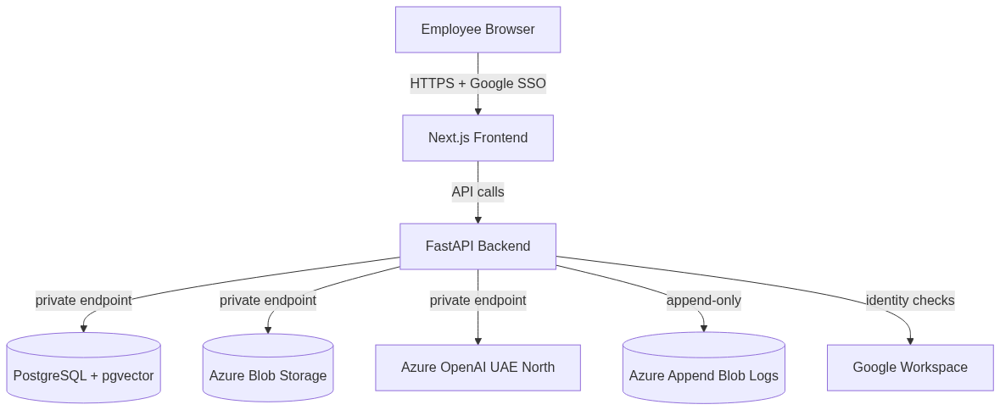

<details>
<summary>Mermaid source</summary>

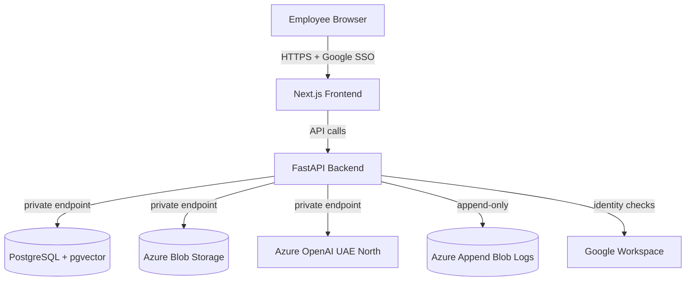

</details>

---

## 12. Team Structure & Relevant Experience

### 12.1. Team Structure

| Role | Person | Responsibilities |
|---|---|---|
| **Lead Developer** | Igor Kan | Full-stack development (Python backend + React/Next.js frontend + RAG pipeline), architecture design, Azure deployment, project management |
| **Aurora Stakeholders** | Aurora CEO + Senior Tax Managers | Requirements validation, UAT testing, knowledge base content, weekly feedback |

This is a lean, efficient team. The project does not require a large team because:
- A working prototype is **already built and tested**
- Modern AI-powered development workflows accelerate coding significantly
- The tech stack (FastAPI + Next.js + PostgreSQL) is mature and well-documented

### 12.2. Relevant Experience

| Project | Relevance |
|---|---|
| **Aurora AI Assistant prototype** | The current project. Backend (FastAPI, 5+ API endpoints), RAG pipeline (LlamaIndex + pgvector), Next.js frontend with chat/admin/audit views, 7 automated tests — all functional today. |
| **AI-powered applications** | Experience building LLM-powered tools with RAG pipelines, vector databases, prompt engineering, and secure API integrations. Familiar with Azure OpenAI, Google Cloud AI, and Anthropic Claude APIs. |

### 12.3. Current Prototype Status

| Component | Status |
|---|---|
| FastAPI backend (5+ API endpoints) | ✅ Working |
| LlamaIndex RAG pipeline | ✅ Functional |
| PostgreSQL + pgvector database | ✅ Working (Docker) |
| Next.js frontend (chat + admin + audit views) | ✅ Working |
| Google Workspace SSO authentication | ✅ Working |
| RBAC (5 roles with persistent users) | ✅ Working |
| Escalation guardrails (sensitive topics) | ✅ Working |
| Audit logging | ✅ Working |
| Source citation display | ✅ Working |
| Confidence scoring | ✅ Working |
| Feedback system (thumbs up/down) | ✅ Working |
| 7 automated tests | ✅ Passing |
| Dockerfiles (frontend + backend) | ✅ Created |
| docker-compose.yml | ✅ Created |

> **We are NOT starting from zero.** A working prototype exists. What remains is: Azure OpenAI credentials, loading the actual 50–80 document knowledge base, security hardening, production deployment to Azure UAE North, and documentation.

---

## 13. Contract Terms

| Term | Details |
|---|---|
| **IP Ownership** | Aurora owns 100% of the source code, documentation, and all project deliverables upon final payment. Full rights to modify, extend, or migrate to another developer at any time. |
| **NDA** | Mutual NDA to be signed before any client data, internal documents, or Aurora-specific processes are shared. |
| **Payment Schedule** | **30% upfront** ($201) at project start / **30% at MVP delivery** ($201) / **40% at final launch** ($268) |
| **Post-Launch Support** | 2–3 months included (bug fixes, minor adjustments, knowledge base update assistance, monitoring). |
| **Source Code Delivery** | Full source code delivered via **private GitHub repository**. Aurora is added as owner. |
| **Change Requests** | Scope changes beyond this proposal will be estimated and agreed upon separately before implementation. |
| **Communication** | Weekly progress demos + async updates via agreed channel (Telegram/Email/Google Meet). |

### Payment Schedule Visualization

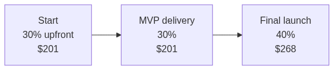

<details>
<summary>Mermaid source</summary>

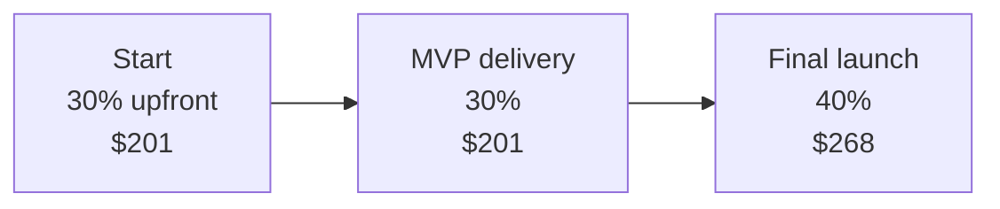

</details>

---

## 14. Next Steps

To proceed, we need from Aurora:

| # | Action Item | Who | When |
|---|---|---|---|
| 1 | ✅ **Approve proposal** and confirm budget ($670 Phase 1) | Aurora CEO | ASAP |
| 2 | 📋 **Sign mutual NDA** | Both parties | Before document sharing |
| 3 | 📄 **Provide knowledge base documents** — the initial 50–80 PDFs/DOCXs | Aurora team | Week 1 |
| 4 | ☁️ **Azure subscription** — Aurora provides or we set up jointly (Azure OpenAI UAE North access approval takes 3–5 business days) | Aurora / Igor | Week 1 |
| 5 | 👥 **User list** — names, Google emails, and roles for the initial 15–17 staff | Aurora admin | Week 2 |
| 6 | 📝 **Escalation topics list** — which queries should always route to Tax Manager | Aurora CEO + Tax Managers | Week 2 |
| 7 | 🗓️ **Schedule weekly demos** — 30-minute meeting every Friday or Monday | Both parties | Week 1 |

> **We are ready to begin immediately upon approval.**

---

*This proposal is confidential and prepared for Aurora Tax Agency's internal evaluation only.*
*© 2026 Igor Kan. All rights reserved until transfer of IP upon completion.*
