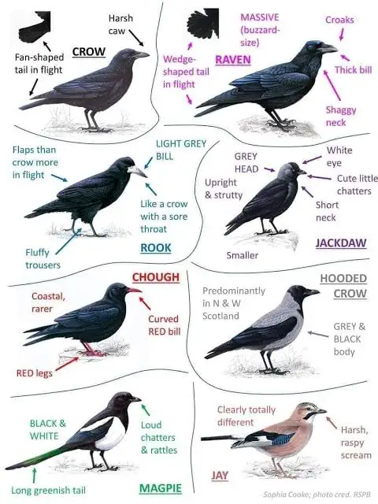
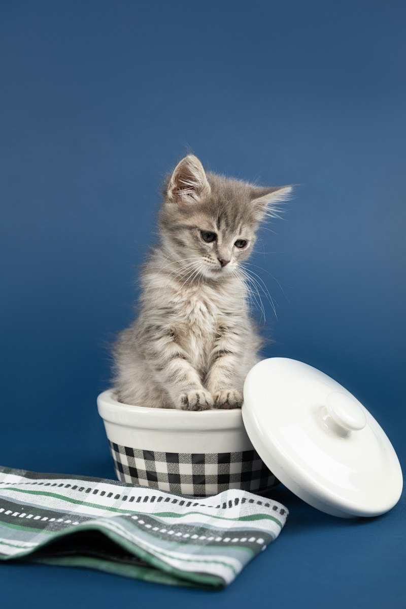
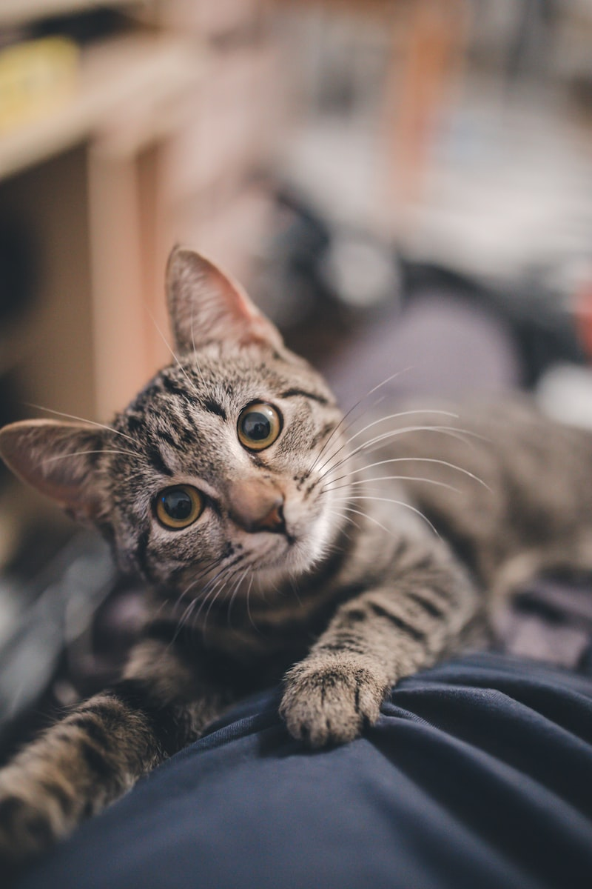
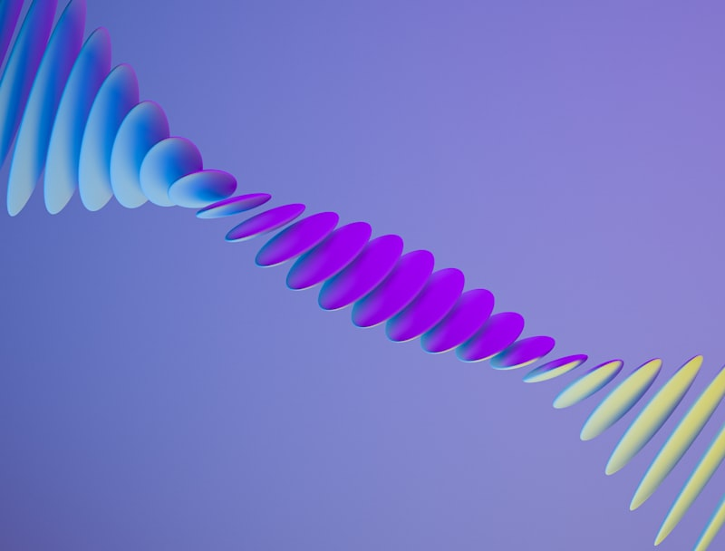
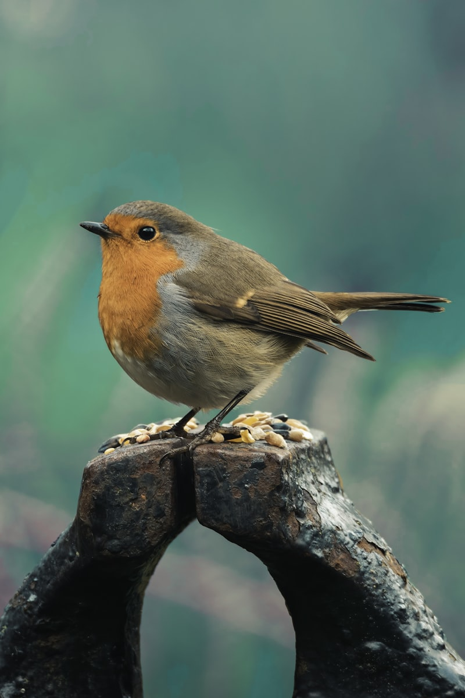
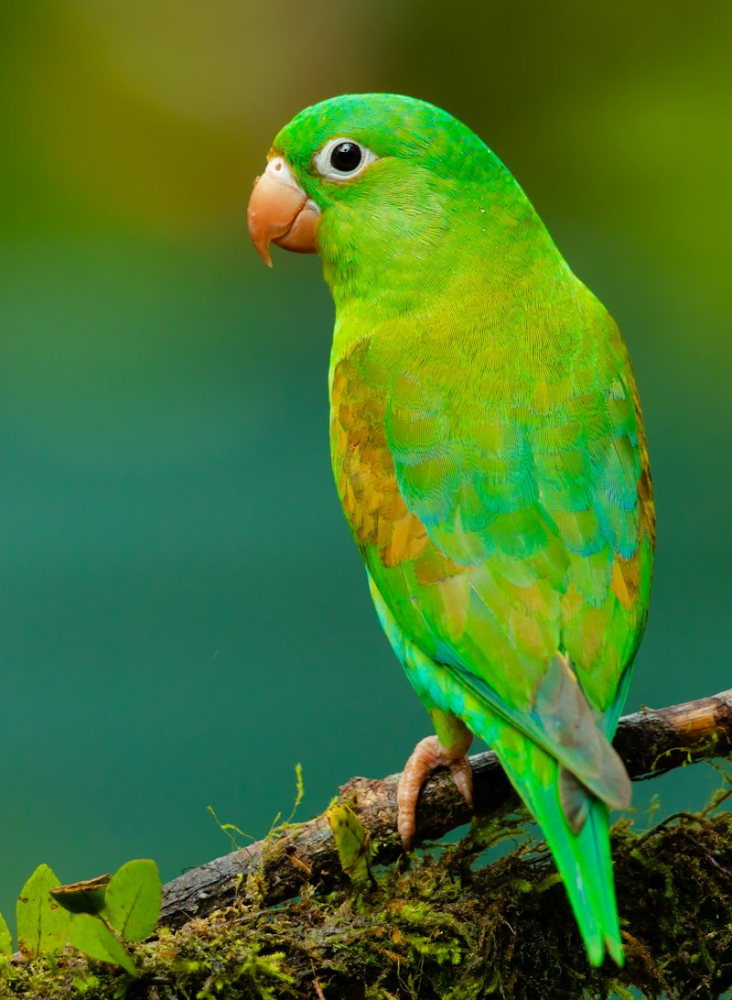

::: {.callout-note}
### Linguistic Companion Article
For the companion philological taxonomy examining adjectives, nouns, and registers of intellect—including the etymological origins and linguistic misuse of *birdbrain*, *dunce*, and *polymath*—see [The Spectrum of Intellect: A Ranked Lexicon from Birdbrain to Polymath](the-spectrum-of-intelligence-lexicon.qmd).
:::

## 1. Introduction: Deconstructing the Metric of Mind

For centuries, Western philosophy and classical biology evaluated intelligence through a linear, anthropocentric prism—an unbroken *Scala Naturae* ascending from inanimate matter through "lower" beasts to humankind. Under this naive Cartesian rubric, birds were relegated to the status of unthinking biological automata: fragile, instinct-driven creatures endowed with tiny craniums incapable of abstract contemplation.

This prejudice survived deep into the twentieth century, fossilized in colloquial insults such as *birdbrain*, *featherbrained*, and *dolt*. 

However, twenty-first-century cognitive ethology and comparative neuroanatomy have dismantled this assumption. Intelligence is not a monolithic scalar variable ($g$ factor); rather, it is a high-dimensional evolutionary vector comprising:
1. **Causal Reasoning & Spontaneous Tool Fabrication**: The ability to infer physical properties and manufacture multi-stage implements without trial-and-error conditioning.
2. **Episodic Memory & "Mental Time Travel"**: The capacity to consciously recall *what*, *where*, and *when* an event transpired, alongside future-oriented planning.
3. **Social Metacognition & Theory of Mind**: Predicting the perceptual perspectives, deceptive intents, and knowledge states of conspecifics.
4. **Symbolic Communication & Referential Semantics**: Encoding abstract concepts, numbers, and categories into compositional signals.
5. **Sensorimotor Embodiment & Dynamic Feedback**: Real-time closed-loop control through unstructured physical environments.

When benchmarked across these axes, avian species—specifically the **Corvidae** (crows, ravens, magpies, jays) and **Psittaciformes** (parrots)—rival or surpass non-human primates and cetaceans. Furthermore, comparing these biological minds against artificial neural networks and modern robotics illuminates profound paradoxes regarding energy, embodiment, and general intelligence.

---

## 2. Avian Field Identification: Diagnostic Traits & Cognitive Profiles

To understand avian cognition, one must first be able to distinguish species in the field. Below is a diagnostic guide to key cognitive heavyweights, featuring anatomical markers, vocalizations, behavioral signatures, and the evolutionary lineage of the Corvidae.

### The Corvidae Lineage

The family **Corvidae** comprises over 130 species distributed across every continent except Antarctica and the deep polar ice caps. Characterized by stout bills, powerful legs, robust flight morphology, and omnivorous dietary flexibility, corvids represent one of the most successful evolutionary radiations in the avian world.

{fig-align="center" width="85%"}

---

### Species Field Profiles & Empirical Cognitive Benchmarks

#### 1. Common Raven (*Corvus corax*)

{fig-align="center" width="75%"}

* **Morphological Identification**:
  * **Size**: Massive (wingspan 115–130 cm; length 56–69 cm).
  * **Diagnostic Silhouettes**: Prominent diamond- or wedge-shaped tail in flight; heavy, decurved culmen (upper bill); shaggy, elongated throat feathers (**hackles**) displayed during vocalizations.
  * **Vocal Profile**: Deep, guttural, resonant croak (*prruk-prruk*), hollow wooden knocking sounds, and liquid bell-like tones.
* **Range & Habitat**: Holarctic; tundra, cliffs, boreal forests, high deserts, and subalpine peaks.
* **Cognitive Signature**:
  * **String-Pulling Heuristics**: In laboratory trials, ravens confronted with food suspended on a dangling string will inspect the apparatus and perform a coordinated sequence—pulling the string with the bill, stepping on the loop with the foot, and repeating—to retrieve the reward on the very first attempt without trial-and-error motor learning.
  * **Conspecific Tactical Deception**: Ravens cache food only when out of sight of competitors. If observed by another raven during caching, they will return later in secret to unearth and re-cache the item elsewhere.

---

#### 2. American Crow (*Corvus brachyrhynchos*)

{fig-align="center" width="75%"}

* **Morphological Identification**:
  * **Size**: Medium (wingspan 85–100 cm; length 40–50 cm).
  * **Diagnostic Silhouettes**: Square-ended or gently rounded fan tail in flight; sleek, non-hackled throat; bill is slender and straight relative to the raven's arched bow.
  * **Vocal Profile**: Sharp, rhythmic, nasal cawing (*caw-caw-caw*); lacks the subterranean resonance of the raven.
* **Range & Habitat**: Ubiquitous across North America; agricultural fields, urban centers, deciduous woodlands.
* **Cognitive Signature**:
  * **Facial Recognition & Cultural Grudge Transmission**: In landmark studies at the University of Washington (Marzluff et al.), crows captured by researchers wearing specific rubber masks remembered the "dangerous" faces for over five years. Crucially, fledglings that had never witnessed the initial capture adopted the mobbing behavior, proving cross-generational social knowledge transmission.

---

#### 3. Eurasian Magpie (*Pica pica*)

{fig-align="center" width="75%"}

* **Morphological Identification**:
  * **Size**: Slender, medium-sized (wingspan 52–62 cm; length 44–46 cm, over half of which is tail).
  * **Diagnostic Silhouettes**: Deep emerald and midnight-blue structural iridescence on wings and tail; snowy-white belly and scapular patches; long, stepped, wedge-like tail trailing in undulating flight.
  * **Vocal Profile**: Harsh, rapid, chattering rattle (*chack-chack-chack-chack*).
* **Range & Habitat**: Across temperate Eurasia; open countryside, suburban parklands, hedgerows.
* **Cognitive Signature**:
  * **Mirror Self-Recognition (MSR)**: In 2008, Prior, Schwarz, and Güntürkün placed colored stickers on magpies in regions visible only in a mirror (the throat). Magpies inspected their reflections and made repeated, targeted scratching motions at their own bodies to remove the mark—making the Eurasian Magpie the first non-mammalian organism to pass the classic Gallupean mirror self-recognition test.

---

#### 4. Blue Jay (*Cyanocitta cristata*)

{fig-align="center" width="75%"}

* **Morphological Identification**:
  * **Size**: Small-to-medium corvid (wingspan 34–43 cm; length 25–30 cm).
  * **Diagnostic Silhouettes**: Pronounced crest on crown that raises or flattens based on arousal state; vivid cerulean blue upperparts contrasted with white underparts and a black collar encircling the throat.
  * **Vocal Profile**: Piercing bell-like calls (*jay! jay!*), harsh screams, and uncanny vocal mimicry of red-shouldered and red-tailed hawks used to disperse competitors from feeding stations.
* **Range & Habitat**: Eastern and Central North America; oak forests, suburbs, urban parks.
* **Cognitive Signature**:
  * **Spatial Memory & Forest Regeneration**: An individual Blue Jay caches between 3,000 and 5,000 acorns each autumn, meticulously selecting undamaged specimens and burying them under specific leaf litter coordinates. Their extraordinary spatial mapping is directly responsible for the rapid post-glacial dispersal of oak forests across North America.

---

#### 5. African Grey Parrot (*Psittacus erithacus*)

{fig-align="center" width="75%"}

* **Morphological Identification**:
  * **Size**: Medium parrot (wingspan 46–52 cm; length 33 cm).
  * **Diagnostic Silhouettes**: Scalloped pale grey mantle, stark white bare periophthalmic facial patch, hooked black bill, and vivid crimson-red tail.
  * **Vocal Profile**: Complex whistles, clicks, shrieks, and acoustic vocal imitation.
* **Range & Habitat**: Equatorial rainforests of Central and West Africa.
* **Cognitive Signature**:
  * **Abstract Conceptualization & Syntax**: Pioneered by Dr. Irene Pepperberg with the subject "Alex," African Grey parrots demonstrate understanding of abstract numerical concepts (including zero / "none"), categorical classification (color, shape, material), and syntactic combinations (*"want cork," "what shape four-corner?"*).

---

## 3. Avian Neuroanatomy: Why "Birdbrain" Is Anatomically Inverted

How can creatures with brains weighing 10 to 20 grams solve problems that confound dogs, cats, and human toddlers? The answer lies in microarchitecture rather than macrovolume.

```
       MAMMALIAN NEOCORTEX                    AVIAN TELENCEPHALIC PALLIUM
 ┌─────────────────────────────┐           ┌─────────────────────────────┐
 │  6-Layered Laminar Cortex   │           │   Dense Nuclear Clusters    │
 │                             │           │                             │
 │  Large soma size            │           │  Hyper-compact soma size    │
 │  Extensive myelinated axons │           │  Minimal axonal distance    │
 │  Lower neuron density       │           │  Ultra-high neuron density  │
 │  (~20,000–50,000 / mm³)     │           │  (~150,000–300,000 / mm³)   │
 └─────────────────────────────┘           └─────────────────────────────┘
```

### The Historical Error: Edinger's "Avian Striatum" Myth

In the late 19th century, German anatomist Ludwig Edinger applied an evolutionary timeline to brain morphology. Because the avian forebrain lacked the six-layered laminar neocortex of mammals, Edinger classified virtually the entire avian telencephalon as a hypertrophied **basal ganglia** (striatum)—a primitive, non-cortical substrate responsible only for instinctive, reflexive motor habits.

This catastrophic misnomer endured until 2004, when the **Avian Brain Nomenclature Consortium** published a historic overhaul in *Nature Neuroscience*. Modern molecular and immunohistochemical tracing proved that the avian forebrain is over **75% pallial**—the exact homologous structural equivalent of the mammalian neocortex, consisting of the *nidopallium*, *mesopallium*, and *hyperpallium*.

### The Olkowicz et al. (2016) Revolution: Forebrain Neuronal Packing

In 2016, a landmark paper by Olkowicz et al. in the *Proceedings of the National Academy of Sciences* (PNAS) utilized the isotropic fractionator method to count total neurons across avian and mammalian brains. The findings transformed comparative neuroscience:

1. **Massive Density Advantage**: Songbirds and parrots pack **200% to 400% more neurons per gram** of forebrain tissue than primates, rodents, or carnivores.
2. **Equivalent Primate Absolute Numbers**: A Common Raven brain contains approximately **1.2 to 2.2 billion total neurons**—roughly matching or exceeding that of a Capuchin monkey (*Cebus*) or a juvenile chimpanzee, despite the physical brain being a fraction of the mass.
3. **Conduction Velocity & Path Length Efficiency**: Because avian neurons are smaller, packed closer together, and unburdened by lengthy myelinated cables across large cortical folds, inter-neuronal communication distances are drastically shortened. This enables faster information processing and cognitive latency.

Biologically and computationally, the term *birdbrain* should denote an ultra-dense, energy-efficient, low-latency processing unit.

---

## 4. The Grand Taxonomic Hierarchy of Intelligence

Below is an empirical ranking of cognitive capacities across biological clades, humans, and synthetic computational architectures, evaluated across six core dimensions.

```
[ Tier 1: Homo sapiens ] ──────────────────────── Recursive Syntax, Culture, Math
             ↓
[ Tier 2: Cetaceans & Non-Human Great Apes ] ──── Spindle Neurons, Dialects, Tools
             ↓
[ Tier 3: Corvids & Psittacines ] ─────────────── Causal Multi-Stage Tools, MSR, Mental Time
             ↓
[ Tier 4: Cephalopods (Octopus, Cuttlefish) ] ─── Decentralized Ganglia, Camouflage Logic
             ↓
[ Tier 5: Social Mammals (Canines, Elephants) ] ─ Interspecies Gaze, Empathy, Mourning
             ↓
[ Tier 6: Collective & Swarm Organisms ] ──────── Symbolic Waggle Dance, Distributed Consensus
             ↓
[ Tier 7: Non-Neuronal Adaptive Systems ] ────── Network Optimization without Synapses
```

---

### Comparative Evaluation Matrix

| Taxon / Entity | Causal Tool Innovation | Episodic Memory & Planning | Social Theory of Mind | Symbolic Communication | Sensorimotor Control | Energetic Budget |
|:---|:---:|:---:|:---:|:---:|:---:|:---:|
| **Humans (*Homo sapiens*)** | ★★★★★ | ★★★★★ | ★★★★★ | ★★★★★ | ★★★★☆ | ~20 Watts |
| **Great Apes (Chimps, Bonobos)**| ★★★★☆ | ★★★★☆ | ★★★★☆ | ★★☆☆☆ | ★★★★☆ | ~15 Watts |
| **Cetaceans (Orcas, Dolphins)** | ★★★☆☆ | ★★★★☆ | ★★★★★ | ★★★☆☆ | ★★★★★ | ~25 Watts |
| **Corvids & Parrots** | ★★★★☆ | ★★★★☆ | ★★★★☆ | ★★★☆☆ | ★★★★★ | ~1–3 Watts |
| **Cephalopods (Octopus)** | ★★★☆☆ | ★★★☆☆ | ★☆☆☆☆ | ★★☆☆☆ | ★★★★★ | < 1 Watt |
| **Canines & Carnivores** | ★☆☆☆☆ | ★★☆☆☆ | ★★★★☆ | ★☆☆☆☆ | ★★★★☆ | ~5 Watts |
| **Eusocial Insects (Bees)** | ☆☆☆☆☆ | ★★☆☆☆ | ☆☆☆☆☆ | ★★★☆☆ | ★★★★★ | < 0.001 Watt |
| **Slime Mold (*Physarum*)** | ☆☆☆☆☆ | ★☆☆☆☆ | ☆☆☆☆☆ | ☆☆☆☆☆ | ★★☆☆☆ | Negligible |
| **Large Language Models** | ★★☆☆☆ | ★★☆☆☆ | ★★★☆☆ | ★★★★★ | ☆☆☆☆☆ | ~300+ Kilowatts |
| **Embodied Dynamic Robots** | ★☆☆☆☆ | ★☆☆☆☆ | ☆☆☆☆☆ | ★★☆☆☆ | ★★★★☆ | ~1–5 Kilowatts |

---

### Detailed Analysis of the Tiers

#### Tier 1: Humans (*Homo sapiens*)
* **Defining Cognitive Feats**: Recursive grammar, compositional symbolic mathematics, counterfactual simulations of unbounded depth, externalized cumulative culture (books, silicon, internet), and trans-generational transmission of technology.
* **Limitation**: Vulnerable to cognitive biases, narrative delusions, affective distortions, and catastrophic ideological lock-in.

#### Tier 2: Great Apes & Cetaceans
* **Great Apes (*Pan troglodytes*, *Pan paniscus*)**: Spontaneous modification of termite-fishing twigs, stone-hammer nut cracking, tactical alliance management, rudimentary mirror self-recognition, and intentional gestural communication.
* **Cetaceans (*Orcinus orca*, *Tursiops truncatus*)**: Possess von Economo neurons (spindle cells) in paralimbic zones at densities exceeding humans. Exhibit matrilineal pod dialects, long-range acoustic echolocation imaging, cooperative wave-washing hunting tactics, and multi-generational cultural traditions.

#### Tier 3: Corvids & Psittacines (The Avian Cognitive Apex)
* **New Caledonian Crow (*Corvus moneduloides*)**: Systematically manufactures barbed hooks from *Pandanus* leaves and bends wire into curved implements to extract hidden larvae from hollow wooden logs.
* **Clark's Nutcracker (*Nucifraga columbiana*)**: Buries up to **33,000 pine seeds** across a 200-square-kilometer mountain territory each autumn and successfully locates over 80% of them four to nine months later under heavy snowpack, relying on visual parallax and cognitive triangulation.
* **Scrub Jays (*Aphelocoma californica*)**: Demonstrate **mental time travel**. They cache perishable wax worms and non-perishable nuts. If allowed to recover food after a short delay, they choose the worms; after a long delay (when worms rot), they flexibly abandon the worms and recover the nuts.

#### Tier 4: Cephalopods (The Alien Mind)
* **Octopus (*Octopus vulgaris*, *Thaumoctopus mimicus*)**: Diverged from the vertebrate lineage 600 million years ago. Operates with roughly 500 million neurons, **two-thirds of which reside not in the brain, but inside the eight semi-autonomous arms**. Capable of unscrewing child-proof prescription jars, navigating complex mazes, dynamic real-time chromatic camouflage matching polarized light, and using discarded coconut halves as defensive bivalve shields.

#### Tier 5: Social Carnivores & Domesticates
* **Domestic Dogs (*Canis familiaris*)**: Evolutionary specialization through domestication has granted dogs an unrivaled capacity for **interspecific social referencing**. Dogs naturally comprehend human pointing gestures and gaze cues that chimpanzees and wolves fail to parse without extensive training.
* **Elephants (*Elephas maximus*, *Loxodonta africana*)**: Massive temporal lobes, lifelong matriarchal acoustic memory of hundreds of individuals, tool use (modifying branches to swat flies), mirror self-recognition, and ritualized mourning over the skeletal remains of deceased conspecifics.

#### Tier 6: Collective & Swarm Cognition
* **Honeybees (*Apis mellifera*)**: Possess fewer than one million neurons, yet execute Karl von Frisch's famous **waggle dance**—a symbolic, vector-based communicative code translating distance, angle relative to solar azimuth, and nectar quality into bodily vibrations. Swarms reach consensus on nest-site relocations via quorum sensing algorithms that mimic distributed neural threshold firing.

#### Tier 7: Non-Neuronal Adaptive Systems
* **Slime Mold (*Physarum polycephalum*)**: A giant single-celled syncytium with no nervous system whatsoever. In famous laboratory experiments by Tero et al. (Science, 2010), when oat flakes were arranged to represent Tokyo and its surrounding satellite cities, the slime mold's protoplasmic foraging network grew into a topological layout that matched the efficiency, fault tolerance, and cost of the multi-billion-dollar Tokyo subway rail network.

---

## 5. The Silicon Dimension: Biological Mind vs. Artificial Intelligence

Where do modern computational intelligences—Large Language Models (LLMs), Deep Reinforcement Learning (DRL), and Embodied Robotics—fit on this spectrum?

```
┌────────────────────────────────────────────────────────────────────────┐
│                        MORAVEC'S PARADOX (1988)                        │
│                                                                        │
│   "It is comparatively easy to make computers exhibit adult-level      │
│    performance on intelligence tests or playing checkers, and          │
│    difficult or impossible to give them the skills of a one-year-old   │
│    when it comes to perception and mobility."                          │
└────────────────────────────────────────────────────────────────────────┘
```

### The Triumphs and Pitfalls of Modern AI

1. **Superhuman Closed-World Formal Optimization**:
   * Systems like **AlphaZero** and **MuZero** solve game-theoretic environments (Chess, Go, Shogi, Atari) through Monte Carlo Tree Search and deep reinforcement learning, playing at levels far transcending all biological minds. Yet they possess zero cross-domain transfer: an AlphaZero model cannot recognize a bird, hold a conversation, or turn a door handle.
2. **The LLM Frontier (GPT-4, Claude, Gemini)**:
   * **Superhuman Strengths**: Near-instantaneous retrieval across trillions of tokens, multilingual translation, code synthesis, advanced mathematical proofs, and abstract pattern recognition.
   * **Biological Deficits**:
     * **Lack of Sensorimotor Grounding**: LLMs exist purely in an abstract symbolic token universe. They do not perceive gravity, friction, momentum, or physical space.
     * **No Continuous Episodic Memory**: Unless augmented with external vector databases, current transformer weights remain static once trained. An American crow continuously updates its internal map of dangerous humans every second; a raw LLM does not learn from its conversation unless context-injected.
     * **Susceptibility to Causal Hallucination**: An LLM can write an exquisite Shakespearean sonnet about a raven pulling a string, but can simultaneously fail basic physical common-sense tests regarding whether water will spill if a cup is tipped upside down.
3. **The Robotic Embodiment Gap (Moravec's Paradox)**:
   * While Boston Dynamics' humanoid robots can execute backflips and parkour through pre-mapped trajectory optimization, real-world general manipulation remains unsolved. A wild New Caledonian crow hopping across uneven, windblown tropical branches, inspecting tree bark, selecting a twig of exact tensile strength, modifying it with its beak, and wedging it into a fissure at precisely the correct fulcrum angle outperforms a multimillion-dollar industrial robot arm in mechanical adaptability.
4. **The Thermodynamic Disparity**:
   * The human brain operates continuously on **approximately 20 Watts** of metabolic energy.
   * A raven's brain operates on **under 2 Watts**.
   * Training a frontier foundation model requires **megawatts of electrical power**, millions of gallons of cooling water, and thousands of specialized H100 GPUs running for weeks.

---

## 6. Synthesis: The Plurality of Mind

The evolutionary radiation of intelligence reveals that human cognition is not the universal blueprint of consciousness, but merely one idiosyncratic architectural solution optimized for social hunting, tool manipulation, and symbolic language on the African savannah.

Nature has invented "mind" multiple independent times:
- In the **layered cortex of primates**;
- In the **nuclear pallium of corvids and parrots**;
- In the **distributed peripheral ganglia of the octopus**;
- And now, in the **matrix multiplications and self-attention heads of silicon arrays**.

To label someone a *birdbrain* is to demonstrate a profound ignorance of both biology and engineering. The next time you observe an American crow inspecting a crosswalk, waiting for traffic lights to stop cars before dropping a hard-shelled walnut under the tires, you are not observing a simple automaton—you are witnessing a compact, 2-Watt biological supercomputer forged by 66 million years of post-dinosaur avian evolution.

---

## 7. Scholarly References & Further Reading

1. **Olkowicz, S., Kocourek, M., Lučan, R. K., Porteš, M., Fitch, W. T., Herculano-Houzel, S., & Němec, P.** (2016). *Birds have primate-like numbers of neurons in the forebrain*. **Proceedings of the National Academy of Sciences (PNAS)**, 113(26), 7255–7260. [doi:10.1073/pnas.1517131113](https://doi.org/10.1073/pnas.1517131113).
2. **Emery, N. J., & Clayton, N. S.** (2004). *The mentality of crows: convergent evolution of intelligence in corvids and apes*. **Science**, 306(5703), 1903–1907. [doi:10.1126/science.1098410](https://doi.org/10.1126/science.1098410).
3. **Prior, H., Schwarz, A., & Güntürkün, O.** (2008). *Mirror-induced behavior in the magpie (Pica pica): evidence of self-recognition*. **PLoS Biology**, 6(8), e202. [doi:10.1371/journal.pbio.0060202](https://doi.org/10.1371/journal.pbio.0060202).
4. **Pepperberg, I. M.** (2002). *The Alex Studies: Cognitive and Communicative Abilities of Grey Parrots*. Harvard University Press.
5. **Birch, J., Burn, C., Schnell, A., Browning, H., & Crump, A.** (2020). *Dimensions of animal consciousness*. **Trends in Cognitive Sciences**, 24(10), 789–801. [doi:10.1016/j.tics.2020.07.007](https://doi.org/10.1016/j.tics.2020.07.007).
6. **Moravec, H.** (1988). *Mind Children: The Future of Robot and Human Intelligence*. Harvard University Press.
7. **Marzluff, J. M., Walls, J., Cornell, H. N., Withey, J. C., & Craig, D. P.** (2010). *Lasting recognition of threatening people by wild American crows*. **Animal Behaviour**, 79(3), 699–707.
8. **Tero, A., Takagi, S., Saigusa, T., Ito, K., Bebber, D. P., Fricker, M. D., Yumiki, K., Kobayashi, R., & Nakagaki, T.** (2010). *Rules for biologically inspired adaptive network design*. **Science**, 327(5964), 439–442. [doi:10.1126/science.1177894](https://doi.org/10.1126/science.1177894).
