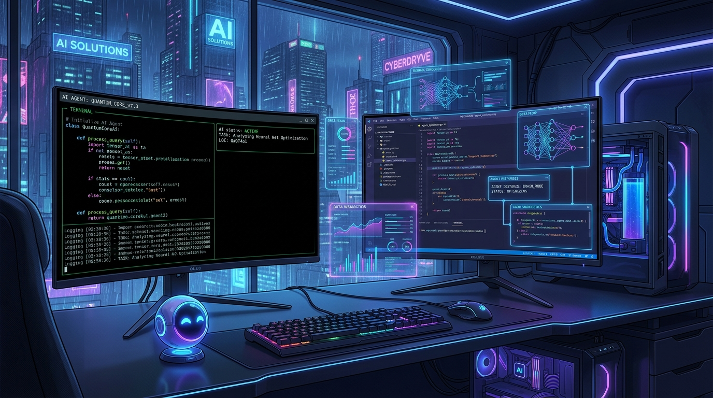

**Google Antigravity (AGY)** is an AI-first software development platform designed to seamlessly pair human developers with autonomous coding agents. Whether running as a lightweight command-line tool (`agy`) or operating inside the full-featured **Antigravity IDE & 2.0 GUI**, mastering AGY will boost your agentic coding workflows.

This guide covers session management, terminal CLI operations, keybindings, GUI navigation, slash commands, and advanced productivity tips.

---

## 1. Session Management: Creating, Clearing, & Deleting Sessions

AGY maintains agent sessions in isolated local workspace directories. Knowing how to reset, resume, or permanently purge these sessions is key to maintaining clean agent states.

### A. How AGY Sessions Are Stored
Session state, transcripts, background task outputs, subagent logs, and generated artifacts are stored locally on your machine at:

$$\text{Session Directory} = \verb|~/.gemini/antigravity-cli/brain/<conversation-id>/|$$

* `transcript.jsonl`: Token-efficient, line-by-line log of all user inputs and agent actions.
* `transcript_full.jsonl`: Untruncated detailed conversation history.
* `scratch/`: Persistent directory for temporary scripts, debug outputs, and transient files.

---

### B. Managing Sessions in the CLI (`agy`)

| Action | Command / Method | Description |
| :--- | :--- | :--- |
| **In-Session Reset** | `/clear` or `/reset` | Clears current context window in interactive mode without quitting `agy`. |
| **Start New Session** | `agy` | Spawns a fresh session without continuing previous history. |
| **New Project Context**| `agy --new-project` | Forces AGY to treat the current session as a brand-new project context. |
| **Resume Latest** | `agy -c` or `agy --continue` | Resumes the most recently active conversation session. |
| **Resume Specific ID** | `agy --conversation <ID>` | Re-attaches to a specific historical conversation by its ID string. |

---

### C. Deleting Session Files from Disk

If you need to permanently purge session data, history, or artifacts:

```bash
# Delete a specific session by conversation ID
rm -rf ~/.gemini/antigravity-cli/brain/<conversation-id>

# Purge all stored session history and logs
rm -rf ~/.gemini/antigravity-cli/brain/*
```

---

### D. Managing Sessions in the GUI (Antigravity IDE & App 2.0)

* **Start New Chat:** Click the **+ New Chat** button in the sidebar or press `Ctrl + N` (`Cmd + N` on macOS).
* **Delete Session:** Hover over a conversation item in the history sidebar, click the three-dot menu `...` or trash icon, and choose **Delete Session**.
* **Switch Sessions:** Click on any past entry in the sidebar timeline to instantly restore its context, artifacts, and terminal history.

---

## 2. Command Line Interface (`agy`) Reference

The `agy` CLI is built for rapid, terminal-bound iteration. It utilizes a robust Terminal User Interface (TUI) with standard command-line editing shortcuts.

### A. CLI Keybindings & Shortcuts (TUI Mastery)

When typing a prompt in the interactive `agy` CLI, you can use these shortcuts to navigate and edit text rapidly:

* **`Ctrl + U` (Erase Prompt):** Instantly clears the entire line before the cursor. Use this to quickly erase the current prompt you are typing and start over.
* **`Ctrl + C` (Cancel/Interrupt):** Stops the agent if it is currently generating a response. If you are typing a prompt, it will discard the current prompt line.
* **`Ctrl + D` (Exit):** Quits the `agy` CLI session completely.
* **`Ctrl + L` (Clear Screen):** Clears the terminal screen for a cleaner workspace (doesn't delete conversation history).
* **`Ctrl + W` (Delete Word):** Deletes the word immediately before the cursor.
* **`Ctrl + A` / `Home`:** Move the cursor to the beginning of the prompt.
* **`Ctrl + E` / `End`:** Move the cursor to the end of the prompt.
* **`Up / Down Arrows`:** Navigate through your prompt history to recall and re-run previous inputs.

### B. Key CLI Flags & Subcommands

```bash
# Launch interactive CLI with specific reasoning effort (low | medium | high)
agy --effort high

# Run in non-interactive print mode (execute a single prompt and output response)
agy -p "Fix the linting errors in src/main.py and run pytest"

# Add multiple workspace directories to the active agent context
agy --add-dir /path/to/repo-a --add-dir /path/to/repo-b

# List available subcommands, models, and installed plugins
agy models
agy plugins
agy agent
```

### C. The `--dangerously-skip-permissions` Flag

By default, AGY operates safely by pausing and asking for user permission before executing terminal commands or modifying critical files. 

If you are running AGY in an automated pipeline (e.g., CI/CD) or fully trust the agent in a sandbox environment, you can use the `--dangerously-skip-permissions` flag:

```bash
agy --dangerously-skip-permissions -p "Install all npm dependencies and build the production bundle"
```

**⚠️ Warning:** As the name implies, this flag gives the agent full autonomy to execute arbitrary shell commands and write files without human review. Use with caution.

---

## 3. Essential Slash Commands

Slash commands provide high-level shortcuts within both the CLI prompt and GUI chat input:

```
+-------------------+-------------------------------------------------------------------------+
| Slash Command     | Workflow Description                                                    |
+-------------------+-------------------------------------------------------------------------+
| /clear or /reset  | Resets active turn history while preserving project rules and settings.  |
| /goal             | Triggers long-running, autonomous execution until the target is met.    |
| /plan             | Generates a structured multi-step execution plan before editing code.   |
| /grill-me         | Conducts an interactive developer interview to refine unclear specs.    |
| /schedule         | Schedules background timers or recurring cron triggers for tasks.       |
| /learn            | Distills recent agent fixes or custom setups into persistent rules.     |
+-------------------+-------------------------------------------------------------------------+
```

---

## 4. Antigravity GUI & IDE Features

The **Antigravity 2.0** desktop application and IDE offer a visual canvas tailored for complex web applications and multi-agent coordination.

### Key GUI Panes & Workflows

1. **Chat Canvas & Inline Lenses:** View agent reasoning, Markdown artifacts, code diffs, and interactive carousels in real time.
2. **Subagents Panel:** Monitor background subagents spawned by `invoke_subagent`. Observe isolated conversations and exchange messages asynchronously.
3. **Background Tasks & Terminals:** Track background process execution (e.g. `npm run dev`, `cargo watch`) without locking your chat input.
4. **Artifact Preview:** View generated HTML/JS web apps, rendered Mermaid diagrams, and formatted report documents directly inside the UI.

---

## 5. Pro Tips & Best Practices

> [!TIP]
> **Use Subagents for Parallel Tasks**
> Delegate heavy refactoring, web searches, or documentation audits to background subagents. This keeps your main conversation clean and responsive.

> [!IMPORTANT]
> **Workspace Rules (`.gemini/rules/`)**
> Define project-specific guidelines by creating `.md` files in `.gemini/rules/` within your workspace root. AGY automatically incorporates these rules into every session turn.

> [!NOTE]
> **Non-Blocking Background Commands**
> When launching long-running processes or servers via CLI, allow AGY to send them to the background. The reactive notification engine will alert you upon process completion.

---

## Summary Cheat Sheet

* **Erase Prompt & Start Over:** `Ctrl + U`
* **Clear active turn context:** `/clear`
* **Resume last CLI session:** `agy -c`
* **Purge session storage:** `rm -rf ~/.gemini/antigravity-cli/brain/<ID>`
* **Run single non-interactive task:** `agy -p "your prompt"`
* **Auto-approve tool execution:** `agy --dangerously-skip-permissions`
