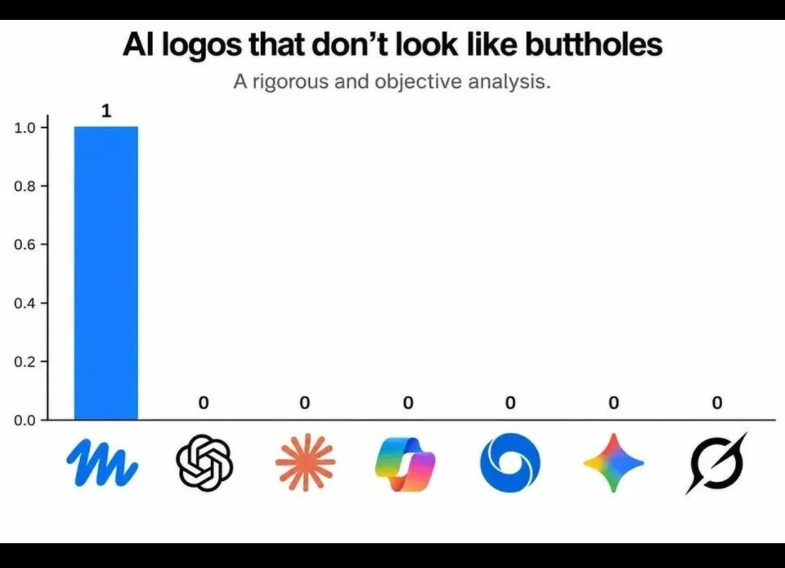

## 1. The Paradigm Shift: From Chatbots to Agentic Harnesses

Most software engineers and technical operators interact with large language models (LLMs) through a web browser chat window. While convenient for quick questions, this conversational paradigm represents the lowest-leverage way to use modern frontier models. 

When you type into a web UI, you face severe limitations:
* **Manual Context Ingestion:** You must manually copy-paste snippets, losing project structure, AST relationships, and git history.
* **Passive Generation:** The model generates markdown text, leaving you to manually paste it into your editor, run the compiler, interpret the error, and paste it back.
* **Ephemeral State:** Web sessions lack version control, reproducible flags, and seamless integration into Unix pipelines.

To unlock true productivity, we must distinguish between three distinct tiers of AI tooling:

```
[ Tier 1: Chatbots ]           --> Web UIs (ChatGPT, Claude.ai, Gemini Web)
        │
[ Tier 2: CLI Harnesses ]      --> Headless stdin/stdout tools (Aider, Claude Code, agy CLI)
        │
[ Tier 3: Autonomous Agents ]  --> Tool-augmented ReAct loops with persistent workspace authority
```

High-velocity engineering lives in **Tiers 2 and 3**.

---

## 2. Advanced Prompting Strategies and Tactical Patterns

The phrase "prompt engineering" often gets dismissed as superstitious incantation. In reality, effective prompting is simply **writing unambiguous technical specifications under finite attention constraints**.

### A. Context Bounding and the Attention Budget
LLMs do not read text linearly; they attend across tokens using self-attention mechanisms. When you saturate a context window with thousands of lines of irrelevant boilerplate, the model's retrieval accuracy degrades (the "needle in a haystack" phenomenon).

* **Rule of Minimal Sufficient Context:** Feed only the interfaces, signatures, relevant test cases, and immediate dependencies. Use tools like `ripgrep` and AST parsers to slice out exact function definitions before prompting.
* **Systematic Role & Output Constraints:** Define explicit bounds. Never say *"make it good."* Say: *"Refactor `process_stream()` in `stream.py` to use asynchronous generators. Preserve all existing docstrings. Return only the unified diff."*

### B. Structural XML / Markdown Framing
Frontier models (especially Anthropic's Claude and Google's Gemini) respond exceptionally well to structured tags. Wrapping distinct operational layers in XML tags prevents instructions from bleeding into data:

```xml
<context>
We are refactoring an asynchronous pipeline using Python 3.11 and asyncio.
Existing unit tests are located in tests/test_pipeline.py.
</context>

<rules>
- Do not introduce external dependencies outside the standard library.
- Ensure all coroutines handle asyncio.CancelledError cleanly.
- Target latency: under 5ms per event.
</rules>

<code_to_refactor>
...
</code_to_refactor>
```

### C. The "Grill-Me" (Socratic Inversion) Tactic
When facing an underspecified architectural problem, do not ask the model to generate the architecture immediately. Invert the responsibility:

> *"I want to design an event-driven cache invalidation pipeline for our PostgreSQL read replicas. Before writing any code or architecture documents, interview me. Ask me 3 to 5 targeted, highly critical questions about throughput, consistency guarantees, failure modes, and deployment constraints. Do not proceed until I answer."*

This forces the model to discover edge cases you overlooked, preventing hundreds of lines of hallucinated or incompatible architecture.

### D. Chain-of-Thought Scratchpads
For complex algorithmic or mathematical tasks, force the model to decouple reasoning from code generation. Instruct the model to reason inside `<thinking>` tags before outputting any code or conclusion. This allocates computational tokens specifically to the planning phase.

---

## 3. The Power of Terminal AI: CLI Harnesses and Unix Integration

Integrating AI into the command line transforms LLMs into composable Unix utilities. 

### Why the CLI Dominates the Browser
1. **Piping and Streaming:** You can pipe compiler outputs, logs, and `git diff` streams directly into an LLM harness (`git diff | llm "summarize breaking API changes"`).
2. **Deterministic Workspace Access:** CLI tools can inspect filesystems, run linters, execute unit tests, and review diffs without manual intervention.
3. **Headless & Scriptable:** Terminal agents can run unattended in CI/CD pipelines, nightly cron jobs, or batch refactoring scripts.

### Prominent CLI Tooling Landscape
* **Aider (`aider`):** Excellent terminal-based pair programming tool. It builds an in-memory repository map using tree-sitter, automatically commits changes with descriptive git messages, and iterates against linter feedback.
* **Claude Code / Anthropic CLI:** Tailored for deep codebase reasoning, tool execution, and extended architectural tasks.
* **Antigravity CLI (`agy`):** A multi-agent command-line harness featuring custom skills, subagent orchestration, and reactive background timers.
* **GitHub Copilot CLI / Kimi CLI / Gemini CLI:** Lightweight terminal companions designed for quick command synthesis, shell explanations, and rapid inline fixes.

---

## 4. Agentic AI and Provider Architectural Differences

Agentic AI extends beyond static question-and-answer exchanges into dynamic **ReAct (Reason + Act)** execution loops:

$$\text{User Objective} \longrightarrow \left[ \text{Thought} \longrightarrow \text{Tool Call} \longrightarrow \text{Environment Execution} \longrightarrow \text{Observation} \right]^* \longrightarrow \text{Final Synthesis}$$

An agent has the autonomy to read a file, discover an error, execute a shell command to verify the error, rewrite the code, re-run the test suite, and iterate until the tests pass.

### Provider Strengths & Workflow Nuances

| Provider / Model Family | Primary Superpower | Best Used For | Architectural Nuances |
| :--- | :--- | :--- | :--- |
| **Anthropic (Claude 3.7 Sonnet / 3.5)** | Surgical code refactoring, extended thinking, instruction fidelity | Core engineering, multi-file codebase refactors, strict rule adherence | Exceptional at following complex negative constraints and architectural guardrails without drift. |
| **Google (Gemini 2.5 / 3.x Flash & Pro)** | 1M–2M+ token context window, native multimodality, raw speed | Ingesting entire codebases, video/audio transcripts, massive log analysis | Lightning-fast inference speeds; handles comprehensive repository dumps in a single prompt. |
| **OpenAI (GPT-4o, o1, o3-mini)** | Deep mathematical proofing, competitive programming logic | Complex algorithmic proofs, pure logic puzzles, system architecture | Reasoning models (`o1`/`o3`) spend internal compute exploring search trees before returning results. |
| **Open-Source / Local (DeepSeek R1, Llama 3)** | Sovereign computation, zero API cost, data privacy | Offline operations, sensitive corporate code, high-volume automated scrubbing | Can be fine-tuned or hosted locally on hardware via Ollama or vLLM without egress risk. |

---

## 5. Drawbacks, Pitfalls, and the Trap of AI Homogenization

Despite the immense power of agentic tools, uncritical reliance on AI introduces profound engineering and cultural risks.

### The Technical Pitfalls
* **Hallucination of Plausible Bullshit:** Models optimize for token probability, not factual truth. An LLM will invent nonexistent library flags or deprecated API endpoints with supreme confidence.
* **Sycophancy and Flattery:** LLMs are trained via RLHF to be polite and agreeable. If you propose an architectural anti-pattern, the model will often validate your terrible idea rather than challenging you.
* **Erosion of Mechanical Sympathy:** Relying on AI to generate boilerplate without understanding the underlying POSIX calls, memory allocations, or network sockets leads to fragile, unmaintainable systems.

### The Visual & Intellectual Monoculture: "The Sphincter Phenomenon"

The pitfalls of AI are not merely technical—they are cultural. When organizations rush to adopt AI without critical discernment, they fall prey to **homogenization and cognitive conformity**.

A hilarious and damning illustration of this phenomenon recently swept through design circles: almost every major AI startup and corporate lab ended up with nearly identical, generic, radial vortex branding:



*For those interested in exploring this corporate design fiasco further, see the original exposé on [Velvet Shark: AI Company Logos That Look Like Buttholes](https://velvetshark.com/ai-company-logos-that-look-like-buttholes).*

As the article hilariously documents, dozens of multi-million-dollar AI companies independently converged on the exact same generic swirling aperture, radial spiral, or undulating organic ring. When everyone uses the same tools, follows the same corporate focus-group instincts, and optimizes for vague "futurism," they end up designing something indistinguishable from a biological sphincter.

### The Broader Metaphor for Software Engineering
This design blunder serves as a potent cautionary tale for software developers:

1. **AI Boilerplate is the Logo of Code:** If you prompt an LLM without strict taste, architectural principles, and personal vision, it will generate the software equivalent of a generic radial logo—mediocre, bloated, cookie-cutter code that looks vaguely modern but possesses no soul, resilience, or efficiency.
2. **The Loss of Distinct Perspective:** In an ecosystem flooded with synthetic content and automated PRs, **human taste, rigorous skepticism, and original thought are your only defensible moat**. 
3. **Praise the Outliers, Question the Crowd:** Just as we must admire human excellence and reject intellectual envy, we must also reject the uncritical herd mentality that mistakes generic AI outputs for genuine mastery.

---

## 6. Practical Blueprint for an Elite Daily AI Workflow

To operate at the highest echelon of modern engineering:

1. **Draft the Spec First:** Use human reasoning to outline what you are building. Use Socratic prompting ("Grill-me") to expose edge cases.
2. **Write the Failing Test:** Write an explicit, automated test that proves the feature is broken or nonexistent.
3. **Deploy the Agent in the Terminal:** Point an agentic CLI (such as Claude Code, Aider, or Antigravity) at the workspace. Let the agent inspect the codebase, make atomic edits, and run the test suite in a closed loop until green.
4. **Audit Every Diff with Paranoia:** Never blindly accept an agent's git commit. Inspect the diff line-by-line. Check for performance regressions, subtle logic inversions, and unnecessary dependencies.
5. **Preserve Human Discernment:** Treat the model as a relentless, tireless junior developer with encyclopedic memory but zero intuition. You are the lead architect.

---
© 2026 Igor Kan
