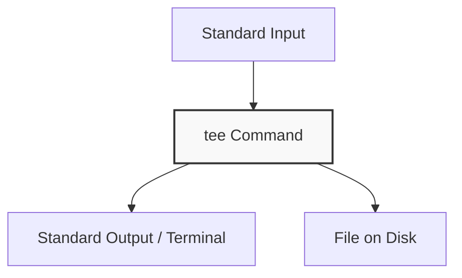

Unix-like operating systems are packed with small, single-purpose command-line tools. When combined, these utilities form a highly flexible scripting environment. 

In this guide, we will master **`curl`** (for making network requests), **`tee`** (for splitting output streams), and other core tools like **`xargs`** and **`find`** that are essential for command-line efficiency.

---

### 1. Network Requests with `curl`

`curl` (Client URL) is a tool used to transfer data to or from a server using supported protocols (such as HTTP, HTTPS, FTP, etc.). It is widely used for debugging APIs, downloading files, and testing network endpoints.

#### Making a Basic GET Request
By default, `curl` prints the response body of a request directly to the terminal screen (`stdout`):
```bash
curl https://api.github.com/zen
```

#### Downloading Files (`-o` and `-O`)
* **`-o <filename>`:** Saves the downloaded resource under a custom filename.
  ```bash
  curl -o output.html https://example.com
  ```
* **`-O` (Uppercase O):** Saves the file using its remote filename.
  ```bash
  curl -O https://releases.ubuntu.com/24.04/ubuntu-24.04-desktop-amd64.iso
  ```

#### Sending POST Requests (`-d` / `--data`)
To send data to an endpoint (like a REST API), use the `-d` flag. This automatically changes the request method from GET to POST:
```bash
curl -d '{"username":"admin", "role": "developer"}' \
     -H "Content-Type: application/json" \
     https://httpbin.org/post
```

#### Custom Headers (`-H` / `--header`)
Add custom headers for authentication or content-type specification:
```bash
curl -H "Authorization: Bearer YOUR_TOKEN_HERE" https://api.github.com/user
```

#### Following Redirects (`-L` / `--location`)
By default, `curl` does not follow HTTP redirects (301 or 302 status codes). Use `-L` to follow them automatically:
```bash
curl -L http://github.com  # Redirects to https://github.com
```

#### Inspecting Headers and Debugging (`-I` and `-v`)
* **`-I` (Uppercase i):** Fetch only the HTTP response headers (GET method becomes HEAD).
  ```bash
  curl -I https://example.com
  ```
* **`-v` (Verbose):** Prints complete debug logs including TLS handshakes, request headers, and response status.
  ```bash
  curl -v https://example.com
  ```

---

### 2. Splitting Streams with `tee`

`tee` is named after the T-splitter used in plumbing. It reads from standard input (`stdin`) and writes to both standard output (`stdout`) **and** one or more files simultaneously.



#### Basic Usage
Print command output to the screen *and* save it to a file:
```bash
ls -la | tee file_list.txt
```

#### Appending Output (`-a` / `--append`)
By default, `tee` overwrites the destination file. Use `-a` to append text to the end of the file instead:
```bash
echo "Session Log Start" | tee -a log.txt
```

#### The Classic Sysadmin Trick: Writing with `sudo`
Standard output redirection (`>`) is handled by the shell itself, not the command. This means running `sudo echo "nameserver 1.1.1.1" > /etc/resolv.conf` will **fail** because your shell does not have permission to write to `/etc/resolv.conf`, even though the `echo` command was run with `sudo`.

To solve this, use `tee` combined with `sudo`:
```bash
echo "nameserver 1.1.1.1" | sudo tee /etc/resolv.conf
```
Since `tee` runs as a process, launching it with `sudo` gives it permission to write directly to protected system files.

---

### 3. Other Essential CLI Commands

#### Utility A: `xargs` (Build and Execute Commands)
`xargs` reads items from standard input (delimited by blanks or newlines) and executes a command using those items as arguments.

```bash
# Find all .tmp files and delete them in one go
find . -name "*.tmp" | xargs rm
```
*Why use `xargs`?* If you find 1,000 files, `xargs` gathers them and runs `rm file1 file2 ... file1000` as a single process, rather than launching 1,000 individual `rm` processes.

#### Utility B: `find` (Search Filesystem)
`find` searches directory trees recursively for files matching specific criteria.

```bash
# Find files by name (case-insensitive)
find /home -iname "*.config"

# Find only directories modified in the last 24 hours
find . -type d -mmin -1440
```

#### Utility C: `tar` (Tape Archive)
`tar` is used to pack or unpack file archives.

* **Create a Compressed Archive (`-czvf`):**
  ```bash
  # c = create, z = gzip compress, v = verbose progress, f = archive file name
  tar -czvf backup.tar.gz /path/to/folder
  ```
* **Extract a Compressed Archive (`-xzvf`):**
  ```bash
  # x = extract
  tar -xzvf backup.tar.gz -C /target/directory
  ```

---

### 4. Combining the Tools into Pipelines

By combining these utilities, you can write highly efficient one-liners:

#### Example: Download a JSON payload, pretty-print to terminal, log to disk, and parse out a token
```bash
curl -s -d '{"user":"test"}' https://httpbin.org/post | \
  tee request_log.json | \
  jq -r '.json.user'
```
1. **`curl -s`** fetches the payload silently.
2. **`tee request_log.json`** saves the exact response payload to disk while forwarding it down the pipeline.
3. **`jq`** parses the json and prints the `user` property raw to stdout.
