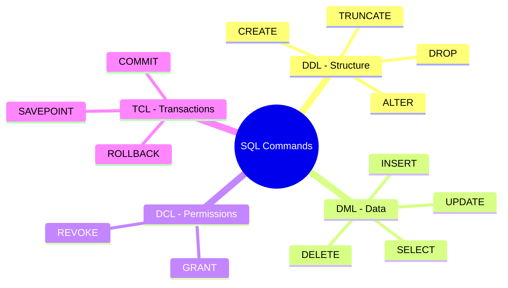

In the landscape of modern software, data is one of the most critical assets. To organize, store, and retrieve this data efficiently, relational database management systems (RDBMS) have been the industry standard for over four decades. 

At the center of these systems lies **SQL (Structured Query Language)**. This guide details SQL's architecture, sub-languages, core operations, and the key differences between popular database engines.

---

### 1. What is SQL?

SQL is a declarative programming language designed for managing data held in a Relational Database Management System (RDBMS). 

Unlike imperative programming (where you write code detailing *how* to perform a task), SQL is **declarative**: you specify *what* data you want, and the database engine's query optimizer decides the most efficient way (e.g., using indexes or table scans) to retrieve it.

In a relational database:
* Data is stored in **Tables** (Relations).
* Tables consist of **Rows** (Records) and **Columns** (Attributes).
* Tables are linked together using **Primary Keys** (unique identifiers) and **Foreign Keys** (references to primary keys in other tables).

---

### 2. The Four SQL Sub-Languages

SQL is divided into four distinct sub-languages, categorized by what the commands do:



#### A. DDL (Data Definition Language)
Used to define or modify the database schema and structure (tables, indexes, constraints).
* `CREATE`: Creates tables or databases.
* `ALTER`: Modifies an existing table structure.
* `DROP`: Deletes tables or databases completely.
* `TRUNCATE`: Empties all data inside a table but preserves the structure.

#### B. DML (Data Manipulation Language)
Used to query, insert, modify, and delete the actual records stored in tables.
* `SELECT`: Retrieves data from one or more tables.
* `INSERT`: Adds new rows.
* `UPDATE`: Modifies existing rows.
* `DELETE`: Removes rows.

#### C. DCL (Data Control Language)
Used to manage user permissions, security, and access controls.
* `GRANT`: Gives a user access privileges.
* `REVOKE`: Withdraws access privileges.

#### D. TCL (Transaction Control Language)
Used to manage transactions, ensuring data integrity via ACID properties.
* `COMMIT`: Saves all modifications made during the transaction permanently.
* `ROLLBACK`: Restores the database to its state before the transaction began.
* `SAVEPOINT`: Creates temporary checkpoints within a transaction to roll back to if needed.

---

### 3. Core SQL Operations (with Examples)

Here is a typical database scenario containing two tables: `users` and `orders`.

#### Table Creation (DDL)
```sql
CREATE TABLE users (
    id SERIAL PRIMARY KEY,
    name VARCHAR(100) NOT NULL,
    email VARCHAR(150) UNIQUE NOT NULL,
    created_at TIMESTAMP DEFAULT CURRENT_TIMESTAMP
);

CREATE TABLE orders (
    id SERIAL PRIMARY KEY,
    user_id INT REFERENCES users(id),
    amount DECIMAL(10, 2) NOT NULL,
    order_date DATE DEFAULT CURRENT_DATE
);
```

#### Inserting Records (DML)
```sql
INSERT INTO users (name, email) VALUES 
('Alice Smith', 'alice@example.com'),
('Bob Jones', 'bob@example.com');

INSERT INTO orders (user_id, amount) VALUES 
(1, 49.99),
(1, 150.00),
(2, 22.50);
```

#### Querying with Joins (DML)
To combine columns from both tables, we use a `JOIN`:
```sql
SELECT users.name, orders.amount, orders.order_date
FROM users
INNER JOIN orders ON users.id = orders.user_id
WHERE orders.amount > 30.00
ORDER BY orders.amount DESC;
```

#### Grouping and Aggregating Data
To find the total amount spent by each user:
```sql
SELECT users.name, SUM(orders.amount) AS total_spent
FROM users
LEFT JOIN orders ON users.id = orders.user_id
GROUP BY users.name
HAVING SUM(orders.amount) > 50.00;
```

---

### 4. Comparing SQL Dialects and Database Engines

Although SQL is standardized by ANSI/ISO, every major database engine implements its own features, syntax adjustments, and extensions (known as **dialects**).

#### A. PostgreSQL
* **Type:** Open-source Object-Relational Database.
* **Key Features:** Highly extensible, supports advanced indexing, JSON querying natively, window functions, and custom data types.
* **Best For:** Complex applications, GIS data tracking (via PostGIS), and enterprise-grade reliability.

#### B. MySQL / MariaDB
* **Type:** Open-source Relational Database.
* **Key Features:** Extremely fast read performance, simple to set up, highly popular in web hosting environments (LAMP stack).
* **Best For:** Web applications, content management systems (like WordPress), and standard CRUD applications.

#### C. SQLite
* **Type:** Serverless, embedded file-based database.
* **Key Features:** Extremely lightweight. The entire database is stored in a single file on disk. No server configuration required.
* **Best For:** Local application testing, mobile applications (iOS/Android), and local CLI utilities.

#### D. Microsoft SQL Server / Oracle Database
* **Type:** Commercial proprietary databases.
* **Key Features:** High-end security integration, advanced query optimization, robust commercial support.
* **Best For:** Large-scale enterprise systems and financial processing software.

---

### 5. Summary: SQL vs. NoSQL

| Feature | Relational (SQL) | Non-Relational (NoSQL) |
|---------|------------------|------------------------|
| **Data Model** | Tabular (Rows/Columns) | Document (JSON), Key-Value, Graph |
| **Schema** | Strict, predefined | Dynamic, flexible |
| **Transactions** | Strict compliance (ACID) | Eventual consistency (BASE) |
| **Scaling** | Vertical (Larger server) | Horizontal (More servers) |
| **Use Case** | Financial applications, complex joins | Big data, real-time analytics, user profiles |
