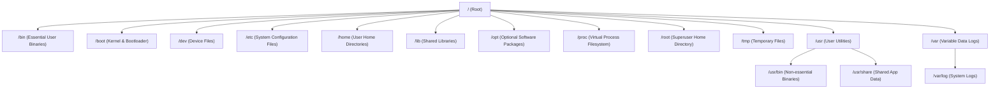

For users coming from Windows, the Linux filesystem can seem disorienting. Windows organizes files around physical storage drives (e.g., `C:\` for the primary system, `D:\` for external drives). 

Linux, however, structures everything under a single unified directory tree starting from the **Root directory (`/`)**. Physical storage devices are "mounted" to specific directories within this single tree.

This structure is governed by the **Filesystem Hierarchy Standard (FHS)**, ensuring consistency across different Linux distributions.

---

## 1. The FHS Directory Tree

Here is a visual map of the standard Linux filesystem structure:

---

## 2. Directory Breakdown & Purpose

### `/ (Root)`
The primary directory that contains all other directories and files on the system, regardless of which physical disk partition they reside on.

### `/bin` and `/sbin`
* **`/bin` (Binaries):** Essential command-line utilities needed in single-user mode or for system repair (e.g., `ls`, `cp`, `bash`).
* **`/sbin` (System Binaries):** Essential system administration commands reserved for the superuser (e.g., `iptables`, `fdisk`, `reboot`).
* *Note: In modern distributions, `/bin` and `/sbin` are often symbolic links to `/usr/bin` and `/usr/sbin`.*

### `/boot`
Contains the static files needed to start the operating system, including the Linux kernel, initial RAM disk (initramfs), and bootloader configuration (GRUB).

### `/dev` (Devices)
In Unix/Linux, *"everything is a file"*. This directory contains virtual files representing physical hardware. For example:
* `/dev/sda` represents the first hard disk drive.
* `/dev/input/mice` represents mouse input.
* `/dev/null` is a virtual device that discards all data written to it.

### `/etc` (Editable Text Configuration)
The nerve center of system configuration. It contains host-specific configuration files for the operating system and services. For example:
* `/etc/passwd` lists local system users.
* `/etc/hosts` configures hostname-to-IP mappings.
* `/etc/fstab` defines disk mounting points.

### `/home` and `/root`
* **`/home`:** Contains the home directories for standard users (e.g., `/home/igorkan`). This is where files, desktop folders, and user configuration dotfiles (`~/.config/`) reside.
* **`/root`:** The home directory for the superuser/administrator (`root`). It is separated from `/home` to ensure the system administrator can still log in and repair the machine even if the `/home` partition fails to mount.

### `/proc` and `/sys` (Virtual Filesystems)
These are not real folders on your hard drive; they are virtual interfaces created by the Linux kernel.
* **`/proc` (Process):** Contains files representing running processes and kernel parameters. For instance, reading `/proc/cpuinfo` displays CPU specifications.
* **`/sys` (System):** Provides hierarchical information about hardware drivers and kernel subsystems.

### `/usr` (User System Resources)
Contains user utilities, libraries, and documentation.
* `/usr/bin` contains non-essential executables (like python, git, and nodejs).
* `/usr/lib` holds shared library binaries.
* `/usr/share` holds architecture-independent files like icons, themes, and documentation.

### `/var` (Variable)
Stores data that changes dynamically as the system operates.
* `/var/log` contains system and application log files (e.g., syslog, boot logs).
* `/var/spool` holds print queues and mail queues.
* `/var/cache` holds cached application data.

### `/tmp` (Temporary)
A scratch directory where applications can read and write temporary files. Typically, the files here are cleared automatically every time the computer reboots.
