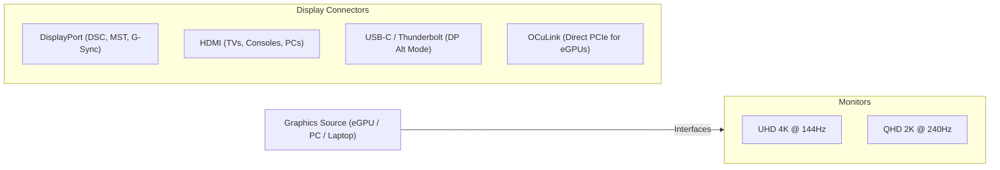

Whether you are compiling code, rendering 3D graphics, or gaming, your monitor is the primary window into your computer's operating system. However, choosing and configuring a monitor involves navigating a maze of panel types, resolution standards, refresh rates, and cable interfaces.

This guide breaks down the core hardware metrics of modern displays and explains the abbreviations, bandwidth limits, and display cables used to connect them.

---

## 1. Display Panel Technologies

The active panel determines how pixels are illuminated, directly affecting color accuracy, contrast, response time, and viewing angles.

| Panel Type | Contrast Ratio | Response Time | Color Accuracy | Best Use Case |
|---|---|---|---|---|
| **IPS** (In-Plane Switching) | Moderate (1000:1) | Fast (~1–4ms) | Excellent | Coding, Design, General Use |
| **VA** (Vertical Alignment) | High (3000:1 - 5000:1) | Moderate (~4–8ms) | Good | Media Consumption, Dark Rooms |
| **OLED** (Organic LED) | Infinite ($\infty$:1) | Instant (<0.1ms) | Outstanding | HDR Gaming, Color-Critical Work |
| **TN** (Twisted Nematic) | Poor (800:1) | Very Fast (1ms) | Poor | Budget / Legacy Esports |

---

## 2. Core Performance Metrics

### Resolution (Pixel Count)
Resolution refers to the number of distinct pixels a screen can display. More pixels result in a sharper image and more workspace (real estate) on your desktop.

* **FHD / 1080p (Full High Definition):** $1920 \times 1080$ pixels. Standard budget resolution.
* **QHD / 2K / 1440p (Quad High Definition):** $2560 \times 1440$ pixels. The sweet spot for 27-inch monitors, balancing clarity and GPU performance.
* **UHD / 4K (Ultra High Definition):** $3840 \times 2160$ pixels. Exceptional sharpness, ideal for 32-inch displays or high-density laptops.
* **8K:** $7680 \times 4320$ pixels. Cutting-edge professional display standard.

### Refresh Rate (Hz)
Measured in Hertz (Hz), the refresh rate is the number of times per second the monitor updates the image on the screen.
* Standard monitors run at **60Hz**.
* High-refresh displays (**120Hz, 144Hz, 240Hz, 360Hz+**) provide fluid cursor movement, reduce eye strain, and significantly lower input latency.

### Response Time (ms)
Measured in milliseconds (ms), this is the time it takes for a pixel to change from one color to another (typically Grey-to-Grey or **GtG**). Slow response times cause **ghosting** (smearing trails behind moving objects).

---

## 3. Display Cables and Interfaces

Different cables support different bandwidths. Using the wrong cable can lock your monitor to a lower resolution or refresh rate.

### DisplayPort (DP)
Developed by VESA, **DisplayPort** is the industry standard for computer-to-monitor connections.
* **DP 1.4:** Supports up to 4K @ 120Hz (or 4K @ 144Hz using **DSC - Display Stream Compression**).
* **DP 2.1:** High bandwidth (up to 80 Gbps), supporting dual 4K @ 120Hz or single 8K displays natively without compression.
* **Key Features:** Supports **MST (Multi-Stream Transport)** for daisy-chaining multiple monitors using one output port, and native variable refresh rates (G-Sync/FreeSync).

### HDMI (High-Definition Multimedia Interface)
**HDMI** is the standard interface for consumer electronics (TVs, consoles, and monitors).
* **HDMI 2.0:** Bandwidth capped at 18 Gbps (supports 4K @ 60Hz or 1440p @ 144Hz).
* **HDMI 2.1:** Up to 48 Gbps bandwidth. Supports 4K @ 120Hz/144Hz and 8K @ 60Hz. It also supports **VRR (Variable Refresh Rate)** and **eARC (Enhanced Audio Return Channel)**.

### USB-C & Thunderbolt
Modern monitors can connect via a single USB-C cable using **DP Alt Mode (DisplayPort Alternate Mode)**.
* **How it works:** The cable carries DisplayPort video signals, USB data (for built-in monitor hubs), and **USB-PD (Power Delivery)** to charge a laptop simultaneously (up to 100W+).

### OCuLink (Optical-Copper Link)
**OCuLink** is not a display cable, but it is highly relevant for custom workstation setups.
* **What it is:** A small-form-factor PCIe connector (PCIe Gen 4 x4) that provides a direct, high-bandwidth connection (up to 64 Gbps) between a computer motherboard and an external device.
* **Role in display systems:** OCuLink is primarily used to connect **eGPUs (External Graphics Processing Units)** to laptops or mini-PCs. Because it runs directly on the PCIe bus without the protocol overhead of Thunderbolt/USB4, it offers higher graphics performance. The external graphics card then outputs to the monitor using standard DisplayPort or HDMI cables.
