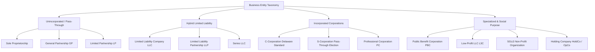
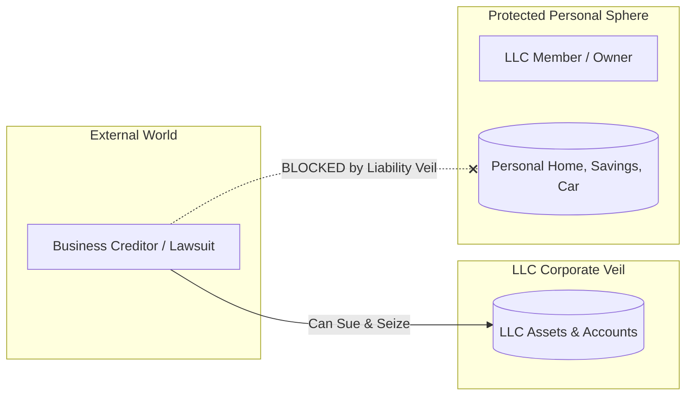
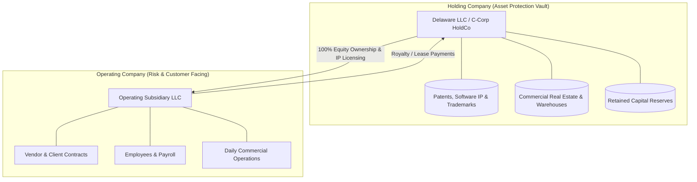
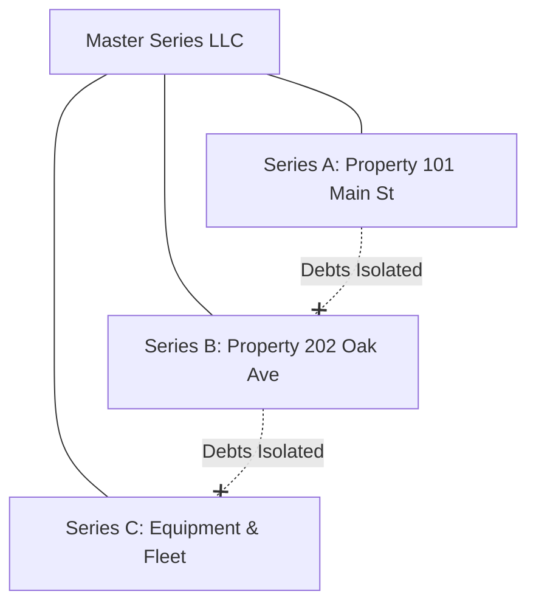
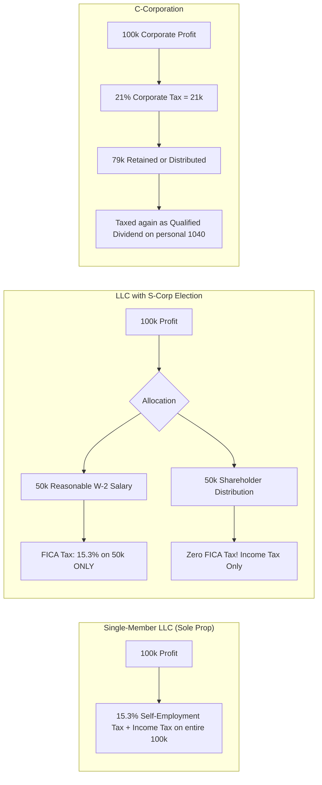
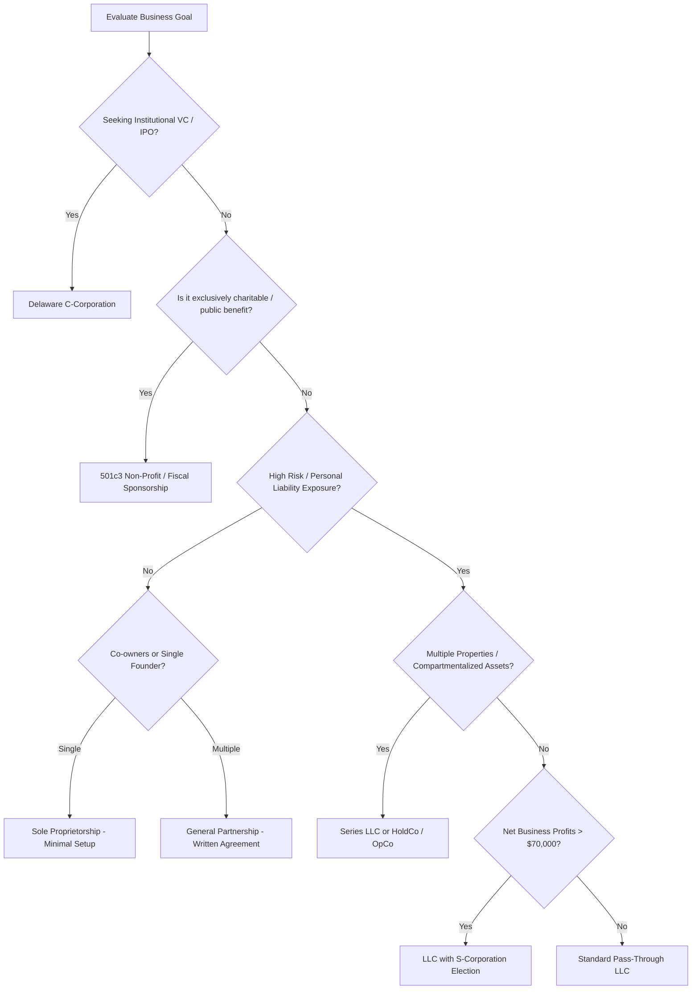

## 1. Introduction: The Legal Scaffold of Enterprise

In commerce, law, and capital allocation, a business is fundamentally defined by its **legal entity structure**. Choosing how to organize an enterprise is one of the most consequential decisions a founder, investor, or engineer will ever make. 

The selected entity dictates four interdependent dimensions:
1. **Liability Protection**: Whether personal assets (homes, savings, family assets) are insulated from business liabilities, lawsuits, and creditors.
2. **Taxation Architecture**: Whether earnings are taxed once as pass-through income, subject to self-employment taxes (FICA), or taxed twice at the corporate and dividend levels.
3. **Capital Formation & Governance**: The ease of issuing equity, creating multiple share classes, granting stock options, and attracting venture capital.
4. **Administrative Compliance**: Ongoing statutory formalities, reporting obligations, franchise taxes, and operational overhead.

This guide provides a rigorous, comprehensive analysis of global and North American business structures, maps out the mechanics of entity selection using architectural flowcharts, and delivers specific blueprints for tech startups, open-source projects, freelancers, content creators, and investment vehicles.

---

## 2. The Core Entity Taxonomy

---

### 1. Sole Proprietorship
* **Legal Status**: No legal separation between the individual and the business. The business is the alter-ego of the owner.
* **Liability**: **Unlimited personal liability**. If the business is sued, incurs debts, or causes injury, the owner's personal bank accounts, real estate, and investments can be seized.
* **Taxation**: Pass-through taxation via **Schedule C (Form 1040)**. Net profits are subject to both ordinary federal/state income tax and **self-employment tax** (15.3% covering Social Security and Medicare).
* **Governance & Formation**: Zero statutory formation paperwork (other than optional local DBAs / "Doing Business As" fictitious name filings and business permits).
* **Best Used For**: Low-risk hobby businesses, preliminary freelancing testing phases, or short-term micro-gigs.

---

### 2. Partnerships (GP, LP, LLP)

#### General Partnership (GP)
* **Structure**: An association of two or more co-owners engaged in business for profit.
* **Liability**: **Joint and several unlimited personal liability**. Each partner is personally liable for the full debts of the partnership—even liabilities incurred unilaterally by another partner's negligence or reckless contracts.
* **Taxation**: Pass-through entity filing **Form 1065** (informational return) and issuing **Schedule K-1** to each partner.

#### Limited Partnership (LP)
* **Structure**: Composed of at least one **General Partner (GP)** who manages operations with unlimited liability, and one or more **Limited Partners (LPs)** who contribute capital as passive investors.
* **Liability**: Limited partners risk only their contributed capital, provided they do not participate in active managerial control.
* **Primary Use Case**: Private equity funds, hedge funds, venture capital syndicates, and commercial real estate investments.

#### Limited Liability Partnership (LLP)
* **Structure**: Designed specifically for licensed professionals (attorneys, CPAs, architects, physicians).
* **Liability**: Shields each partner from personal liability arising from the malpractice, negligence, or misconduct of *other* partners, while retaining personal liability for their own individual actions.

---

### 3. Limited Liability Company (LLC)
Pioneered in Wyoming in 1977 and adopted universally across the United States, the LLC is a hybrid legal vehicle combining the **limited liability shield of a corporation** with the **tax flexibility of a partnership**.

#### Key Mechanics:
* **Owners**: Called **Members** (single-member or multi-member).
* **Governing Document**: The **Operating Agreement**—the internal constitution governing equity splits, voting thresholds, capital calls, distributions, and buyout/dissolution procedures.
* **Management Modalities**:
  * *Member-Managed*: All owners actively participate in day-to-day decisions (default).
  * *Manager-Managed*: Owners appoint professional managers or a designated member to direct operations; non-managing members act as passive investors.
* **Filing**: Formed by filing **Articles of Organization** (or *Certificate of Formation*) with the Secretary of State.

#### LLC Tax Flexibility: The Chameleon Entity
The IRS does not have a dedicated tax classification for LLCs. Instead, owners select how they wish to be taxed:
1. **Default Single-Member**: Disregarded entity taxed as a Sole Proprietorship (Schedule C).
2. **Default Multi-Member**: Taxed as a Partnership (Form 1065 + Schedule K-1).
3. **Elective S-Corporation**: Formed via **IRS Form 2553** to reduce self-employment tax.
4. **Elective C-Corporation**: Formed via **IRS Form 8832** to retain earnings at corporate rates.

---

### 4. Corporations: C-Corp vs. S-Corp

| Dimension | C-Corporation | S-Corporation | Limited Liability Company (LLC) |
| :--- | :--- | :--- | :--- |
| **Legal Entity** | Separate legal corporate entity | Separate legal entity (Tax election) | Separate legal entity |
| **Ownership Limits** | Unlimited shareholders; foreign nationals, VCs, funds allowed | Maximum **100 shareholders**; must be US citizens or permanent residents | Unlimited members; individuals, foreign entities, trusts allowed |
| **Share Classes** | Multiple classes allowed (Common, Preferred Series A/B) | **Only one class of stock** (voting differences permitted) | Flexible membership units and economic waterfall allocations |
| **Taxation Mechanism** | **Double Taxation**: Corporate tax (21% federal) + Dividend tax on distributions | **Pass-Through**: Profits pass directly to shareholders' Form 1040 | **Pass-Through** (default) or Elective S/C Corp |
| **Self-Employment Tax** | None on corporate profits or dividends | Savings via **Salary + Distribution Split** | 15.3% FICA on all net business profits (unless S-Corp elected) |
| **Venture Capital Fit** | **Universal Standard** (Required by 99% of institutional VCs) | Ineligible for institutional VC funds | Generally rejected by institutional venture capital |
| **Equity Incentives** | Stock options (ISOs, NSOs), RSUs, Phantom Stock | Restricted stock; no complex preferred option pools | Profits Interests, Phantom Units (complex to administer) |
| **Special Tax Shield** | **Section 1202 QSBS** (Up to $10M or 10x tax-free capital gain) | Not eligible for QSBS | Not eligible for QSBS |

---

## 3. Advanced Corporate & Structural Architectures

---

### 1. The Holding Company + Operating Company (HoldCo / OpCo)
For enterprises accumulating significant capital, intellectual property, or physical assets, operating through a single entity is hazardous. A single catastrophic customer lawsuit, slip-and-fall accident, or contract breach could wipe out all corporate assets.

The **HoldCo / OpCo architecture** neutralizes this risk:
1. **The Holding Company (HoldCo)**:
   * Holds the crown jewels: software source code, patents, trademarks, real estate, and accumulated treasury reserves.
   * Signs no direct customer contracts and employs no customer-facing personnel.
2. **The Operating Company (OpCo)**:
   * A wholly-owned subsidiary of the HoldCo.
   * Interacts with customers, signs vendor leases, manages payroll, and delivers services.
   * Licenses IP and leases real estate from the HoldCo under arms-length commercial agreements.
   * *Protection*: If OpCo is sued into bankruptcy, creditors cannot pierce through to seize the IP or real estate owned by HoldCo.

---

### 2. The Series LLC
Available in over a dozen US states (including Delaware, Texas, Nevada, and Wyoming), a **Series LLC** permits an organization to create distinct, compartmentalized cells ("series") beneath a single master LLC umbrella:

* **Statutory Wall**: Under state law, the debts, liabilities, and obligations incurred by one series are enforceable *only* against that specific series, and not against the master LLC or any other parallel series.
* **Primary Use Case**: Real estate investors managing dozens of rental properties who wish to avoid paying separate state formation fees and annual reports for 50 distinct LLCs.

---

### 3. Public Benefit Corporations (PBC) & B-Corps
* **Delaware Public Benefit Corporation (PBC)**: A legal corporate entity whose board of directors is statutorily mandated to balance three interests:
  1. Pecuniary interest of stockholders
  2. The specific public benefits identified in its charter (e.g., environmental sustainability, open scientific access)
  3. The best interests of those materially affected by the corporation's conduct.
* **Certified B Corp**: **Not a legal entity**. It is a private certification issued by the non-profit **B Lab**, verifying that a company meets rigorous social and environmental governance standards. A standard LLC, C-Corp, or PBC can become a Certified B Corp.

---

## 4. Taxation Optimization: Pass-Through vs. S-Corp vs. C-Corp

Understanding the flow of tax dollars determines how much capital remains in the business to compound.

### 1. The S-Corp Tax Arbitrage (FICA Savings)
In a standard LLC, an owner with $\$120,000$ in net business income pays self-employment tax (15.3%) on the entire $\$120,000$ ($\approx \$18,360$), in addition to state and federal income taxes.

By filing **IRS Form 2553** to elect S-Corp tax status:
1. The owner classifies as both an **employee** and a **shareholder**.
2. The owner pays themselves a **"Reasonable Salary"** (e.g., $\$60,000$) via W-2 payroll, subject to standard payroll taxes (15.3% FICA).
3. The remaining $\$60,000$ is taken as a **Shareholder Distribution**, which is **completely exempt from self-employment tax**!
4. *Annual Net Savings*: $15.3\% \times \$60,000 \approx \mathbf{\$9,180}$ saved every year.
*Rule of Thumb*: The S-Corp election becomes financially advantageous once net annual business profits exceed **$\$60,000$ to $\$80,000$**, offsetting the annual payroll processing fees and corporate return costs (Form 1120-S).

---

### 2. The Section 1202 QSBS Super-Exclusion (C-Corporations)
Under Section 1202 of the Internal Revenue Code, non-corporate investors who hold **Qualified Small Business Stock (QSBS)** in an active US C-Corporation for more than **5 years** can exclude up to **100% of their capital gains** from federal taxation upon sale!
* **Exclusion Limit**: The greater of **$\$10,000,000$** or **10 times the taxpayer's original basis**.
* This single tax incentive is why nearly all venture capital-backed founders form Delaware C-Corporations: a successful exit yields tens of millions of dollars in completely tax-free capital gains.

---

## 5. Strategic Entity Selection Blueprints by Industry

### 1. Free and Open Source (FOSS) Software
* **Model A: Pure Community Public Good**:
  * *Structure*: **501(c)(3) Non-Profit Organization** or **Fiscal Sponsorship**.
  * *Execution*: Rather than incorporating an independent non-profit, early FOSS projects join established umbrella foundations (e.g., **Software Freedom Conservancy**, **The Apache Software Foundation**, or **The Linux Foundation**). This provides immediate 501(c)(3) tax-exempt status, handles corporate donations, and holds project trademarks without administrative burden.
* **Model B: Individual Solo Contributor**:
  * *Structure*: **Single-Member LLC**.
  * *Execution*: Protects personal assets when accepting corporate sponsorships via GitHub Sponsors or Open Collective while shielding against patent/copyright infringement claims.

---

### 2. Open Core & Hosted Commercial SaaS
* **Model**: Free open-source core with commercial cloud-hosted service or enterprise proprietary features (e.g., GitLab, Red Hat, Supabase).
* **Recommended Structure**: **Delaware C-Corporation**.
* **Rationale**: SaaS infrastructure requires substantial server capital and hiring elite engineering talent. Institutional investors will only inject equity into a C-Corp where preferred stock can be issued and stock option pools (ESOPs) can be granted to key contributors.

---

### 3. Freelancers & Independent Tech Contractors
* **Recommended Structure**: **Single-Member LLC** (transitioning to S-Corp election once net profit exceeds $\$70,000$).
* **Rationale**:
  1. *Liability Shield*: Protects personal assets if a client sues over an accidental production outage, data breach, or missed contract SLA.
  2. *Professional Credibility*: Corporate clients frequently refuse to contract directly with individuals (due to IRS worker-misclassification / 1099 vs. W-2 enforcement); having an LLC with an Employer Identification Number (EIN) streamlines vendor onboarding.

---

### 4. High-Growth Tech Startups
* **Recommended Structure**: **Delaware C-Corporation**.
* **The "Delaware Startup Package" Mechanics**:
  * *Filing*: Incorporated under the Delaware General Corporation Law (DGCL), renowned for its specialized Court of Chancery, predictable corporate case law, and investor-friendly statutes.
  * *Early Formalities*:
    * Authorize $10,000,000$ shares of Common Stock.
    * Issue founder shares at par value ($\$0.0001$ per share) with **4-year vesting (1-year cliff)**.
    * **File Section 83(b) Election with the IRS within 30 days of stock issuance** (vital to avoid devastating future income taxes on unvested stock appreciation).
    * Adopt an Equity Incentive Plan for employee stock options.
    * Raise initial capital via **Y Combinator SAFEs** (Simple Agreements for Future Equity).

---

### 5. Content Creators, YouTubers, Streamers & Influencers
* **Recommended Structure**: **Single-Member LLC** (with S-Corp election for high earners).
* **Rationale**: Content creators operate in a high-liability legal zone:
  * Copyright infringement claims (DMCA strikes, background music disputes)
  * Defamation / libel lawsuits from commentary or product reviews
  * FTC regulatory enforcement over sponsorship disclosures
  * Physical injury liabilities during on-location video production.
  * *Separation*: Signing agency, merchandise, and sponsor contracts through an LLC guarantees that an adverse legal judgment cannot seize the creator's personal home or personal savings.

---

### 6. Authors, Musicians, and Creative IP Holders
* **Recommended Structure**: **Two-Tier LLC (IP HoldCo + Publishing OpCo)**.
* **Execution**:
  * *IP HoldCo*: Holds the underlying copyrights, master recordings, book publishing rights, and trademarks.
  * *Publishing OpCo*: Signs distribution contracts with Spotify, Amazon KDP, or traditional record labels.
  * *Benefit*: If a distribution deal goes sour or an agency sues the publishing company, the underlying core intellectual property remains securely vaulted inside the IP holding entity.

---

### 7. Real Estate & Angel Investment Syndicates
* **Real Estate**: **Series LLC** or **Individual LLC per Property** held under a parent HoldCo. Each rental property is isolated in its own liability cell, preventing a tenant slip-and-fall at Property A from foreclosing on Property B.
* **Angel Syndicates / Venture Funds**: **Limited Partnership (LP)** managed by an LLC General Partner (GP), utilizing **Special Purpose Vehicles (SPVs)** for single-company investment allocations.

---

## 6. The Master Decision Tree for Entity Formation

Use this flowchart to evaluate your specific scenario:

---

## 7. Curated Legal Sources & Regulatory References

* **Internal Revenue Service (IRS)**:
  * *Publication 334*: Tax Guide for Small Business.
  * *Publication 542*: Corporations.
  * *Instructions for Form 2553*: Election by a Small Business Corporation.
  * *Section 1202 of the Internal Revenue Code*: Qualified Small Business Stock (QSBS) Gain Exclusion.
* **Delaware Department of State - Division of Corporations**:
  * *Delaware General Corporation Law (DGCL)*, Title 8, Delaware Code. The preeminent corporate legal framework in the United States.
  * *Delaware Limited Liability Company Act*, Title 6, Chapter 18.
* **U.S. Small Business Administration (SBA)**:
  * "Choose a business structure: Detailed comparative guidance on legal liabilities and tax registrations."
* **Uniform Law Commission (ULC)**:
  * *Revised Uniform Limited Liability Company Act (RULLCA)* (2006/2013).
  * *Uniform Partnership Act (UPA)*.
* **James Stewart**, *Calculus: Early Transcendentals*, 8th Edition, Cengage Learning (2015). Mathematical principles of resource optimization, marginal rate analysis, and constrained utility functions reflecting corporate capital allocation.
 
 

  © 2026 Igor Kan

