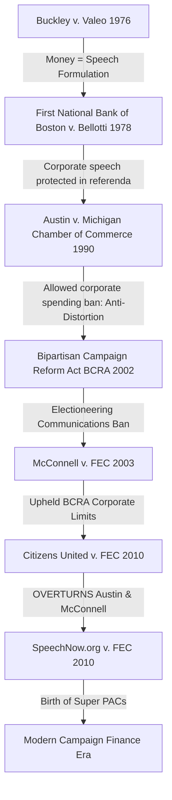
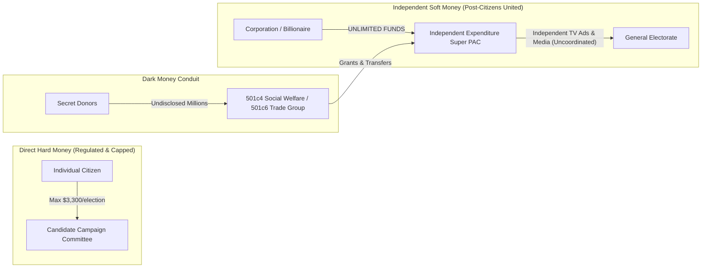

## 1. Introduction: The Collision of Speech and Capital

Few judicial decisions in modern American history have generated as fierce a constitutional and political debate as ***Citizens United v. Federal Election Commission*, 558 U.S. 310 (2010)**. Decided by a razor-thin 5–4 majority, the Supreme Court struck down federal restrictions on independent political expenditures by corporations and labor unions, holding that political spending is a form of constitutionally protected speech under the **First Amendment**.

To its defenders, the ruling represents an uncompromising vindication of fundamental democratic principles: the government possesses no legitimate authority to censor political discourse or discriminate against speakers based on their corporate or associational identity.

To its critics, the decision uncorked a torrent of unregulated corporate and billionaire wealth into American elections, distorted democratic representation, dismantled decades of bipartisan campaign finance legislation, and catalyzed the proliferation of **Super PACs** and non-disclosing **"dark money"** entities.

To analyze *Citizens United* with constitutional rigor, one must examine:
1. The structural mechanics of the First Amendment's Free Speech Clause.
2. The foundational jurisprudential trajectory from *Buckley v. Valeo* (1976) through *Austin* (1990) and the Bipartisan Campaign Reform Act (BCRA) of 2002.
3. The factual genesis of *Hillary: The Movie*.
4. Justice Anthony Kennedy’s majority rationale versus Justice John Paul Stevens’s 90-page dissent.
5. The post-*Citizens United* landscape (*SpeechNow.org*, Super PACs, 501(c)(4) entities, and foreign influence debates).

---

## 2. The First Amendment Architecture & Free Speech Doctrine

```
                    The First Amendment (1791)
                                │
    ┌───────────┬───────────────┼───────────────┬───────────┐
    ▼           ▼               ▼               ▼           ▼
[Religion]  [Speech]         [Press]        [Assembly]  [Petition]
            (Core Political Speech
             Subject to Strict Scrutiny)
```

The First Amendment to the United States Constitution provides:
> *"Congress shall make no law respecting an establishment of religion, or prohibiting the free exercise thereof; or abridging the freedom of speech, or of the press; or the right of the people peaceably to assemble, and to petition the Government for a redress of grievances."*

### 1. The Hierarchy of Speech Protections
American constitutional law does not treat all utterances equally. The Supreme Court has erected a tiered hierarchy of First Amendment scrutiny:

| Tier of Speech | Scrutiny Standard | State Justification Burden | Examples |
| :--- | :---: | :--- | :--- |
| **Political & Core Public Speech** | **Strict Scrutiny** | Must advance a **compelling government interest** via the **least restrictive means**. | Debates on electoral candidates, public policy, ideology. |
| **Commercial Speech** | **Intermediate Scrutiny** (*Central Hudson*) | Must directly advance a **substantial government interest** and be narrowly tailored. | Commercial advertising, product promotions. |
| **Unprotected Speech** | **Zero Protection** | Outside constitutional protection entirely. | True threats, incitement to imminent lawless action (*Brandenburg*), obscenity (*Miller*), defamation (*NYT v. Sullivan* rules apply). |

### 2. The State Action & Incorporation Doctrines
* **The State Action Requirement**: The First Amendment restricts **governmental entities** (federal, state, and municipal organs), not private corporations, private employers, or private digital platforms.
* **Incorporation via the 14th Amendment**: Originally binding only the federal government (*Barron v. Baltimore*, 1833), the Free Speech Clause was incorporated against the states through the Due Process Clause of the Fourteenth Amendment in ***Gitlow v. New York*, 268 U.S. 652 (1925)**.

---

## 3. The Jurisprudential Genealogy: From *Buckley* to *Austin*

*Citizens United* did not emerge in a vacuum; it was the culmination of a 35-year constitutional struggle over campaign finance regulation.



### 1. *Buckley v. Valeo*, 424 U.S. 1 (1976): The Cornerstone Formula
Following the Watergate scandal, Congress enacted sweeping amendments to the Federal Election Campaign Act (FECA). In *Buckley*, the Court established the fundamental dichotomy that governs American election law:
* **Expenditure Limits $\implies$ Unconstitutional**: The Court held that limiting what a candidate, individual, or group can independently spend on political speech is an unconstitutional restriction on the *quantity* of speech. In an electronic mass-media democracy, virtually all effective communication costs money.
* **Contribution Limits $\implies$ Constitutional**: The Court upheld limits on direct financial contributions given directly to candidate campaigns (e.g., capping individual donations), holding that large direct donations create an intolerable danger of **quid pro quo corruption** or the appearance of corruption.

### 2. *First National Bank of Boston v. Bellotti*, 435 U.S. 765 (1978)
The Supreme Court struck down a Massachusetts statute prohibiting corporations from spending money to influence ballot referenda. Justice Lewis Powell established that the First Amendment protects the **inherent value of the speech to inform the public**, regardless of whether the speaker is an individual or a corporation.

### 3. *Austin v. Michigan Chamber of Commerce*, 497 U.S. 658 (1990)
In a major departure, the Court upheld a Michigan state law prohibiting corporations from using general corporate treasury funds for independent political expenditures. Justice Thurgood Marshall formulated the **"anti-distortion" rationale**:
> The state has a compelling interest in preventing *"the corrosive and distorting effects of immense aggregations of wealth that are accumulated with the help of the corporate form and that have little or no correlation to the public's support for the corporation's political ideas."*

---

## 4. *Citizens United v. FEC*: Factual Genesis & The Ruling

### 1. The Catalyst: *Hillary: The Movie*
In 2008, **Citizens United**—a 501(c)(4) conservative non-profit corporation funded primarily by individual donations with a small fraction of for-profit commercial corporate contributions—produced *Hillary: The Movie*, a 90-minute documentary sharply critical of then-Senator Hillary Clinton during the 2008 Democratic presidential primaries.

Citizens United intended to release the film via video-on-demand cable broadcast within 30 days of the 2008 primary elections and produced television commercials promoting the release.

However, Section 203 of the **Bipartisan Campaign Reform Act of 2002 (BCRA)** made it a federal crime for any corporation or labor union to finance **"electioneering communications"**—defined as any broadcast, cable, or satellite communication that:
1. Mentions a clearly identified candidate for federal office.
2. Is distributed within **30 days of a primary** or **60 days of a general election**.
3. Reaches the relevant electorate.

Violators faced civil and criminal penalties. Citizens United filed suit against the Federal Election Commission (FEC), seeking declaratory and injunctive relief on First Amendment grounds.

---

### 2. The Government’s Fatal Concession
During oral arguments in March 2009, Justice Samuel Alito asked the Deputy Solicitor General, Malcolm Stewart, whether the government’s theory of BCRA Section 203 would allow Congress to ban a **book** published by a corporation or union that advocated for or against a candidate shortly before an election.

The government conceded: **Yes, under the statute, Congress could prohibit the publication and distribution of books.**

This admission stunned the Court. The prospect of federal bureaucrats banning political books provoked the Court to order a complete re-argument of the case, expanding the question from a narrow statutory exemption to the constitutionality of corporate independent expenditure bans overall.

---

### 3. The 5–4 Majority Opinion (Justice Anthony Kennedy)
On January 21, 2010, the Supreme Court ruled 5–4 in favor of Citizens United, striking down BCRA § 203 and formally **overturning *Austin* (1990)** and the relevant parts of ***McConnell v. FEC* (2003)**:

```
                          Key Majority Holdings
                                    │
     ┌──────────────────────────────┼──────────────────────────────┐
     ▼                              ▼                              ▼
[Anti-Distortion Rejected]    [Associations of Men]        [Independent ≠ Corrupt]
Speech cannot be censored     Corporations and unions      Independent expenditures
based on the speaker's        are associations with        do not produce quid pro
corporate identity.           First Amendment rights.      quo corruption.
```

1. **Rejection of Identity-Based Speech Restrictions**:
   * The First Amendment protects speech, not merely specific categories of speakers:
     > *"The Government may not suppress political speech on the basis of the speaker's corporate identity. No sufficient governmental interest justifies limits on the political speech of nonprofit or for-profit corporations."*
2. **Repudiation of the *Austin* Anti-Distortion Doctrine**:
   * Kennedy forcefully rejected Marshall’s anti-distortion theory, calling it an impermissible form of government equalization:
     > *"The rule that political speech cannot be limited based on a speaker’s wealth is a necessary consequence of the premise that the First Amendment generally prohibits the silencing of speech based on its content or viewpoint."*
3. **Redefining the Anti-Corruption Interest**:
   * The majority strictly confined the government's compelling interest in regulating campaign finance to preventing **quid pro quo corruption** (direct exchange of cash for political favors) or its appearance.
   * Crucially, Kennedy held as a matter of law that **independent expenditures—spending completely uncoordinated with a candidate’s official campaign—cannot cause quid pro quo corruption**:
     > *"Independent expenditures, including those made by corporations, do not give rise to corruption or the appearance of corruption... The fact that speakers may have influence over or access to elected officials does not mean that these officials are corrupt."*
4. **Validation of Disclosure Requirements (8–1 Vote)**:
   * While striking down spending limits, the Court overwhelmingly upheld BCRA’s **disclaimer and disclosure requirements** (Sections 201 and 311):
     > *"A modern computer-based disclosure system allows shareholders and citizens to make informed decisions and give proper weight to different speakers and messages."*

---

### 4. Justice Stevens’s Monumental Dissent
Justice John Paul Stevens, joined by Justices Ruth Bader Ginsburg, Stephen Breyer, and Sonia Sotomayor, delivered a passionate 90-page partial dissent:

1. **Corporations Are Not Living Citizens**:
   * Stevens emphasized that corporations are legal fictions endowed by the state with special economic privileges (perpetual life, limited liability, favorable asset accumulation) to encourage business, not to participate as voters in self-government:
     > *"Corporations have no consciences, no beliefs, no feelings, no thoughts, no desires. Corporations help structure and facilitate the activities of human beings, to be sure, and their 'personhood' often serves as a useful legal fiction. But they are not themselves members of 'We the People' by whom and for whom our Constitution was established."*
2. **Drowning Out the Citizenry**:
   * By allowing corporate treasuries to spend without limit, individual human citizens lacking millions in capital are effectively drowned out in public discourse.
3. **Corruption Beyond Quid Pro Quo**:
   * Stevens warned that financial dependency creates systemic influence, distortion, and gratitude that subvert the representative link between elected officials and their constituent voters.

---

## 5. The Post-*Citizens United* Landscape: Super PACs and Dark Money



### 1. The Emergence of Super PACs: *SpeechNow.org v. FEC*
Contrary to popular belief, *Citizens United* did not directly create Super PACs. That threshold was crossed two months later by the D.C. Circuit Court of Appeals in ***SpeechNow.org v. FEC*, 599 F.3d 686 (D.C. Cir. 2010)**:
* *Legal Syllogism*:
  1. *Citizens United* held that independent expenditures cannot corrupt as a matter of law.
  2. If independent expenditures cannot corrupt, the government has no compelling anti-corruption interest in capping financial *contributions* made to political groups that engage *exclusively in independent expenditures*.
* This logic authorized **Independent Expenditure-Only Political Action Committees (Super PACs)**, which can raise **unlimited sums from individuals, corporations, and unions**, provided they do not coordinate directly with candidate campaigns.

### 2. The Rise of "Dark Money" (501(c)(4) and 501(c)(6) Entities)
While Super PACs must publicly disclose their donors to the FEC, political donors circumvented disclosure by funneling hundreds of millions of dollars through **Internal Revenue Code 501(c)(4) "social welfare" organizations** and **501(c)(6) trade associations** (such as the U.S. Chamber of Commerce):
* Under IRS rules, 501(c)(4) entities are not required to disclose their donor lists publicly.
* These organizations can engage in political campaigning as long as politics is not their "primary purpose" (interpreted as $< 50\%$ of overall expenditures).
* The 501(c)(4) donates to a Super PAC, which then buys television advertisements. On FEC filings, the donor is listed merely as the anonymous non-profit, concealing the original source of funds.

---

## 6. Comprehensive Jurisprudential Comparison Matrix

| Dimension | Pre-*Citizens United* Regime | Post-*Citizens United* Doctrine |
| :--- | :--- | :--- |
| **Corporate Independent Expenditures** | Prohibited from general treasury funds within 30/60 day electioneering windows (*BCRA § 203*). | **Constitutionally Protected**. Corporations and unions may spend unlimited general funds independently. |
| **Union Political Spending** | Restricted to segregated voluntary PAC funds (SSFs). | **Unlimited independent spending** authorized from general union dues. |
| **Direct Candidate Contributions** | Strictly capped by federal statute ($3,300 per election in 2024). | **Remains Strictly Capped**. Corporations are still prohibited from direct campaign contributions. |
| **Anti-Distortion Rationale** | Validated by *Austin v. Michigan Chamber of Commerce* (1990). | **Overruled and Repudiated** as an unconstitutional form of speech censorship. |
| **Definition of Corruption** | Broad: encompasses distortion, improper influence, and undue access. | **Narrow**: Strictly confined to explicit **quid pro quo** corruption or its direct appearance. |
| **Outside Spending Ecosystem** | Traditional PACs with strict $5,000 contribution caps. | **Super PACs** (unlimited contributions) + **501(c)(4) Dark Money** conduits. |
| **Disclosure Mandates** | Upheld (*McConnell*). | **Upheld 8–1**. Disclaimer and public reporting requirements remain constitutional. |

---

## 7. Curated Sources & Legal References

* ***Citizens United v. Federal Election Commission*, 558 U.S. 310 (2010)**. The official United States Reports slip opinion, including Justice Kennedy’s majority opinion, Chief Justice Roberts's concurrence, and Justice Stevens’s partial dissent.
* ***Buckley v. Valeo*, 424 U.S. 1 (1976)**. Foundational per curiam opinion establishing the distinction between campaign expenditures and direct contributions.
* ***Austin v. Michigan Chamber of Commerce*, 497 U.S. 658 (1990)**. Marshall's majority opinion formulating the anti-distortion doctrine (subsequently overruled).
* ***SpeechNow.org v. Federal Election Commission*, 599 F.3d 686 (D.C. Cir. 2010)**. The landmark appellate ruling giving birth to Super PACs.
* **Bipartisan Campaign Reform Act of 2002 (BCRA)**, Pub. L. 107–155 (McCain-Feingold Act).
* **The Brennan Center for Justice**, "Citizens United Explained", New York University School of Law (2024). Empirical tracking of outside spending, Super PAC proliferation, and dark money trends.
* **Richard L. Hasen**, *Plutocrats United: Campaign Money, the Supreme Court, and the Distortion of American Elections*, Yale University Press (2016).
* **James Stewart**, *Calculus: Early Transcendentals*, 8th Edition, Cengage Learning (2015). Mathematical principles of resource optimization, marginal voter persuasion cost curves, and the mathematical modeling of influence distribution under power-law capital concentrations.
<br>
<br>

<div style="text-align: center; color: #888; font-size: 0.9em;">
  © 2026 Igor Kan
</div>
