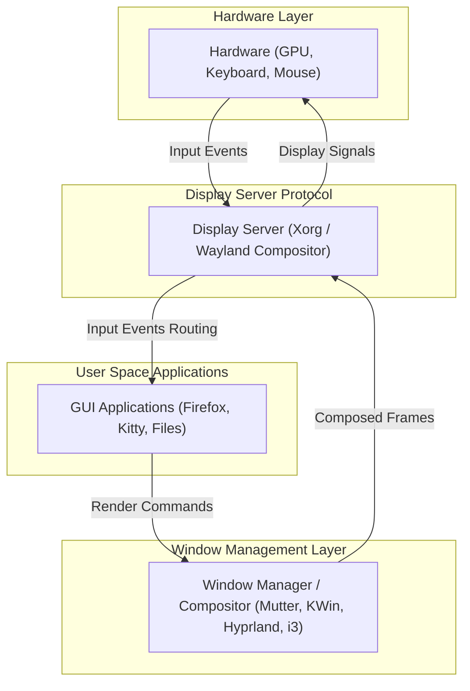

For users transitioning to Linux or diving deeper into system customization ("ricing"), the visual layer of the operating system can seem like a confusing maze of acronyms and interchangeable terms. 

Unlike Windows or macOS, where the graphical user interface (GUI) is tightly coupled with the core operating system, Linux treats the GUI as a modular, replaceable stack of software. This article breaks down the entire desktop stack from display protocols to custom rices like **Illogical Impulse**, complete with installation commands, configuration paths, and configuration examples.

---

## 1. The Foundation: Display Protocols & Servers

At the very bottom of the graphical stack sits the **Display Server**. Its job is to coordinate communication between your hardware (graphics card, keyboard, mouse) and your applications, telling the hardware where and how to render pixels.

Here is how data flows through the Linux graphical stack:



### X11 (X Window System)
Introduced in 1984, the [X Window System](https://www.x.org/wiki/) (specifically its modern server implementation, **Xorg**) is the legacy standard.
* **How it works:** It uses a client-server architecture. Applications (clients) send drawing requests to the X Server, which interacts with the hardware. A separate Window Manager is responsible for arranging the application windows.
* **Network Transparency:** X11 natively supports running an application on a remote server and displaying its window on your local machine.
* **Downsides:** It is old, bloated, lacks built-in security isolation (any app can capture keystrokes from other apps), and is prone to screen tearing.

### Wayland
[Wayland](https://wayland.freedesktop.org/) is the modern successor to X11, designed to simplify the stack and enhance performance and security.
* **How it works:** Wayland is a *protocol*, not a server. The server is called a **Wayland Compositor** (which acts as the display server, window manager, and compositor all in one).
* **Direct Rendering:** Applications render directly into their own off-screen buffers, and the compositor paints them to the screen. Every frame is perfect (no screen tearing).
* **Security:** Strict isolation. Applications cannot sniff keystrokes or record screens without explicit permission through system portals.

---

## 2. Window Managers (WM) vs. Desktop Environments (DE)

When you interact with panels, menus, and window frames, you are interacting with either a Window Manager or a full Desktop Environment.

| Component | Purpose | Resource Usage | Examples |
|---|---|---|---|
| **Window Manager (WM)** | Solitary job: positioning, sizing, and styling application windows. | Extremely low (~50MB - 150MB RAM) | [i3wm](https://i3wm.org/), [bspwm](https://github.com/baskerville/bspwm), [Hyprland](https://hyprland.org/), [Sway](https://swaywm.org/) |
| **Desktop Environment (DE)** | A complete suite of unified applications (file manager, settings, panels, system tray, display manager, WM). | Moderate to High (500MB - 2GB+ RAM) | [GNOME](https://www.gnome.org/), [KDE Plasma](https://kde.org/plasma-desktop/), [XFCE](https://xfce.org/) |

### Desktop Environments

#### GNOME
Built on the GTK toolkit, [GNOME](https://www.gnome.org/) focuses on a distraction-free, touch-friendly, workspace-centric interface. It defaults to Wayland and uses its own compositor called [Mutter](https://gitlab.gnome.org/GNOME/mutter).

#### KDE Plasma
Built on Qt, [KDE Plasma](https://kde.org/plasma-desktop/) is famous for being incredibly modular and customizable. It is lightweight despite its power and supports both X11 and Wayland via its compositor/WM, [KWin](https://invent.kde.org/plasma/kwin).

#### XFCE4
A lightweight DE built on GTK. [XFCE](https://xfce.org/) is modular, stable, and uses very little RAM, making it perfect for older hardware. It operates primarily on X11 using the [Xfwm](https://gitlab.xfce.org/xfce/xfwm4) window manager.

---

### Window Managers & Compositors

#### Hyprland
[Hyprland](https://hyprland.org/) is a dynamic tiling Wayland compositor written in C++. It is popular for its fluid animations, rounded corners, dual-gaps, active blur rendering, and extensive customizability.

#### i3wm
[i3wm](https://i3wm.org/) is a classic, manual tiling window manager for X11. It organizes windows in a non-overlapping grid, heavily relying on keyboard shortcuts.

---

## 3. What are Dotfiles?

In Linux, user-specific configurations are stored as plain text files, often prefixed with a dot (`.`), which hides them in standard directory listings. Collectively, these are known as **dotfiles**.

### Standard Locations
* **Global config folder:** `~/.config/` (contains configuration folders for most modern applications).
* **Shell configurations:** `~/.bashrc`, `~/.zshrc` (stored directly in the home directory).
* **X11 Startup:** `~/.xinitrc` (scripts executed when launching X11).

### Illogical Impulse: Next-Gen Hyprland Config
[Illogical Impulse](https://ii.clsty.link/) (developed by GitHub user [end-4](https://github.com/end-4)) is a highly integrated, aesthetic, and usability-first set of dotfiles for the **Hyprland** Wayland compositor.
* **Core Technology:** It relies heavily on [Quickshell](https://github.com/outfoxxed/quickshell) (and previously [AGS - Aylur's GTK Shell](https://github.com/Aylur/ags)) to construct widgets, control hubs, volume sliders, app launchers, and status bars using Javascript/Typescript.
* **Why it's unique:** Unlike traditional configs where you chain different tools together (e.g., [Waybar](https://github.com/Alexays/Waybar) for status bar, [Rofi](https://github.com/davatorium/rofi) for launcher, [Dunst](https://github.com/dunst-project/dunst) for notifications), Illogical Impulse unifies all desktop components into a single, cohesive Material Design interface.

---

## 4. Installation & Setup Guide

### Installing the Graphics Stack
Below are commands to install different desktop options on **Arch Linux** and **Ubuntu/Debian**:

#### Installing DEs:
```bash
# Arch Linux
sudo pacman -S gnome                 # GNOME Group
sudo pacman -S plasma-meta kde-applications # KDE Plasma Suite
sudo pacman -S xfce4 xfce4-goodies   # XFCE4

# Ubuntu/Debian
sudo apt install ubuntu-desktop      # GNOME (Default Ubuntu)
sudo apt install kde-standard        # KDE Plasma
sudo apt install xfce4 xfce4-goodies # XFCE4
```

#### Installing Hyprland (Wayland WM):
```bash
# Arch Linux (Recommended)
sudo pacman -S hyprland waybar kitty rofi-wayland dunst polkit-kde-agent

# Ubuntu (Requires 23.04 or newer)
sudo apt install hyprland
```

### Deploying the "Illogical Impulse" Dotfiles
To deploy the custom [Illogical Impulse](https://github.com/end-4/dots-hyprland) desktop environment, you should use the official installation script on an Arch-based system:

```bash
# Clone the repository
git clone --depth 1 https://github.com/end-4/dots-hyprland.git ~/dots-hyprland

# Navigate and run the installation script
cd ~/dots-hyprland
./install.sh
```
*Note: Make sure to read the installer prompts carefully, as it manages system packages and backup files.*

---

## 5. Configuration & Structure Examples

Here is how configuration files for various components are structured and where they are placed.

### Hyprland Configuration
**Path:** `~/.config/hypr/hyprland.conf`

```ini
# --- Example hyprland.conf snippet ---

# Monitor Configuration
monitor=DP-1, 1920x1080@144, 0x0, 1

# Auto-start essential applications
exec-once = waybar & dunst & hyprpaper

# Styling
general {
    gaps_in = 5
    gaps_out = 10
    border_size = 2
    col.active_border = rgba(33ccffee) rgba(00ff99ee) 45deg
    col.inactive_border = rgba(595959aa)
    layout = dwindle
}

decoration {
    rounding = 10
    blur {
        enabled = true
        size = 8
        passes = 2
    }
}

# Keybindings
$mainMod = SUPER
bind = $mainMod, Q, exec, kitty
bind = $mainMod, C, killactive, 
bind = $mainMod, M, exit, 
bind = $mainMod, V, togglefloating, 
bind = $mainMod, left, movefocus, l
bind = $mainMod, right, movefocus, r
```

### X11 i3wm Configuration
**Path:** `~/.config/i3/config`

```ini
# --- Example i3 config snippet ---

# Modifier Key (Alt = Mod1, Super/Windows = Mod4)
set $mod Mod4

# Font configuration
font pango:DejaVu Sans Mono 8

# Keyboard bindings to launch applications
bindsym $mod+Return exec i3-sensible-terminal
bindsym $mod+d exec dmenu_run

# Kill focused window
bindsym $mod+Shift+q kill

# Split direction keys
bindsym $mod+h split h
bindsym $mod+v split v
```

### How WMs launch from terminal: `.xinitrc`
For X11 Window Managers, you control how the session starts using your `~/.xinitrc` file:

```bash
# --- ~/.xinitrc ---

# Start background services
feh --bg-scale ~/Pictures/wallpaper.png &
picom --experimental-backends &  # Compositor for rounded corners/blur under X11
dunst &                          # Notification daemon

# Execute the Window Manager (Must remain in foreground)
exec i3
```

For Wayland, sessions are usually started directly from a display manager (like SDDM or GDM) or by executing the compositor command directly from the TTY console:
```bash
Hyprland
```
