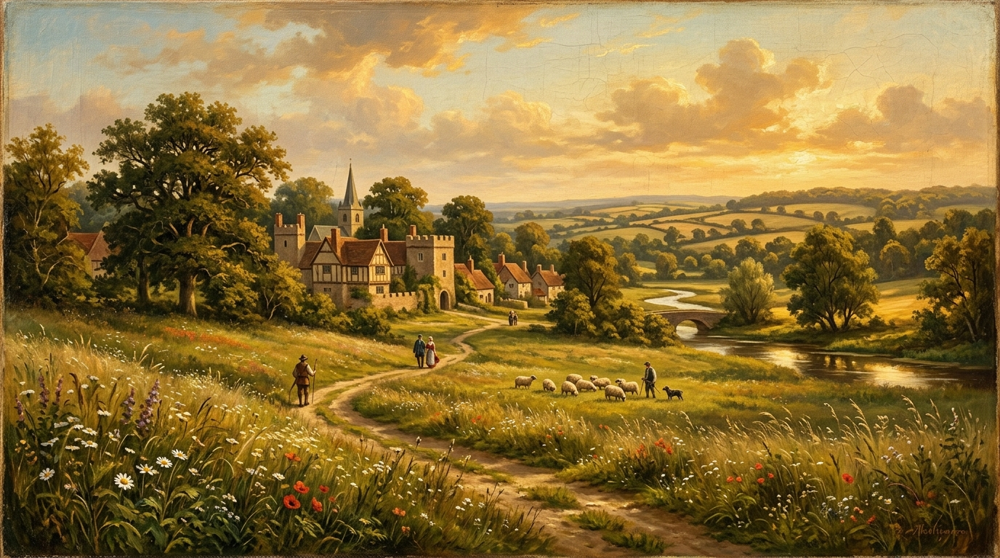

**Sonnet 18**, *"Shall I compare thee to a summer's day?"*, is one of the most famous poems in the English language. In it, the speaker compares their beloved to a summer's day, but concludes that the beloved is actually much better. Summer is fleeting, sometimes too hot, and often plagued by rough winds. But the beloved's beauty will remain eternal, preserved forever within the lines of this very poem.

Here is a line-by-line reading guide, combining the original text, vocabulary notes, and a modern translation based on standard literary interpretations (such as those found on NoSweatShakespeare).

---

### Quatrain 1

**Original text:**
> Shall I compare thee to a summer’s day?
> Thou art more lovely and more **temperate**:
> Rough winds do shake the darling buds of May,
> And summer’s **lease** hath all too short a date:

::: {.column-margin}
**temperate:** Even-tempered, moderate, and mild. Not extreme.
**lease:** The allotted time or duration given to summer by nature.
:::

**Modern Translation:**
Shall I compare you to a summer’s day? 
You are more lovely and more moderate: 
Harsh winds disturb the delicate flower buds of May, 
and summer simply doesn’t last long enough.

---

### Quatrain 2

**Original text:**
> Sometime too hot the eye of heaven shines,
> And often is his gold **complexion** dimm’d;
> And every fair from fair sometime **declines**,
> By chance or nature’s changing course **untrimm’d**;

::: {.column-margin}
**complexion:** The visible appearance or face of the sun.
**declines:** Fades or decreases in beauty.
**untrimm’d:** Stripped of its beauty and ornaments.
:::

**Modern Translation:**
Sometimes the sun is too hot, 
and its golden face is often dimmed by clouds. 
All beautiful things eventually become less beautiful, 
either by the accidents of life or by the inevitable passing of time.

---

### Quatrain 3

**Original text:**
> But thy eternal summer shall not fade
> Nor lose possession of that fair thou **owest**;
> Nor shall Death brag thou wander’st in his shade,
> When in eternal lines to time thou **growest**:

::: {.column-margin}
**owest:** Ownest or possessest.
**growest:** Become a permanent, growing part of time through the poem.
:::

**Modern Translation:**
But your eternal beauty won’t fade, 
nor will you lose the beauty you possess. 
And Death will never be able to brag that you are wandering in his shadows, 
because you will live on in my enduring, eternal poetry.

---

### The Couplet

**Original text:**
> So long as men can breathe or eyes can see,
> So long lives this and this gives life to thee.

**Modern Translation:**
As long as there are people still alive breathing and reading, 
this poem will survive, and it will keep your memory alive forever.
