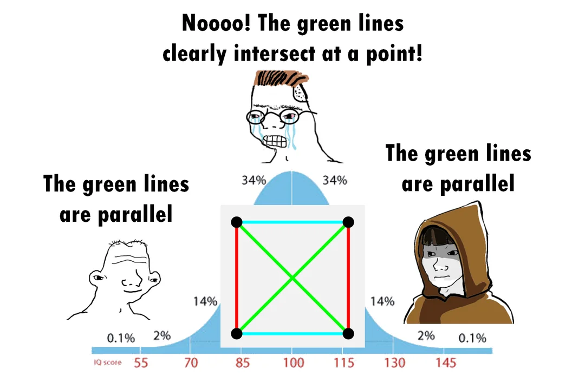
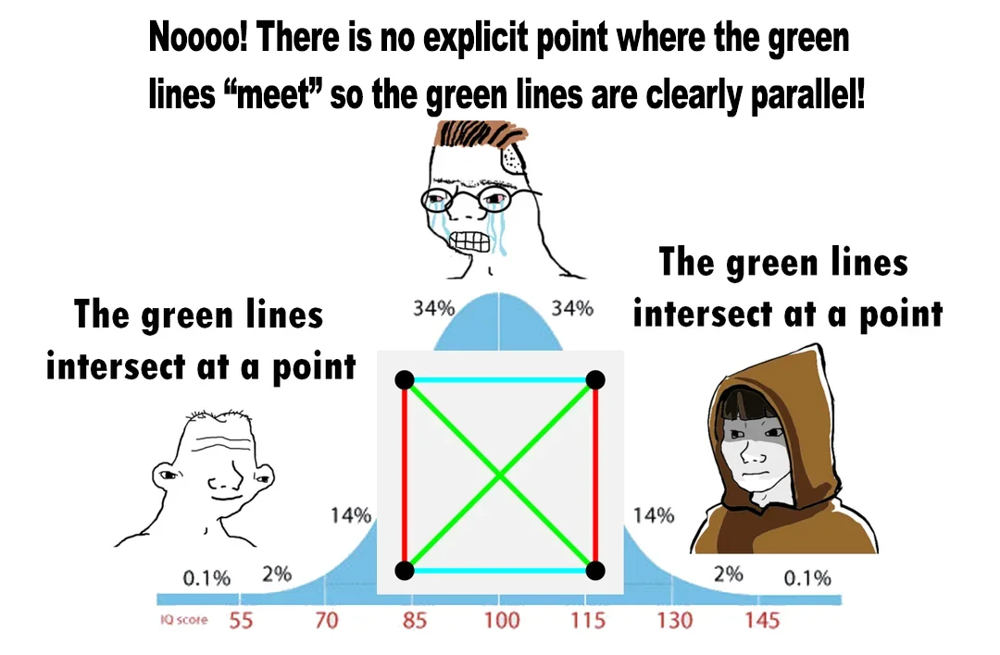
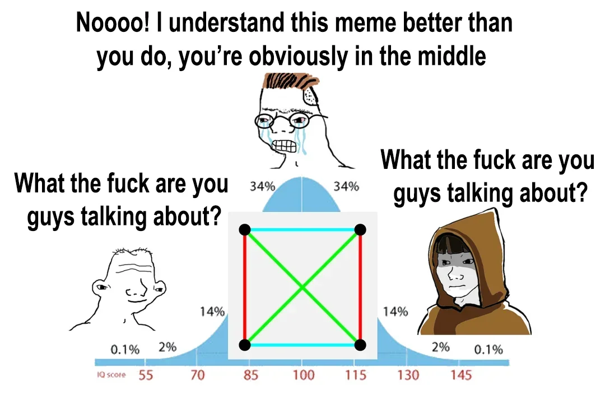

::: {.callout-note}
### Companion Treatises in this Foundations Series
* [The Geometry Masterclass: Axiomatic Systems, Metric Inequalities, and Projective Methods](file:///home/igorkan/repos/quarto-writing/posts/mathematics/geometry-axioms-theorems-olympiad-putnam-guide.qmd)
* [Mathematical Counterexamples, Paradoxes, and Cognitive Blindspots](file:///home/igorkan/repos/quarto-writing/posts/mathematics/mathematical-counterexamples-paradoxes-and-cognitive-blindspots.qmd)
* [Formal Logic, Model Theory, and Classical Mechanics](file:///home/igorkan/repos/quarto-writing/posts/mathematics/formal-logic-and-classical-mechanics.qmd)
* [Heuristics, Problem Solving, Mathematical Intuition, and Breakthroughs](file:///home/igorkan/repos/quarto-writing/posts/cognitive-science/heuristics-problem-solving-mathematical-intuition-and-breakthroughs.qmd)
:::

---

## 1. Introduction: The Meme That Divided the Mathematical Internet

In internet mathematical culture, few images have generated more fierce debate, cognitive dissonance, and pedantic flame wars than the **Midwit Geometry Bell Curve**:

{fig-align="center" width="85%"}

The diagram depicts a square with four black vertices:
* Two horizontal cyan lines connecting the top and bottom pairs of vertices.
* Two vertical red lines connecting the left and right pairs of vertices.
* Two diagonal green lines crossing across the center.

The three characters on the bell curve react as follows:
* **The Low-IQ Observer (IQ 55):** *"The green lines are parallel."*
* **The Midwit (IQ 100):** *"Noooo! The green lines clearly intersect at a point!"*
* **The Grandmaster (IQ 145):** *"The green lines are parallel."*

Almost immediately, variants appeared online. A second variant inverted the punchline:

{fig-align="center" width="85%"}

And finally, a third meta-meme emerged expressing sheer exasperation at the entire discourse:

{fig-align="center" width="85%"}

Is this merely an absurd internet joke? Or is it an extraordinarily deep gateway into **synthetic incidence geometry**, **finite fields**, **projective geometry**, and **model theory**?

As we will prove rigorously from first principles, this meme captures one of the most fundamental shifts in the history of mathematics: **the decoupling of geometry from visual pictures**. 

---

## 2. The Axiomatic Foundations of Incidence Geometry

To understand why the green lines can be simultaneously "parallel," "intersecting," or a "category error," we must first discard the intuitive illusion that geometry is the study of physical drawings on chalkboards or paper.

### 2.1 Hilbert's Cleansing of Intuition
In 1899, David Hilbert published *Grundlagen der Geometrie* (Foundations of Geometry), famously declaring:
> *"One must be able to say at all times—instead of points, straight lines, and planes—tables, chairs, and beer mugs."*

In modern mathematics, a **geometry** does not start with continuous space $\mathbb{R}^2$, rulers, or pencils. A geometry is formally defined as an abstract **Incidence Structure**:

::: {#def-incidence-structure}
#### Definition: Incidence Structure
An **incidence structure** is a triple $\mathcal{S} = (\mathcal{P}, \mathcal{L}, \mathcal{I})$, where:
1. $\mathcal{P}$ is a non-empty set whose elements are called **points**.
2. $\mathcal{L}$ is a non-empty set whose elements are called **lines**.
3. $\mathcal{I} \subseteq \mathcal{P} \times \mathcal{L}$ is a binary relation called the **incidence relation**. 

If $(P, \ell) \in \mathcal{I}$, we say *"the point $P$ lies on the line $\ell$"* or *"the line $\ell$ passes through the point $P$"*.
:::

Notice what is **missing** from this definition:
* There is no notion of distance (metric).
* There is no notion of angle, degrees, or perpendicularity.
* There is no notion of "betweenness" or continuity.
* There is no assumption that a line contains infinitely many points.

### 2.2 The Axioms of an Affine Plane
When is an arbitrary incidence structure $(\mathcal{P}, \mathcal{L}, \mathcal{I})$ entitled to be called an **affine plane**? It must satisfy three non-negotiable axioms:

::: {#def-affine-plane}
#### Axioms of an Affine Plane
An incidence structure $\mathcal{A} = (\mathcal{P}, \mathcal{L}, \mathcal{I})$ is an **affine plane** if:

1. **Axiom A1 (Line Existence & Uniqueness):**  
   Given any two distinct points $P, Q \in \mathcal{P}$ ($P \neq Q$), there exists **exactly one** line $\ell \in \mathcal{L}$ such that $(P, \ell) \in \mathcal{I}$ and $(Q, \ell) \in \mathcal{I}$. We denote this line by $P Q$.

2. **Axiom A2 (Playfair's Parallel Postulate):**  
   Two lines $\ell, m \in \mathcal{L}$ are defined to be **parallel** (denoted $\ell \parallel m$) if and only if they are identical or share no points:
   $$\ell \parallel m \iff \ell = m \quad \text{or} \quad \{P \in \mathcal{P} : P \in \ell \text{ and } P \in m\} = \emptyset$$
   *Axiom:* For every line $\ell \in \mathcal{L}$ and every point $P \in \mathcal{P}$ not on $\ell$, there exists **strictly one** line $m \in \mathcal{L}$ passing through $P$ such that $m \parallel \ell$.

3. **Axiom A3 (Non-Degeneracy):**  
   There exist at least four points in $\mathcal{P}$, no three of which are collinear (i.e., no single line contains three of them).
:::

If an incidence structure satisfies Axioms A1, A2, and A3, it is a mathematically valid affine plane—regardless of whether it contains infinitely many points (like $\mathbb{R}^2$) or a finite handful of discrete tokens!

---

## 3. The 4-Point Affine Plane $AG(2, \mathbb{F}_2)$: The Minimal Geometry

Now let us construct the exact mathematical universe depicted in the meme: the finite affine plane over the Galois field of two elements, denoted $AG(2, \mathbb{F}_2)$ or $AG(2, 2)$.

### 3.1 The Galois Field $\mathbb{F}_2$
The smallest possible field is $\mathbb{F}_2 = \{0, 1\}$, where addition is modulo 2 (exclusive OR, $\oplus$) and multiplication is standard integer multiplication (logical AND, $\wedge$):

$$\begin{array}{c|cc} + & 0 & 1 \\ \hline 0 & 0 & 1 \\ 1 & 1 & 0 \end{array} \qquad \begin{array}{c|cc} \times & 0 & 1 \\ \hline 0 & 0 & 0 \\ 1 & 0 & 1 \end{array}$$

Notice the fundamental characteristic of $\mathbb{F}_2$: **$1 + 1 = 0$**, which means $-1 = +1$. Moreover, the element $2 = 0$, which means division by $2$ is division by zero! **The fraction $\frac{1}{2}$ does not exist in $\mathbb{F}_2$.**

### 3.2 The Point Set $\mathcal{P}$
The affine plane $AG(2, \mathbb{F}_2)$ is the 2-dimensional vector space $V = \mathbb{F}_2^2$.
Its points are ordered pairs $(x, y)$ where $x, y \in \{0, 1\}$:
$$\mathcal{P} = \Big\{ (0,0), \; (1,0), \; (0,1), \; (1,1) \Big\}$$
There are **exactly 4 points** in the entire universe! In the meme diagram, these are the four black corner vertices:
* $P_1 = (0,0)$ (Bottom-Left)
* $P_2 = (1,0)$ (Bottom-Right)
* $P_3 = (0,1)$ (Top-Left)
* $P_4 = (1,1)$ (Top-Right)

### 3.3 What is a Line in $AG(2, \mathbb{F}_2)$?
In analytic linear algebra, a line in an affine space over a field $\mathbb{F}$ is an affine 1-dimensional subspace—that is, a coset of a 1-dimensional vector subspace:
$$\ell = \vec{x}_0 + \operatorname{span}\{\vec{v}\}, \quad \vec{v} \neq \mathbf{0}$$
Since the scalar field is $\mathbb{F}_2 = \{0, 1\}$, the span of a non-zero direction vector $\vec{v}$ consists of only two vectors:
$$\operatorname{span}\{\vec{v}\} = \{0 \cdot \vec{v}, \; 1 \cdot \vec{v}\} = \{\mathbf{0}, \; \vec{v}\}$$
Therefore, every line in $AG(2, \mathbb{F}_2)$ contains **exactly two points**:
$$|\ell| = 2 \quad \forall \ell \in \mathcal{L}$$

By Axiom A1, every pair of distinct points determines a unique line. How many distinct pairs of points can be chosen from a set of 4 points?
$$\binom{4}{2} = \frac{4 \times 3}{2} = 6 \text{ lines}$$
Thus, **the entire geometry contains exactly 4 points and 6 lines!**

### 3.4 The Six Lines and Three Parallel Classes
Let us write out all six lines explicitly using their algebraic equations over $\mathbb{F}_2$ and identify their visual colors in the meme:

#### Parallel Class 1 (Horizontal Lines — The Cyan Lines)
Slope $m = 0$, defined by equations of the form $y = c$:
* **Line $\ell_1$ (Bottom Cyan):** $y = 0 \implies \{(0,0), \; (1,0)\} = \{P_1, P_2\}$
* **Line $\ell_2$ (Top Cyan):** $y = 1 \implies \{(0,1), \; (1,1)\} = \{P_3, P_4\}$
* **Intersection:** $\ell_1 \cap \ell_2 = \emptyset \implies \ell_1 \parallel \ell_2$.

#### Parallel Class 2 (Vertical Lines — The Red Lines)
Slope $m = \infty$, defined by equations of the form $x = c$:
* **Line $\ell_3$ (Left Red):** $x = 0 \implies \{(0,0), \; (0,1)\} = \{P_1, P_3\}$
* **Line $\ell_4$ (Right Red):** $x = 1 \implies \{(1,0), \; (1,1)\} = \{P_2, P_4\}$
* **Intersection:** $\ell_3 \cap \ell_4 = \emptyset \implies \ell_3 \parallel \ell_4$.

#### Parallel Class 3 (Diagonal Lines — The Green Lines)
Slope $m = 1$, defined by equations of the form $y = x + c$:
* **Line $\ell_5$ (Main Diagonal Green):** $y = x \implies \{(0,0), \; (1,1)\} = \{P_1, P_4\}$
* **Line $\ell_6$ (Anti-Diagonal Green):** $y = x + 1 \implies \{(1,0), \; (0,1)\} = \{P_2, P_3\}$
* **Intersection:**
  $$\ell_5 \cap \ell_6 = \{(0,0), (1,1)\} \cap \{(1,0), (0,1)\} = \emptyset$$
  Because $\ell_5 \cap \ell_6 = \emptyset$, by Axiom A2, **$\ell_5 \parallel \ell_6$!**

### 3.5 The Resolution: The Green Lines Are Strictly Parallel!
We have arrived at the mathematical punchline of Meme 1:
$$\mathbf{In \ } AG(2, \mathbb{F}_2), \mathbf{\ the \ two \ green \ diagonal \ lines \ are \ PARALLEL!}$$

Why does the midwit scream *"Noooo! The green lines clearly intersect at a point!"*?
Because the midwit suffers from the **Continuous Diagrammatic Fallacy**:
1. When drawing the 4 points on a 2D Euclidean page, the human eye embeds the points into $\mathbb{R}^2$: $P_1 = (0,0), P_2 = (1,0), P_3 = (0,1), P_4 = (1,1)$.
2. In $\mathbb{R}^2$, the line segments connecting $(0,0) \to (1,1)$ and $(1,0) \to (0,1)$ intersect at $(0.5, 0.5)$.
3. But the affine plane $AG(2, \mathbb{F}_2)$ **knows nothing of $\mathbb{R}^2$**!
4. The coordinates $(0.5, 0.5)$ **do not exist** in $\mathbb{F}_2^2$. In $\mathbb{F}_2$, $0.5$ is literally undefined (division by $1+1=0$).
5. The visual crossing in the middle of the drawing is an **optical artifact of the Euclidean representation**, completely external to the incidence geometry itself!
