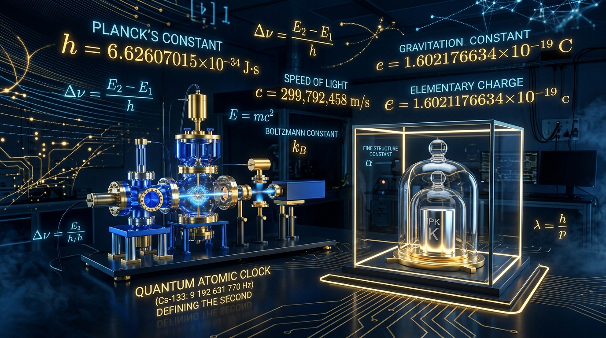

On **May 20, 2019** (World Metrology Day), the 26th General Conference on Weights and Measures (CGPM) enacted the most profound conceptual revolution in metrology since the inception of the metric system during the French Revolution. 

For the first time in human history, **every single one of the seven base units of the International System of Units (SI) is defined entirely in terms of fixed, exact numerical values of fundamental physical constants**. Physical artifacts subject to decay, contamination, and loss have been permanently banished from the foundations of physical law.

---

## 1. The Definitional Architecture of the Revised SI

The modern SI is anchored by fixing the exact numerical values of seven defining constants:

| Base Unit | Dimension | Defining Constant | Symbol | Fixed Numerical Value | Units |
|:---|:---|:---|:---:|:---|:---|
| **Second** | Time ($\text{T}$) | Hyperfine transition of $^{133}\text{Cs}$ | $\Delta\nu_{\text{Cs}}$ | $9{,}192{,}631{,}770$ | $\text{Hz} = \text{s}^{-1}$ |
| **Meter** | Length ($\text{L}$) | Speed of light in vacuum | $c$ | $299{,}792{,}458$ | $\text{m}\cdot\text{s}^{-1}$ |
| **Kilogram** | Mass ($\text{M}$) | Planck constant | $h$ | $6.62607015 \times 10^{-34}$ | $\text{J}\cdot\text{s} = \text{kg}\cdot\text{m}^2\cdot\text{s}^{-1}$ |
| **Ampere** | Electric current ($\text{I}$) | Elementary charge | $e$ | $1.602176634 \times 10^{-19}$ | $\text{C} = \text{A}\cdot\text{s}$ |
| **Kelvin** | Thermodynamic temp ($\Theta$) | Boltzmann constant | $k$ | $1.380649 \times 10^{-23}$ | $\text{J}\cdot\text{K}^{-1} = \text{kg}\cdot\text{m}^2\cdot\text{s}^{-2}\cdot\text{K}^{-1}$ |
| **Mole** | Amount of substance ($\text{N}$) | Avogadro constant | $N_{\text{A}}$ | $6.02214076 \times 10^{23}$ | $\text{mol}^{-1}$ |
| **Candela** | Luminous intensity ($\text{J}$) | Luminous efficacy of $540\text{ THz}$ radiation | $K_{\text{cd}}$ | $683$ | $\text{lm}\cdot\text{W}^{-1} = \text{cd}\cdot\text{sr}\cdot\text{kg}^{-1}\cdot\text{m}^{-2}\cdot\text{s}^3$ |

---

## 2. A Critical History: From Human Body Parts to Artifacts

### The Pre-Metric Patchwork
For millennia, human weights and measures were anthropomorphic or agricultural:
* **Length:** The cubit (forearm length), the foot, the inch (width of three barleycorns).
* **Mass:** The **avoirdupois pound**, established in England in the 14th century, defined as exactly $7{,}000$ troy grains of wheat taken from the middle of the ear.
* Local barons, guilds, and kings minted arbitrary standards, creating thousands of mutually incompatible systems that made honest trade and rigorous scientific comparison nearly impossible.

### The Metric Revolution: CGS vs. MKS
In the 1790s, the French Academy of Sciences set out to create a system "for all people, for all time" (*à tous les temps, à tous les peuples*):
* The **meter** was originally defined as $1/10{,}000{,}000$ of the meridian distance from the North Pole to the Equator passing through Paris.
* The **grave** (later renamed **kilogram**) was the mass of one cubic decimeter ($1\text{ liter}$) of pure water at its freezing point.

In the late 19th century, physicists developed the **CGS system** (centimeter-gram-second). Championed by James Clerk Maxwell and Carl Friedrich Gauss, CGS cleanly unified mechanics with electrostatics (esu) and electrodynamics (emu). However, units like the dyne ($10^{-5}\text{ N}$) and erg ($10^{-7}\text{ J}$) were impractical for mechanical engineering and electrical power distribution. 

In 1901, Italian engineer Giovanni Giorgi demonstrated that adding a fourth electrical unit (the ohm or ampere) unified mechanics and electromagnetism into the **MKS system** (meter-kilogram-second-ampere), which became the direct forerunner of the modern SI established in 1960.

---

## 3. The Fatal Flaws of *Le Grand K* (IPK)

In 1889, metrologists manufactured the **International Prototype of the Kilogram (IPK)**, known colloquially as *Le Grand K*. It was a right-circular cylinder ($39\text{ mm}$ height by $39\text{ mm}$ diameter) machined from an alloy of $90\%$ platinum and $10\%$ iridium, chosen for its extreme density ($\approx 21.5\text{ g/cm}^3$) and corrosion resistance. It was housed under three concentric glass bell jars in an environmentally controlled subterranean vault at the BIPM in Sèvres, France.

Over its 130-year reign, the IPK revealed unavoidable physical pathologies:

1. **Surface Contamination & Volatile Adsorption:** Despite hermetic glass vaults, atmospheric hydrocarbons, volatile organic compounds (VOCs), and airborne mercury vapor gradually diffused onto the cylinder's surface, steadily increasing its mass by approximately $1\text{ }\mu\text{g}$ per year.
2. **The Cleaning/Washing Dilemma:** Before periodic calibrations, the BIPM washed the IPK using a standardized protocol: rubbing with solvent-soaked chamois followed by steam cleaning with bi-distilled water. Each cleaning inevitably abraded microscopic clusters of platinum and iridium atoms, causing irreversible mass loss.
3. **Divergence of National Sister Prototypes:** Every few decades, the IPK was compared against its identical official sister copies (*témoins*) distributed to national metrology institutes worldwide (such as K20 at NIST in the United States). By the 3rd Periodic Verification (1988–1992), the national prototypes had diverged from the IPK by more than **$50\text{ micrograms}$**.
4. **The Epistemological Paradox:** Because the IPK was *by definition* exactly one kilogram ($\Delta m \equiv 0$), it was impossible to determine whether the IPK was losing mass or the copies were gaining mass. If a stray cosmic ray knocked off an atom from Le Grand K, the mass of every star, atom, and galaxy in the universe instantly increased by definition!

---

## 4. Quantum Realization of Mass: The Kibble Balance

To sever mass from a physical object, metrologists turned to quantum mechanics, linking mass directly to the **Planck constant** ($h$). The primary realization instrument is the **Kibble Balance** (conceived by Bryan Kibble in 1975 at the NPL).

The balance eliminates unmeasurable geometric uncertainties in magnetic coils by operating in two distinct alternating phases:

### Phase 1: Weighing Mode (Static Force Equilibrium)
A calibration mass $m$ rests on a circular coil of wire of length $L$ suspended in a radial magnetic field of flux density $B$. A direct current $I$ is passed through the coil, creating an upward electromagnetic Lorentz force that precisely counterbalances gravity:

$$ m g = I \oint (\mathbf{dl} \times \mathbf{B}) = I (B L) $$

where $g$ is local gravitational acceleration (measured simultaneously with absolute gravimeters to parts in $10^9$).

### Phase 2: Velocity Mode (Dynamic Induction)
The mass is removed. The coil is moved vertically through the exact same radial magnetic field at a constant controlled velocity $v$. By Faraday's Law of Induction, a voltage $V$ is induced across the coil terminals:

$$ V = - \frac{d\Phi}{dt} = v (B L) \implies B L = \frac{V}{v} $$

### The Kibble Cancellation
Substituting the geometric product $B L = V / v$ back into the weighing equation:

$$ m g = I \left( \frac{V}{v} \right) \implies m g v = I V $$

**Mechanical power equals electrical power!** 

### Macroscopic Quantum Standards
To tie electrical power ($I V$) to Planck's constant $h$, the voltage and current are measured using macroscopic quantum effects:

1. **Josephson Effect (Voltage Standard):**
   When a microwave frequency $f_{\text{J}}$ irradiates a superconductor-insulator-superconductor tunnel junction, the voltage across the junction is quantized in exact steps:
   $$ V = n \left( \frac{h}{2e} \right) f_{\text{J}} $$

2. **Quantum Hall Effect (Resistance Standard):**
   At cryogenic temperatures ($< 1\text{ K}$) and strong magnetic fields ($> 10\text{ T}$), the Hall resistance of a 2D electron gas is strictly quantized:
   $$ R_{\text{H}} = \frac{1}{p} \left( \frac{h}{e^2} \right) $$

Expressing current via Ohm's Law through a quantum Hall resistor ($I = V' / R_{\text{H}}$), the electrical power product becomes:

$$ I V = \frac{V \cdot V'}{R_{\text{H}}} = \frac{\left[ n_1 \left(\frac{h}{2e}\right) f_1 \right] \left[ n_2 \left(\frac{h}{2e}\right) f_2 \right]}{\frac{1}{p} \left(\frac{h}{e^2}\right)} = \left( \frac{p \, n_1 n_2}{4} \right) h \, f_1 f_2 $$

**The elementary charge $e$ cancels out completely!**

$$ m = \frac{p \, n_1 n_2}{4 g v} h \, f_1 f_2 $$

Because frequencies ($f_1, f_2$) and length/velocity ($v$) are referenced to atomic clocks and laser interferometers, **mass is measured directly in terms of Planck's constant $h$**.

---

## 5. The Alternative Realization: The Silicon Avogadro Sphere (XRCD)

The Kibble balance was validated against an independent physical method: the **International Avogadro Coordination (IAC)** X-Ray Crystal Density (XRCD) project.

Metrologists enriched silicon gas to $99.9995\%$ pure isotope $^{28}\text{Si}$ using Russian centrifuges previously used for uranium enrichment. From this ingots, opticians polished two nearly perfect $1\text{ kg}$ spheres whose roundness deviates by less than **$5\text{ nanometers}$** across their $93.7\text{ mm}$ diameter.

The number of atoms $N$ inside the sphere is determined by dividing the macroscopic volume $V_{\text{sphere}}$ (measured by spherical optical interferometry) by the microscopic unit cell volume $V_{\text{cell}} = a_0^3$ (measured by X-ray interferometry):

$$ N = 8 \left( \frac{V_{\text{sphere}}}{a_0^3} \right) $$

(Since a silicon face-centered diamond cubic unit cell contains exactly 8 atoms). The Avogadro constant is then:

$$ N_{\text{A}} = \frac{M(\text{Si}) \cdot N}{m_{\text{sphere}}} $$

Because $h$ and $N_{\text{A}}$ are related through the Rydberg constant $R_\infty$ and the fine-structure constant $\alpha$:

$$ h = \frac{c \, \alpha^2 \, M_u \, A_r(e)}{2 R_\infty N_{\text{A}}} $$

the silicon spheres provided an independent, sub-$20\text{ ppb}$ precision cross-check of Planck's constant prior to the redefinition.

---

## 6. The Thermodynamics and Electrodynamic Revisions

### The Kelvin: Fixing Boltzmann's Constant $k$
* **Old Definition:** $1/273.16$ of the thermodynamic temperature of the triple point of Vienna Standard Mean Ocean Water (VSMOW).
  * *Flaw:* The isotopic composition of water varies naturally; isotopic shifts alter the triple point by hundreds of microkelvins.
* **New Definition:** Fixes $k = 1.380649 \times 10^{-23}\text{ J/K}$.
* **Realization:** 
  * **Acoustic Gas Thermometry (AGT):** Measuring the speed of sound $u$ in noble gases at low pressure: $u^2 = \gamma k T / m$.
  * **Johnson Noise Thermometry:** Measuring thermal voltage fluctuations in resistors: $\langle V^2 \rangle = 4 k T R \Delta f$.

### The Ampere and the Decoupling of $\mu_0$ and $\varepsilon_0$
Prior to 2019, the ampere was defined via the force between two infinitely long, infinitesimally thin parallel wires separated by $1\text{ meter}$, which artificially set the magnetic permeability of vacuum to an exact integer multiple:

$$ \mu_0 \equiv 4\pi \times 10^{-7}\text{ N/A}^2 \quad (\text{exact by definition}) $$

Under the revised SI, the **elementary charge** $e = 1.602176634 \times 10^{-19}\text{ C}$ is fixed instead. Consequently, $\mu_0$ and vacuum permittivity $\varepsilon_0 = 1/(\mu_0 c^2)$ are **no longer exact constants**! They depend on the dimensionless fine-structure constant $\alpha$:

$$ \mu_0 = \frac{2\alpha h}{e^2 c}, \quad \varepsilon_0 = \frac{e^2}{2\alpha h c} $$

Because $\alpha \approx 1/137.035999...$ is an experimentally determined quantum electrodynamic coupling constant, $\mu_0$ and $\varepsilon_0$ now carry experimental measurement uncertainty (approximately $1.5 \times 10^{-10}$).

---

## 7. Dependency Architecture of the Revised SI

Below is a Python visualization showing the hierarchical network of how the seven fundamental constants define the seven SI base units.

```{python}
#| label: fig-si-network
#| fig-cap: "The network of dependencies between the 7 defining constants and the 7 SI base units."
import matplotlib.pyplot as plt
import matplotlib.patches as patches

fig, ax = plt.subplots(figsize=(10, 6))

# Coordinates for Constants (Inner circle / Top) and Units (Outer circle / Bottom)
constants = {
    r'$\Delta\nu_{\mathrm{Cs}}$': (2, 4),
    r'$c$': (4, 4),
    r'$h$': (6, 4),
    r'$e$': (8, 4),
    r'$k$': (1, 2),
    r'$N_{\mathrm{A}}$': (5, 2),
    r'$K_{\mathrm{cd}}$': (9, 2)
}

units = {
    'Second (s)': (2, 5),
    'Meter (m)': (4, 5.2),
    'Kilogram (kg)': (6, 5.2),
    'Ampere (A)': (8, 5),
    'Kelvin (K)': (1, 0.8),
    'Mole (mol)': (5, 0.8),
    'Candela (cd)': (9, 0.8)
}

# Draw Constants (Diamonds)
for label, (x, y) in constants.items():
    ax.scatter(x, y, s=1500, marker='s', color='#2ca02c', alpha=0.85, zorder=4)
    ax.text(x, y, label, ha='center', va='center', color='white', fontsize=11, fontweight='bold')

# Draw Units (Circles)
for label, (x, y) in units.items():
    ax.scatter(x, y, s=1700, marker='o', color='#1f77b4', alpha=0.85, zorder=4)
    ax.text(x, y, label, ha='center', va='center', color='white', fontsize=8.5, fontweight='bold')

# Directed connections (Constant -> Unit)
edges = [
    (constants[r'$\Delta\nu_{\mathrm{Cs}}$'], units['Second (s)']),
    (constants[r'$c$'], units['Meter (m)']),
    (constants[r'$\Delta\nu_{\mathrm{Cs}}$'], units['Meter (m)']),
    (constants[r'$h$'], units['Kilogram (kg)']),
    (constants[r'$c$'], units['Kilogram (kg)']),
    (constants[r'$\Delta\nu_{\mathrm{Cs}}$'], units['Kilogram (kg)']),
    (constants[r'$e$'], units['Ampere (A)']),
    (constants[r'$\Delta\nu_{\mathrm{Cs}}$'], units['Ampere (A)']),
    (constants[r'$k$'], units['Kelvin (K)']),
    (constants[r'$h$'], units['Kelvin (K)']),
    (constants[r'$N_{\mathrm{A}}$'], units['Mole (mol)']),
    (constants[r'$K_{\mathrm{cd}}$'], units['Candela (cd)'])
]

for (x1, y1), (x2, y2) in edges:
    ax.annotate('', xy=(x2, y2), xytext=(x1, y1),
                arrowprops=dict(arrowstyle="->", color='gray', lw=1.5, alpha=0.6, shrinkA=18, shrinkB=18))

ax.set_xlim(-0.2, 10.2)
ax.set_ylim(0, 6)
ax.axis('off')
ax.set_title("Dependency Graph: Constants (Green Squares) $\\longrightarrow$ SI Base Units (Blue Circles)", 
             fontsize=12, fontweight='bold', pad=20)
plt.tight_layout()
plt.show()
```

---

## 8. Further Viewing & Literature on the SI Redefinition

To explore how these redefining measurements were performed in national metrology laboratories, check out these essential video breakdowns and papers:

* **The Silicon Sphere & Kilogram Redefinition (Veritasium):**


* **The World's Roundest Object (Avogadro Project):**


* **The Transition to the New SI Units:**


* **NIST DIY LEGO Watt Balance Demonstration:**


* **Peer-Reviewed Reference:** [A LEGO Watt balance: An apparatus to determine a fundamental constant](https://pubs.aip.org/aapt/ajp/article/83/11/913/1039505/A-LEGO-Watt-balance-An-apparatus-to-determine-a) (*American Journal of Physics*, L. S. Chao et al., 2015).

* **Additional Documentary Overviews:**






