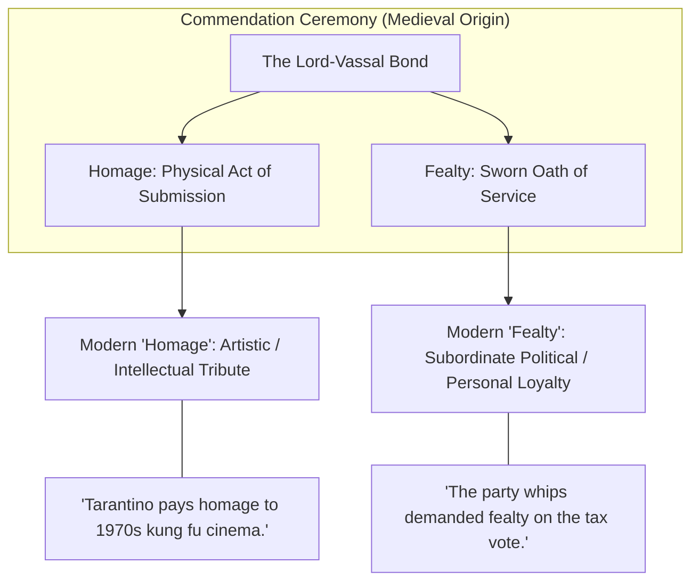

## 1. Introduction: The Hierarchy of Commitment

Human societies have always required binding linguistic formulas to cement political alliances, secure social contracts, and govern relations between rulers and subjects. English possesses an exceptionally rich, layered vocabulary inherited from Anglo-Saxon custom, Anglo-Norman feudal law, and classical Latin jurisprudence: **fealty**, **homage**, **allegiance**, **fidelity**, and **loyalty**.

While conversational English frequently reduces these concepts to the catch-all word *"loyalty"*, sophisticated writers, historians, jurists, and political commentators deploy each term according to precise historical lineages and relational hierarchies:

* Did the obligation arise from a medieval contract of land tenure, a constitutional citizenship duty, or personal moral dedication?
* Is the act a physical ritual of submission (**homage**), a sworn oath of non-aggression and service (**fealty**), or a citizen’s reciprocal duty to a sovereign state (**allegiance**)?
* How do modern political journalists use these medieval legal terms to describe partisan loyalty, corporate vassalage, and geopolitical subordination?

This guide provides an exhaustive pedagogical masterclass on **fealty** and its semantic cluster, tracing their feudal origins, grammatical mechanics, modern figurative transformations, and antonymous violations.

---

## 2. Deep Dive: "Fealty"

```
                         Latin: fidelitas (Faithfulness)
                                       │
                                       ▼
                       Old French: fealté / feauté
                                       │
                                       ▼
                     Middle English: feute / fealte (c. 1300)
                                       │
               ┌───────────────────────┴───────────────────────┐
               ▼                                               ▼
   [Historical Feudal Law]                           [Modern Transferred Sense]
 The sworn oath of fidelity by                    Intense, absolute, or blind
 a vassal to his feudal lord                      allegiance to a party, leader,
 (Oath of Fealty: auxilium et consilium)          ideology, or corporate sovereign
```

### 1. Lexical Profile
* **Part of Speech:** Uncountable Noun (Singular mass noun).
* **Pronunciation:** 
  * UK: /ˈfiː.əl.ti/
  * US: /ˈfiː.əl.ti/ or /ˈfiːl.ti/
* **Etymology:** Derived from Old French *fealté*, evolving from Latin *fidelitas* ("faithfulness, adherence to trust"), from *fidelis* ("faithful") and *fides* ("faith, trust"). It is an etymological doublet of the English word **fidelity**.
* **Syntactic Collocations & Patterns:**
  * *Swear / pledge / vow / promise **fealty to** [person / cause]*
  * *Owe **fealty to** [lord / institution]*
  * *Demand / extract **fealty from** [subordinates / followers]*
  * *Blind / unswerving / unconditional / absolute **fealty***

---

### 2. The Historical Feudal Contract: *Homage* vs. *Fealty*
In medieval Western European feudalism (from the 9th to 15th centuries), a freeman became the vassal of a lord through a formal three-part ceremony known as the **Commendation Ceremony**:


1. **Homage (*Homagium*, from Latin *homo*, "man")**:
   * The physical ceremony of submission. The prospective vassal knelt bareheaded and weaponless, clasped his hands together, placed them between the hands of the lord (*immixtio manuum*), and declared: *"Sire, I become your man."* The lord raised him and sealed the bond with a ceremonial kiss (*osculum*).
2. **Fealty (*Fidelitas*)**:
   * The solemn religious oath that followed homage. Standing with his right hand upon the Holy Gospels or sacred relics, the vassal swore never to injure the lord’s person, family, or castle, and promised **auxilium et consilium** (*aid and counsel*—military service and judicial attendance).
3. **Investiture (*Investitura*)**:
   * The lord's reciprocal transfer of the **fief** (land or revenue), symbolized by handing the vassal a physical token: a clod of earth, a twig, or a charter.

> [!NOTE]
> #### Historical Distinction: Can One Owe Fealty Without Homage?
> Yes. Serfs and peasant tenants were frequently required to swear an oath of *fealty* to the lord of the manor, acknowledging his lordship and promising obedience, but they were never permitted to perform *homage*—because homage was a dignified rite reserved strictly between honorable freemen and noble warriors.

---

### 3. Modern Figurative & Political Register
In modern English, *fealty* has migrated from medieval legal contracts into the lexicon of political critique, corporate governance, and literary drama:

#### 1. Political Journalism & Partisan Discipline
* *"The populist senator demanded absolute **fealty** from party members, threatening to endorse primary challengers against anyone who voted for the bipartisan infrastructure bill."*
* *"In autocratic regimes, judicial appointments are rarely determined by legal competence, but rather by personal **fealty** to the ruling executive."*

#### 2. Corporate & Institutional Vassalage
* *"Silicon Valley startups in the platform’s ecosystem were forced to pledge commercial **fealty**, accepting steep revenue commissions and restrictive APIs under threat of total deplatforming."*

#### 3. Literary & Fantasy World-Building
* In epic literature (such as Frank Herbert's *Dune* or George R. R. Martin's *A Song of Ice and Fire*), the language of feudal oaths (*"I swear fealty to House Atreides"*) heightens archaic gravitas and contractual moral stakes.

---

## 3. The Semantic Cluster: Comparative Analysis

To select the most precise term, writers must distinguish between legal obligations, emotional bonds, civic duties, and religious devotion:

```
[Fealty]     ──► Sworn contractual subordination to a lord or political chieftain.
[Homage]     ──► Public gesture of honor, deference, or artistic tribute.
[Allegiance] ──► Constitutional / civic obligation owed by a citizen to a nation or sovereign.
[Fidelity]   ──► Exacting accuracy, moral constancy, or marital faithfulness.
[Loyalty]    ──► Broad emotional or instinctive steadfastness across any relationship.
[Devotion]   ──► Deep, self-sacrificing affection or spiritual consecration.
[Piety]      ──► Filial, ancestral, or religious reverence (Latin pietas).
```

### Comprehensive Comparison Matrix

| Term | Historical / Etymological Core | Modern Semantic Domain | Typical Preposition & Syntax | Illustrative Example |
| :--- | :--- | :--- | :--- | :--- |
| **Fealty** | Old French *fealté* (sworn vassalage). | Subservient loyalty, political party discipline, factional devotion. | *Fealty to [person / party]* | *"The warlord demanded an oath of **fealty** from every regional governor."* |
| **Homage** | Old French *hommage* (becoming the lord's "man"). | Respectful deference, artistic tribute, public acknowledgment of debt. | *Pay / do homage to [figure / work]* | *"The director's latest film is a stylish **homage** to French New Wave cinema."* |
| **Allegiance** | Anglo-Norman *ligeance* (duty to the liege lord). | Formal, legal duty of a citizen to a state, flag, or constitutional order. | *Allegiance to [nation / flag / cause]* | *"Immigrants taking the naturalization oath formally renounce former **allegiances**."* |
| **Fidelity** | Latin *fidelitas* (accuracy, faithfulness). | 1. Marital/vow constancy.<br>2. Exact truthfulness to source/fact.<br>3. Signal reproduction. | *Fidelity to [vows / text / original]* | *"The translator preserved exceptional **fidelity** to the poet's archaic meter."* |
| **Loyalty** | Old French *loial* (law-abiding, faithful). | Broad personal, institutional, or consumer steadfastness. | *Loyalty to [friend / brand / team]* | *"Customer **loyalty** plummeted after the sudden subscription price hike."* |
| **Adherence** | Latin *adhaerere* (clinging to). | Intellectual, doctrinal, or regulatory compliance. | *Adherence to [rules / doctrine / regime]* | *"Strict **adherence** to sterile protocols prevented post-surgical infection."* |

---

## 4. Nuanced Stylistic Pitfalls: "Homage" vs. "Fealty"

One of the most frequent errors in advanced writing is treating *homage* and *fealty* as direct synonyms. While both originate in the medieval commendation ceremony, their modern trajectories have diverged sharply:



* **You *pay homage* to show respect or creative debt**:
  * You cannot say: *"The director paid fealty to Hitchcock."* (Incorrect: Hitchcock is not a feudal lord commanding the director’s political obedience).
  * Correct: *"The director paid **homage** to Hitchcock through dramatic Dutch-angle framing."*
* **You *swear fealty* to acknowledge superior authority or allegiance**:
  * You cannot say: *"The rebel soldiers swore homage to the general."* (Stilted/Imprecise).
  * Correct: *"The rebel soldiers swore **fealty** to the general."*

---

## 5. The Antonym Spectrum: Violating the Bond

In feudal and constitutional law, breaking an oath of fealty or allegiance was the most catastrophic crime an individual could commit. English preserves specific vocabulary for each degree of betrayal:

```
[Infidelity]   ──► Breach of trust, marital unfaithfulness, or inaccurate copying.
[Perfidy]      ──► Deliberate, treacherous violation of a sworn promise or truce (Latin per-fidem).
[Insubordination] ──► Defiance of lawful authority within a command hierarchy.
[Sedition]     ──► Incitement of resistance or insurrection against the lawful state.
[Treason]      ──► Levying war against one's own sovereign nation or adhering to its enemies.
[Apostasy]     ──► Total renunciation or abandonment of a religious or political faith.
```

### 1. Perfidy
* **Definition:** Deceitfulness, untrustworthiness, or the deliberate violation of an explicit pledge of faith.
* **In Law of Armed Conflict:** Under the Geneva Conventions, *perfidy* is a war crime involving the treacherous abuse of good faith (e.g., feigning surrender or flying a Red Cross flag to ambush enemy forces).
* *Example:* *"The ambassador regarded the sudden surprise dawn offensive as an act of intolerable diplomatic **perfidy**."*

### 2. Treason & High Treason
* **Definition:** Betrayal of one’s sovereign state. Article III, Section 3 of the United States Constitution specifically defines treason as *"levying War against them, or in adhering to their Enemies, giving them Aid and Comfort."*
* *Contrast with Fealty:* In feudal England, *Petit Treason* (*Petty Treason*) referred to a subordinate murdering their lawful superior (a servant killing their master, or a wife killing her husband)—an explicit violation of the natural hierarchy of fealty.

---

## 6. Pedagogical Drills & Active Recall Exercises

Test your command of *fealty*, *homage*, *allegiance*, and their related terms through the following contextual exercises.

### Exercise 1: Precision Word Selection
*Fill each blank with the most precise term: **fealty**, **homage**, **allegiance**, **fidelity**, **perfidy**.*

1. *"The retrospective exhibition was organized as a loving ________ to the late sculptor, showcasing three decades of bronze monumental art."*
2. *"Although dual citizens hold passports from both nations, in times of war, conflicting ________ can create severe diplomatic and legal crises."*
3. *"The rogue faction feigned surrender under a white flag before detonating a remote mine—an egregious violation of the laws of war classified as ________."*
4. *"Modern sound engineers praised the audio mastering, noting its astonishing ________ to the original 1959 magnetic analog tapes."*
5. *"The governor discovered that several key commissioners owed their political careers—and their ultimate ________—not to the voters, but to an influential corporate lobbying syndicate."*

#### Answer Key & Explanations:
1. **homage**: A public artistic tribute or retrospective recognition of creative achievement.
2. **allegiances**: Formal civic or constitutional loyalty owed by a citizen to a sovereign state.
3. **perfidy**: Treacherous abuse of good faith or symbols of truce in combat.
4. **fidelity**: High-accuracy, low-distortion reproduction of an original physical signal or text.
5. **fealty**: Subservient, unswerving loyalty owed to an external patron or political machine.

---

### Exercise 2: Stylistic Analysis & Error Correction
*Identify the semantic or grammatical flaw in each sentence and provide an elevated revision:*

1. *Flawed:* *"The young author paid fealty to Gabriel García Márquez in the opening chapter of her magical-realist novel."*
   * **Diagnosis:** Misuse of *fealty*. An author does not owe political or feudal obedience to another writer; she is honoring his literary influence.
   * **Revision:** *"The young author **paid homage** to Gabriel García Márquez in the opening chapter..."*
2. *Flawed:* *"The company required all employees to sign an oath of allegiance to the brand."*
   * **Diagnosis:** *Allegiance* carries sovereign, constitutional, or national weight. Using it for corporate employment is hyperbolic unless deliberately satirical.
   * **Revision:** *"The company required all employees to demonstrate **unwavering loyalty / dedication** to the brand."* (Or if contractual: *sign an **adherence** / confidentiality agreement*).
3. *Flawed:* *"The vassal did an homage and swore a fealty."*
   * **Diagnosis:** *Fealty* is an uncountable mass noun; it cannot take an indefinite article (*"a fealty"*).
   * **Revision:** *"The vassal **performed homage and swore fealty** to his lord."*

---

## 7. Curated Sources & Further Reading

* **Marc Bloch**, *Feudal Society* (*La Société féodale*), Vols. 1 & 2, University of Chicago Press (1961). The classic structural analysis of the commendation ceremony, homage, and the oath of fealty.
* **F. L. Ganshof**, *Feudalism*, 3rd English Edition, University of Toronto Press (1964). Detailed legal breakdown of *homagium*, *fidelitas*, and *investitura*.
* **Bryan A. Garner**, *Garner's Modern English Usage*, 5th Edition, Oxford University Press (2022). Comprehensive guidance on the contemporary registers of *fealty*, *homage*, and *allegiance*.
* **Oxford English Dictionary (OED)**, "Fealty, n.", Oxford University Press. Historical etymological tracking from Anglo-Norman records to modern usage.
* **James Stewart**, *Calculus: Early Transcendentals*, 8th Edition, Cengage Learning (2015). Mathematical principles of invariant fidelity in geometric transformations, approximation errors, and metric preservation.
<br>
<br>

<div style="text-align: center; color: #888; font-size: 0.9em;">
  © 2026 Igor Kan
</div>
