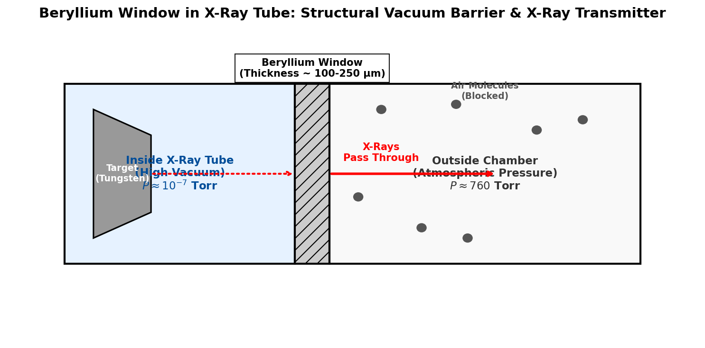

# Introduction to Beryllium

Beryllium (atomic symbol **Be**, atomic number **4**) is the second element in Group 2 (the alkaline earth metals). It is a relatively rare element in the universe, formed primarily through cosmic ray spallation rather than stellar nucleosynthesis. Beryllium is a steel-gray, strong, lightweight metal that possesses unique thermal and mechanical properties, making it indispensable in high-tech engineering despite its high toxicity.

## Physical & Chemical Properties

* **Atomic Configuration**: Beryllium has four protons, five neutrons, and four electrons, with a valence configuration of $1s^2 2s^2$. 
* **Mechanical Properties**: It has one of the highest melting points ($1287^\circ\text{C}$) among the light metals. Its elasticity (Young's modulus $\approx 287 \text{ GPa}$) is about 50% greater than that of steel, yet it weighs 30% less than aluminum. 
* **Thermal Properties**: Beryllium has high thermal conductivity and exceptional dimensional stability over a wide range of temperatures.
* **Chemical Reactivity**: Like aluminum, beryllium forms a thin, protective oxide passivating layer ($\text{BeO}$) on its surface that prevents further reaction with air or water at room temperature.

---

# Key Applications

## Aerospace Alloys and Components

Due to its high stiffness-to-weight ratio and low coefficient of thermal expansion, beryllium and its alloys are critical materials for aerospace, defense, and space exploration:

* **James Webb Space Telescope (JWST)**: The primary mirror of the JWST consists of 18 hexagonal segments made of beryllium. Beryllium was selected because it is extremely rigid, lightweight, and maintains its shape perfectly at the ultra-cold cryogenic operating temperatures ($\approx 40 \text{ K}$) required to observe infrared light. Each segment was plated with a thin layer of gold to reflect infrared light.
* **Structural Components**: It is used in structural parts of satellites, high-speed aircraft, gyroscopes, and guidance systems where weight savings and stiffness are critical.
* **Beryllium-Copper Alloys**: Adding $0.5-3\%$ beryllium to copper creates alloys (such as BeCu) that are extremely strong, have high electrical and thermal conductivity, and are non-sparking and non-magnetic. These are used in specialized tools, springs, and electrical connectors.

## X-Ray Tube Windows

One of beryllium's most famous applications is serving as the output window in X-ray tubes and detectors.

* **Low Atomic Number ($Z=4$)**: According to the physics of radiation absorption, the probability of photoelectric absorption of X-rays by an element is proportional to the fifth power of its atomic number ($Z^5$). Because beryllium has an extremely low atomic number ($Z=4$), it is highly transparent to X-rays.
* **Vacuum Barrier**: Beryllium foil can be rolled thin (100–250 micrometers) to allow low-energy "soft" X-rays to pass through, yet it remains structurally strong enough to maintain the high vacuum inside the X-ray tube against atmospheric pressure.

{#fig-xray-window width=85%}

<details>
<summary>Show Raw Diagram Generator Code</summary>
```python
# Generated using Matplotlib inside python script
import matplotlib.pyplot as plt
import matplotlib.patches as patches

fig, ax = plt.subplots(figsize=(10, 5), dpi=150)
ax.set_xlim(-1, 11)
ax.set_ylim(-1, 5)
ax.axis('off')

# Vacuum chamber
ax.add_patch(patches.Rectangle((0, 0.5), 4, 3.5, facecolor='#e6f2ff', edgecolor='black', lw=2))
# Beryllium window
ax.add_patch(patches.Rectangle((4, 0.5), 0.6, 3.5, facecolor='#cccccc', edgecolor='black', lw=2, hatch='//'))
# Outside atmosphere
ax.add_patch(patches.Rectangle((4.6, 0.5), 5.4, 3.5, facecolor='#f9f9f9', edgecolor='black', lw=2))
```
</details>

## Nuclear Power Plants

Beryllium has a very low absorption cross-section for thermal neutrons and a high scattering cross-section, making it highly effective in nuclear engineering:

* **Neutron Reflectors**: In test reactors and nuclear weapons, beryllium is used as a neutron reflector, bouncing escaping neutrons back into the fuel core to sustain the chain reaction.
* **Fusion Reactor Blankets**: In the ITER fusion reactor, the first wall of the vacuum vessel is lined with beryllium tiles. Beryllium is chosen because it has low plasma contamination (its low $Z=4$ means it causes minimal radiative cooling of the fusion plasma if sputtered into the core) and acts as a multiplier of neutrons to breed tritium from lithium.

---

# Toxicology and Berylliosis

While beryllium is structurally magnificent, its dust and fumes are highly toxic to humans, requiring extreme safety protocols during machining and manufacturing.

## Berylliosis / Chronic Beryllium Disease (CBD)

Berylliosis is a chronic, occupational lung disease caused by the inhalation of dust or fumes containing beryllium or its compounds. 

* **Immune Response**: When inhaled, beryllium particles are engulfed by macrophages in the lungs. In susceptible individuals (often carrying a specific genetic marker, HLA-DPB1), the beryllium acts as a **hapten**, binding to proteins and triggering a cell-mediated immune response.
* **Granuloma Formation**: This chronic immune activation leads to the formation of non-caseating **granulomas** (clusters of immune cells) in the lungs, similar to sarcoidosis. Over time, this causes pulmonary fibrosis (scarring of lung tissue), restricting lung capacity and leading to shortness of breath, persistent coughing, fatigue, and heart failure.
* **Prevention**: OSHA limits exposure to extremely low levels ($0.2 \text{ μg/m}^3$ over an 8-hour shift). Industrial facilities use wet-machining, localized ventilation, and HEPA filtration to prevent beryllium dust from becoming airborne.
