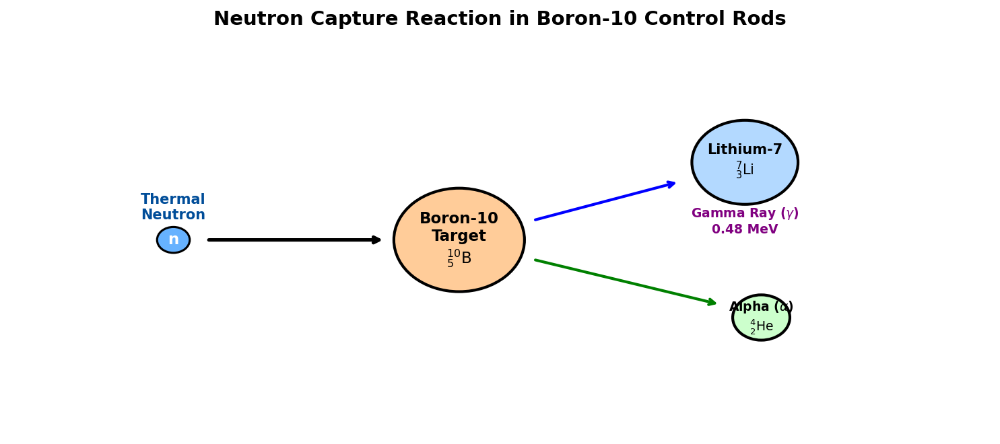

# Introduction to Boron

Boron (atomic symbol **B**, atomic number **5**) is the first element in Group 13 of the periodic table. Unlike the other members of its group (which are metals, such as aluminum), boron is a metalloid (semimetal). It is a rare element in the solar system, formed by cosmic ray spallation, and is concentrated on Earth in highly soluble evaporated mineral deposits known as borate salts (such as borax).

## Chemical & Physical Properties

* **Atomic Configuration**: Boron has five protons, six neutrons, and five electrons, with a valence electron configuration of $1s^2 2s^2 2p^1$. Because it has only three valence electrons, boron typically forms covalent bonds and acts as an electron-deficient Lewis acid in many chemical reactions.
* **Allotropes**: Elemental boron exists in several allotropes. Amorphous boron is a brown powder, while crystalline boron is extremely hard, black, and has a high melting point ($2076^\circ\text{C}$).
* **Hardness**: Crystalline boron is the second hardest element after carbon (diamond). Boron compounds, such as cubic boron nitride ($\text{c-BN}$), are used as superabrasives because they approach diamond-like hardness but are thermally more stable.

---

# Key Applications

## Borosilicate Glass (Pyrex)

The largest commercial application of boron (about 45% of global demand) is the manufacture of borosilicate glass.

* **Composition**: It is made by adding boron trioxide ($\text{B}_2\text{O}_3$) to the standard silica-soda-lime glass mixture.
* **Thermal Shock Resistance**: Standard glass expands significantly when heated, leading to cracking if cooled quickly. Adding boron reduces the coefficient of thermal expansion of the glass by more than half. This allows borosilicate glass (often sold under the brand name Pyrex) to withstand sudden temperature shifts without shattering, making it ideal for laboratory glassware, kitchen bakeware, and halogen headlights.

## Nuclear Reactor Control Rods

Boron is highly valued in nuclear engineering due to the unique properties of its stable isotope, **Boron-10** ($^{10}\text{B}$), which constitutes approximately 20% of natural boron.

* **Neutron Capture**: Boron-10 has an extremely high cross-section (probability) for absorbing "thermal" (slow) neutrons. When $^{10}\text{B}$ captures a neutron, it undergoes a nuclear reaction that splits the atom into Lithium-7 and an alpha particle, releasing a gamma ray:

$$^{10}_{5}\text{B} + ^{1}_{0}\text{n} \rightarrow ^{7}_{3}\text{Li} + ^{4}_{2}\text{He}^{2+} + \gamma \text{ (0.48 MeV)}$$

* **Control Rods**: In nuclear power plants, control rods made of boron carbide ($\text{B}_4\text{C}$) are inserted into the reactor core. By absorbing excess neutrons, these rods regulate the fission chain reaction or shut down the reactor entirely during an emergency.

{#fig-neutron-absorption width=85%}

<details>
<summary>Show Raw Diagram Generator Code</summary>
```python
# Generated using Matplotlib inside python script
import matplotlib.pyplot as plt
import matplotlib.patches as patches

fig, ax = plt.subplots(figsize=(10, 4.5), dpi=150)
ax.set_xlim(-1, 11)
ax.set_ylim(-1, 5)
ax.axis('off')

# Incident neutron
n_in = patches.Circle((1, 2), 0.2, color='#66b2ff', ec='black', lw=1.5)
ax.add_patch(n_in)

# Boron-10 target
b10 = patches.Circle((4.5, 2), 0.8, color='#ffcc99', ec='black', lw=2)
ax.add_patch(b10)

# Products
li7 = patches.Circle((8, 3.2), 0.65, color='#b3d9ff', ec='black', lw=2)
ax.add_patch(li7)
alpha = patches.Circle((8.2, 0.8), 0.35, color='#ccffcc', ec='black', lw=2)
ax.add_patch(alpha)
```
</details>

## Cleaning Agents (Borax and Bleaches)

Sodium tetraborate decahydrate, commonly known as **Borax** ($\text{Na}_2\text{B}_4\text{O}_7 \cdot 10\text{H}_2\text{O}$), is a versatile mineral compound used widely in cleaning:

* **Water Softener**: Borax binds to calcium ($\text{Ca}^{2+}$) and magnesium ($\text{Mg}^{2+}$) ions in hard water, preventing them from interfering with detergents.
* **pH Buffer**: It maintains an alkaline pH in laundry water, boosting the cleaning efficiency of soaps.
* **Perborate Bleaches**: Sodium perborate is used as an active oxygen source in dry laundry detergents and color-safe bleaches, releasing hydrogen peroxide ($\text{H}_2\text{O}_2$) when dissolved in warm water.

## Semiconductor Dopant

In the electronics industry, boron is the primary dopant used to create **p-type (positive carrier) semiconductors** in silicon:

* **Trivalent Acceptor**: Silicon has four valence electrons. Boron has only three. When a boron atom replaces a silicon atom in the crystal lattice, it creates an electron vacancy or "hole."
* **Electrical Conduction**: These holes can accept electrons from neighboring atoms, allowing positive charge carriers to migrate and conduct electricity through the crystal structure.

## Agriculture: Essential Micronutrient

Boron is an essential micronutrient for vascular plants:

* **Cell Wall Synthesis**: Boron binds to pectin in cell walls, providing structural integrity and flexibility.
* **Reproductive Development**: It is crucial for pollen tube germination, seed development, and sugar transport within the plant.
* **Deficiency**: Boron deficiency in soil leads to stunted growth, hollow cores in root vegetables, and poor seed yields.
