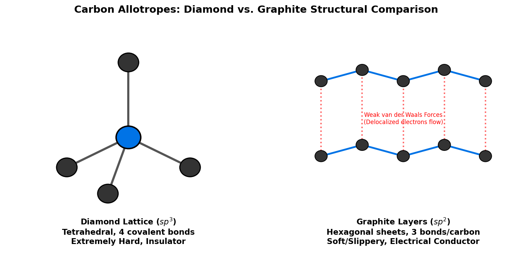

# Introduction to Carbon

Carbon (atomic symbol **C**, atomic number **6**) is a non-metallic, tetravalent element located in Group 14 of the periodic table. It is the 15th most abundant element in the Earth's crust and the 4th most abundant element in the universe by mass (after hydrogen, helium, and oxygen). Carbon's unique ability to form stable, covalent bonds with a wide variety of elements—including itself—allows it to form an almost infinite number of complex molecules, making it the chemical basis for all known organic life.

## Physical & Chemical Properties

* **Atomic Configuration**: Carbon has six protons, six neutrons, and six electrons, with a ground-state valence electron configuration of $1s^2 2s^2 2p^2$. 
* **Tetravalency & Hybridization**: To form bonds, carbon promotes one of its $2s$ electrons to the empty $2p$ orbital, creating four unpaired electrons. These orbitals hybridize into:
  - $sp^3$ (e.g., in methane and diamond), forming four single tetrahedral $\sigma$ bonds.
  - $sp^2$ (e.g., in ethylene and graphite), forming three planar $\sigma$ bonds and one $\pi$ bond.
  - $sp$ (e.g., in acetylene), forming two linear $\sigma$ bonds and two $\pi$ bonds.
* **Catenation**: Catenation is the ability of an element to form long chains or rings of covalent bonds with atoms of the same element. Carbon exhibits catenation to a degree unmatched by any other element, forming stable carbon-carbon chains, branched networks, and ring systems.

---

# Isotopes of Carbon

Carbon has three naturally occurring isotopes: two stable ($^{12}\text{C}$ and $^{13}\text{C}$) and one radioactive ($^{14}\text{C}$).

1. **Carbon-12 ($^{12}\text{C}$)**:
   - *Composition*: 6 protons, 6 neutrons, 6 electrons.
   - *Abundance*: ~98.93% of all natural carbon. It is the IUPAC standard for defining atomic mass units (1 amu is defined as exactly $1/12\text{th}$ the mass of a $^{12}\text{C}$ atom).
2. **Carbon-13 ($^{13}\text{C}$)**:
   - *Composition*: 6 protons, 7 neutrons, 6 electrons.
   - *Abundance*: ~1.07% of all natural carbon. It has a nuclear spin ($I=1/2$), making it highly valuable in Carbon-13 Nuclear Magnetic Resonance ($^{13}\text{C}$-NMR) spectroscopy to map organic structures.
3. **Carbon-14 ($^{14}\text{C}$)**:
   - *Composition*: 6 protons, 8 neutrons, 6 electrons.
   - *Properties*: Radioactive, with a half-life of $5730 \pm 40$ years. It undergoes beta-minus decay to Nitrogen-14 ($^{14}\text{N}$):
     $$^{14}_{6}\text{C} \rightarrow ^{14}_{7}\text{N} + e^- + \bar{\nu}_e$$

### Radiocarbon (Carbon-14) Dating
Cosmic rays strike Nitrogen-14 in the upper atmosphere to continuously generate Carbon-14, which enters the carbon cycle as $^{14}\text{CO}_2$. Living plants and animals absorb $^{12}\text{C}$ and $^{14}\text{C}$ in a constant ratio. When an organism dies, it stops exchanging carbon with the environment. The $^{12}\text{C}$ remains stable, while the $^{14}\text{C}$ decays exponentially. By measuring the residual activity or ratio of $^{14}\text{C}$ to $^{12}\text{C}$, scientists can determine when the organism died:

$$N(t) = N_0 e^{-\lambda t}$$

where $\lambda = \frac{\ln(2)}{5730 \text{ years}}$ is the decay constant, allowing accurate dating of organic artifacts up to approximately 50,000 years old.

---

# Allotropes of Carbon

Allotropes are different structural modifications of the same element. Carbon possesses several famous allotropes with wildly different physical properties arising from their internal bonding geometry.

## Diamond
In diamond, each carbon atom is covalently bonded to four neighboring carbon atoms in a tetrahedral lattice ($sp^3$ hybridization). 
* **Hardness**: The continuous 3D network of strong covalent bonds makes diamond the hardest known natural material (10 on the Mohs scale).
* **Electrical conductivity**: It has no free, delocalized electrons, making it an excellent electrical insulator.
* **Thermal conductivity**: It is an exceptional thermal conductor (higher than copper) because heat propagates rapidly through its rigid lattice vibrations (phonons).

## Graphite
In graphite, carbon atoms are arranged in flat, two-dimensional sheets of hexagonal rings ($sp^2$ hybridization).
* **Bonding**: Within each sheet, carbon atoms form strong covalent bonds with three neighbors. The fourth valence electron occupies a delocalized $\pi$ orbital spanning the layer. The sheets themselves are held together only by weak **van der Waals forces**.
* **Properties**: Because the layers can easily slide past one another, graphite is soft, slippery, and is widely used as a dry lubricant and in pencil "lead." 
* **Electrical Conductivity**: The delocalized electrons are free to migrate parallel to the sheets, making graphite an excellent conductor of electricity.

{#fig-carbon-allotropes width=85%}

<details>
<summary>Show Raw Diagram Generator Code</summary>
```python
# Generated using Matplotlib inside python script
import matplotlib.pyplot as plt
import matplotlib.patches as patches

fig, (ax1, ax2) = plt.subplots(1, 2, figsize=(10, 5), dpi=150)
ax1.set_xlim(-1, 5)
ax1.set_ylim(-1, 5)
ax1.axis('off')

# Central carbon & bonds (Diamond)
cx, cy = 2, 2
neighbors = [(2, 4), (0.5, 1.2), (3.5, 1.2), (1.5, 0.5)]
for nx, ny in neighbors:
    ax1.plot([cx, nx], [cy, ny], color='#555555', lw=3)
```
</details>

## Graphene
Graphene is a single, isolated two-dimensional layer of graphite (a one-atom-thick honeycomb lattice of carbon). 
* **Properties**: It is incredibly strong (about 200 times stronger than steel by weight), highly flexible, and possesses extraordinary electrical conductivity due to its electrons behaving as massless Dirac fermions. It is a key material in nanotechnology and future electronics.

## Fullerenes and Carbon Nanotubes
* **Buckminsterfullerene ($\text{C}_{60}$)**: A hollow, spherical cage of 60 carbon atoms forming a shape resembling a soccer ball (composed of 20 hexagons and 12 pentagons).
* **Carbon Nanotubes (CNTs)**: Cylindrical tube allotropes of carbon with $sp^2$ bonding. They exhibit immense tensile strength, unique electrical properties (can be metallic or semiconducting depending on their geometry/chirality), and are used in structural reinforcement and nanotechnology.

---

# Carbon in Biology

Organic chemistry is, by definition, the chemistry of carbon compounds. Carbon is the structural backbone of all biomolecules:

1. **Proteins**: Composed of amino acids, which contain a central carbon ($\alpha$-carbon) bonded to an amino group, a carboxyl group, a hydrogen atom, and a variable side chain.
2. **Carbohydrates**: Ring-like or chain-like molecules of carbon, hydrogen, and oxygen (e.g., glucose: $\text{C}_6\text{H}_{12}\text{O}_6$) that store and supply energy.
3. **Lipids (Fats)**: Long hydrocarbon chains that serve as cellular membranes and energy storage.
4. **Nucleic Acids (DNA/RNA)**: The genetic code, built on a backbone of deoxyribose sugar (carbon rings) and nitrogenous bases.

## The Carbon Cycle
Carbon cycles through the biosphere via **photosynthesis** (plants capturing $\text{CO}_2$ and converting it to sugars):

$$6\text{CO}_2\text{(g)} + 6\text{H}_2\text{O(l)} + \text{light} \rightarrow \text{C}_6\text{H}_{12}\text{O}_6\text{(aq)} + 6\text{O}_2\text{(g)}$$

And **cellular respiration** (organisms breaking down sugars to release energy and $\text{CO}_2$):

$$\text{C}_6\text{H}_{12}\text{O}_6\text{(aq)} + 6\text{O}_2\text{(g)} \rightarrow 6\text{CO}_2\text{(g)} + 6\text{H}_2\text{O(l)} + \text{energy}$$

---

# Carbon in Fossil Fuels

Fossil fuels (coal, petroleum, and natural gas) are ancient organic matter buried, compressed, and heated under the Earth's crust over hundreds of millions of years.

* **Natural Gas**: Composed primarily of methane ($\text{CH}_4$), the simplest hydrocarbon.
* **Petroleum (Crude Oil)**: A complex liquid mixture of alkanes, cycloalkanes, and aromatic hydrocarbons.
* **Coal**: Primarily solid elemental carbon mixed with organic compounds. 

Combustion of these hydrocarbons releases energy along with carbon dioxide and water vapor:

$$\text{CH}_4\text{(g)} + 2\text{O}_2\text{(g)} \rightarrow \text{CO}_2\text{(g)} + 2\text{H}_2\text{O(g)} \quad \Delta H = -891 \text{ kJ/mol}$$

---

# Carbon Fiber Composites

Carbon-fiber-reinforced polymer (CFRP) is a high-performance composite material consisting of thin, strong carbon fibers embedded in a polymer resin matrix (such as epoxy).

* **Manufacturing**: Carbon fibers are made by heating precursor polymer fibers (typically polyacrylonitrile, PAN) to high temperatures ($1000-3000^\circ\text{C}$) in an inert atmosphere, driving off other elements and leaving aligned, crystalline carbon sheets.
* **Properties**: CFRP has a high strength-to-weight ratio, low thermal expansion, and high stiffness.
* **Applications**: Aerospace (Boeing 787 Dreamliner fuselage), Formula 1 chassis, high-end bicycles, wind turbine blades, and sports equipment.

---

# Inks and Pigments

Carbon-based pigments have been used since antiquity:

* **Carbon Black**: Produced by the incomplete combustion of heavy petroleum products. It is a fine powder consisting almost entirely of elemental carbon.
* **Ink Formulation**: Carbon black is the primary pigment in black printing inks, newspaper inks, plastic colorants, and laser printer toners.
* **Historical Inks**: "India Ink" (composed of soot/carbon black mixed with water and a binding agent like gelatin) has been used in China and Egypt for writing and drawing for over 2000 years, prized because carbon does not degrade or fade over time when exposed to light or air.

---

# Other Applications

* **Activated Carbon**: Extremely porous carbon with a massive surface area (up to $3000 \text{ m}^2/\text{g}$). It is used in water filtration, gas purification, and medical treatments to adsorb toxins.
* **Carbon Steel**: An alloy of iron and carbon (up to 2% carbon). The carbon atoms sit in the interstitial spaces of the iron crystal lattice, preventing the iron planes from sliding past one another and drastically increasing the steel's hardness and yield strength.
