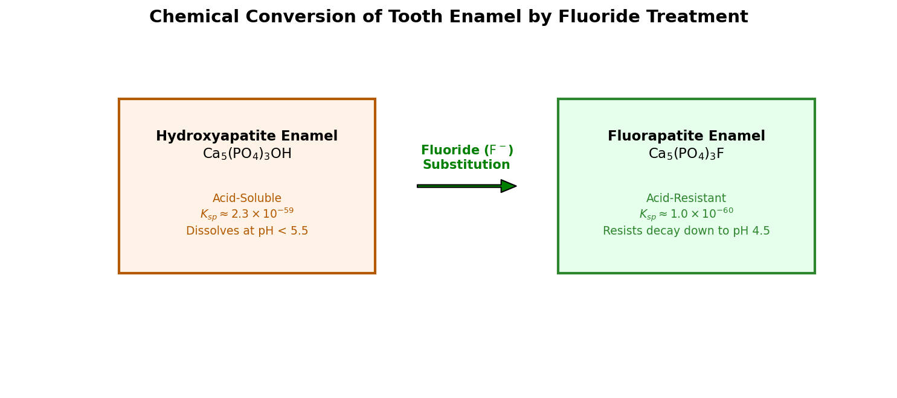

# Introduction to Fluorine

Fluorine (atomic symbol **F**, atomic number **9**) is the first element in Group 17 of the periodic table (the halogens). Under standard conditions, it exists as a diatomic gas ($\text{F}_2$) of a pale yellow color. Fluorine is the most chemically reactive and electronegative of all elements, reacting with almost all other substances, including some noble gases.

## Physical & Chemical Properties

* **Atomic Configuration**: Fluorine has nine protons, ten neutrons, and nine electrons, with a valence configuration of $1s^2 2s^2 2p^5$. It requires only one electron to complete its valence shell.
* **Electronegativity**: It is the most electronegative element (3.98 on the Pauling scale), meaning it attracts shared electrons more strongly than any other element.
* **Reactivity**: Diatomic fluorine gas ($\text{F}_2$) has a relatively low bond dissociation energy ($159 \text{ kJ/mol}$) compared to its high reaction exothermicity, making it violently reactive. It reacts explosively with hydrogen in the dark and sets fire to materials like wood, glass, and water upon contact.
* **Toxicity**: Pure fluorine gas is extremely toxic, causing severe chemical burns to skin, eyes, and lungs.

---

# Key Applications

## Fluoride in Dentistry and Oral Health

Fluorine compounds, specifically soluble fluoride salts like **sodium fluoride** ($\text{NaF}$), **sodium monofluorophosphate**, and **stannous fluoride** ($\text{SnF}_2$), are added to toothpaste and municipal drinking water to prevent tooth decay.

### Chemical Transformation of Tooth Enamel
Tooth enamel consists primarily of **hydroxyapatite**, a calcium phosphate mineral:

$$\text{Hydroxyapatite: } \text{Ca}_5(\text{PO}_4)_3\text{OH}$$

When food acids lower the pH in the mouth below 5.5, hydroxyapatite begins to dissolve (demineralize). When fluoride ions ($\text{F}^-$) are present, they substitute for the hydroxyl group ($\text{OH}^-$) in the crystal lattice, converting it to **fluorapatite**:

$$\text{Ca}_5(\text{PO}_4)_3\text{OH} + \text{F}^- \rightarrow \text{Ca}_5(\text{PO}_4)_3\text{F} + \text{OH}^-$$

* **Acid Resistance**: Fluorapatite has a much lower solubility product constant ($K_{sp}$) than hydroxyapatite, meaning it is significantly more resistant to acid dissolution. It does not begin to dissolve until the pH drops below 4.5.
* **Remineralization**: Fluoride also acts as a catalyst, pulling calcium and phosphate ions out of saliva to rebuild weakened enamel.

{#fig-tooth-enamel width=85%}

<details>
<summary>Show Raw Diagram Generator Code</summary>
```python
# Generated using Matplotlib inside python script
import matplotlib.pyplot as plt
import matplotlib.patches as patches

fig, ax = plt.subplots(figsize=(10, 4.5), dpi=150)
ax.set_xlim(-1, 11)
ax.set_ylim(-1, 5)
ax.axis('off')

# Hydroxyapatite
ax.add_patch(patches.Rectangle((0.5, 1.0), 3.5, 3.0, facecolor='#fff2e6', edgecolor='#b35900', lw=2))
# Fluorapatite
ax.add_patch(patches.Rectangle((6.5, 1.0), 3.5, 3.0, facecolor='#e6ffec', edgecolor='#2d862d', lw=2))
```
</details>

## Teflon (Polytetrafluoroethylene - PTFE)

Teflon is a synthetic fluoropolymer of tetrafluoroethylene ($\text{CF}_2=\text{CF}_2$):

$$\text{PTFE: } \left( -\text{CF}_2-\text{CF}_2- \right)_n$$

### The Strength of the C-F Bond
The carbon-fluorine (C-F) bond is one of the strongest single bonds in organic chemistry ($485 \text{ kJ/mol}$). Because fluorine is highly electronegative, it pulls the bonding electrons tightly toward itself, polarizing the bond and creating a powerful electrostatic attraction between the carbon and fluorine atoms.

* **Chemical Inertness**: In PTFE, a central backbone of carbon atoms is completely shielded by a dense outer sheath of highly electronegative fluorine atoms. Because the C-F bonds are so strong, almost no chemical reagent can break them, making Teflon highly resistant to acids, bases, and solvents.
* **Low Friction**: The fluorine sheath is highly electronegative and holds its electrons tightly, meaning it has very low polarizability. As a result, van der Waals forces between PTFE and other materials are extremely weak. This gives Teflon one of the lowest coefficients of friction of any solid, making it highly non-stick (used in cookware, bearings, and seals).

## High-Performance Fluoroplastics

Beyond Teflon, fluorine chemistry yields various specialized fluoropolymers:

* **PVDF (Polyvinylidene Fluoride)**: A strong, lightweight fluoroplastic used in chemical piping, lithium-ion battery binders, and high-purity water systems. It also exhibits piezoelectric properties.
* **FEP (Fluorinated Ethylene Propylene)**: A softer, highly transparent fluoropolymer that is melt-processible, used for laboratory plasticware and wire insulation in aerospace.

## Other Applications

* **Uranium Enrichment**: Fluorine reacts with uranium to form **uranium hexafluoride** ($\text{UF}_6$), a volatile compound that gasifies at $56.5^\circ\text{C}$. This gas is spun in centrifuges to separate fissionable Uranium-235 from Uranium-238.
* **Glass Etching**: Hydrofluoric acid ($\text{HF}$) is used to etch glass by reacting with silica ($\text{SiO}_2$):
  $$\text{SiO}_2\text{(s)} + 4\text{HF(aq)} \rightarrow \text{SiF}_4\text{(g)} + 2\text{H}_2\text{O(l)}$$
