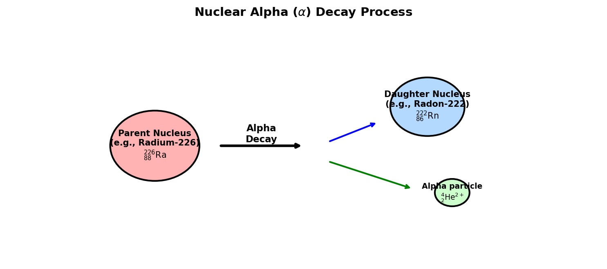

# Introduction to Helium

Helium (atomic symbol **He**, atomic number **2**) is the second element on the periodic table and the second most abundant element in the observable universe (accounting for approximately 24% of the elemental cosmic mass). Despite its abundance in space, helium is relatively rare on Earth, primarily trapped in natural gas deposits formed through the slow radioactive decay of heavy elements.

## Chemical & Physical Properties

* **Atomic Configuration**: Helium has two protons, two neutrons, and two electrons in a closed $1s^2$ shell. This full valence shell makes helium a **noble gas**, meaning it is chemically inert and forms no stable compounds under standard conditions.
* **State and Boiling Point**: It is a colorless, odorless, tasteless, non-toxic, and non-flammable gas. Helium has the lowest boiling point of any element ($4.22 \text{ K}$ or $-268.93^\circ\text{C}$ at 1 atm) and is the only liquid that cannot be solidified simply by lowering the temperature; it requires a pressure of at least 25 bar.
* **Superfluidity**: When cooled below the "lambda point" ($2.17 \text{ K}$), liquid Helium-4 transitions into **Helium II**, a quantum state known as a superfluid. It exhibits zero viscosity, allowing it to flow through microscopic pores and crawl up the walls of its container.

---

# Alpha Particles and Radioactive Origin

Terrestrial helium is not captured from the atmosphere (where it escapes into space because it is lighter than air). Instead, it is extracted from natural gas reservoirs where it has accumulated over billions of years from **alpha ($\alpha$) decay** of uranium and thorium in the Earth's crust.

An **alpha particle** is a fast-moving, highly ionized Helium-4 nucleus ($^4\text{He}^{2+}$), consisting of two protons and two neutrons. 

## The Alpha Decay Process

During alpha decay, an unstable heavy nucleus emits an alpha particle, transforming into a lighter daughter element:

$$^{A}_{Z}\text{X} \rightarrow ^{A-4}_{Z-2}\text{Y} + ^{4}_{2}\text{He}^{2+} + \text{Energy}$$

For example, Radium-226 decays into Radon-222:

$$^{226}_{88}\text{Ra} \rightarrow ^{222}_{86}\text{Rn} + ^{4}_{2}\text{He}^{2+}$$

Once emitted, the alpha particle slows down, gains two electrons from surrounding matter, and becomes a neutral Helium atom.

{#fig-alpha-decay width=85%}

<details>
<summary>Show Raw Diagram Generator Code</summary>
```python
# Generated using Matplotlib inside python script
import matplotlib.pyplot as plt
import matplotlib.patches as patches

fig, ax = plt.subplots(figsize=(10, 4.5), dpi=150)
ax.set_xlim(-1, 11)
ax.set_ylim(-1, 5)
ax.axis('off')

# Parent Nucleus
parent = patches.Circle((2, 2), 0.9, color='#ffb3b3', ec='black', lw=2)
ax.add_patch(parent)

# Daughter Nucleus
daughter = patches.Circle((7.5, 3), 0.75, color='#b3d9ff', ec='black', lw=2)
ax.add_patch(daughter)

# Alpha Particle
alpha = patches.Circle((8, 0.8), 0.35, color='#ccffcc', ec='black', lw=2)
ax.add_patch(alpha)
```
</details>

---

# Key Applications

## Cryogenic Cooling in MRI Scanners

The largest industrial use of liquid helium (accounting for about 30% of global consumption) is cooling the superconducting magnets in Magnetic Resonance Imaging (MRI) machines.

* **Superconductivity**: Superconductors are materials that lose all electrical resistance below a critical temperature. The niobium-titanium (NbTi) coils inside an MRI magnet must be kept below $9.2 \text{ K}$ to remain superconducting.
* **Magnetic Field Stability**: When cooled by liquid helium to $4.2 \text{ K}$, a massive electrical current can flow through the coils indefinitely without producing any heat. This creates an extremely strong, stable magnetic field (typically 1.5 to 3.0 Tesla) needed to align the hydrogen protons inside the human body.

## Scuba Diving Breathing Mixtures

As detailed in decompression physiology, nitrogen becomes narcotic at depth. In deep technical diving, helium is used to replace nitrogen, creating gas mixtures like **Heliox** ($O_2/\text{He}$) and **Trimix** ($O_2/\text{He}/N_2$).

* **Non-Narcotic**: Helium has low lipid solubility, meaning it does not cause narcosis under pressure.
* **Low Density**: Helium is much less dense than nitrogen ($0.178 \text{ g/L}$ vs $1.25 \text{ g/L}$). This reduces the gas density at high pressures, making it much easier for the diver to breathe and decreasing the risk of carbon dioxide retention.

## Buoyancy in Balloons and Aircraft

Helium is used to lift weather balloons, blimps, and party balloons because it is much lighter than air. According to Archimedes' principle, the buoyant force ($F_B$) on a volume $V$ of gas is:

$$F_B = (\rho_{\text{air}} - \rho_{\text{He}}) V g$$

* **Lifting Capacity**: Air density is $\approx 1.29 \text{ g/L}$ and Helium is $\approx 0.18 \text{ g/L}$. Therefore, each liter of helium can lift about $1.11 \text{ grams}$ at sea level.
* **Safety**: While hydrogen is lighter ($\approx 0.09 \text{ g/L}$), helium's chemical inertness makes it completely non-flammable, making it the only safe choice for passenger aircraft (blimps).

## Entertainment: Voice Alteration

Inhaling helium causes a temporary shift in the pitch of a person's voice. 

* **Speed of Sound**: The speed of sound in a gas is inversely proportional to the square root of its molecular mass ($v = \sqrt{\gamma R T / M}$). In air, the speed of sound is $343 \text{ m/s}$, whereas in helium it is $972 \text{ m/s}$.
* **Vocal Tract Resonance**: Inhaling helium does not affect the vibration frequency of your vocal cords (which is determined by muscular tension). However, because sound travels nearly three times faster in helium, the resonant frequencies (formants) of the vocal tract are shifted upward, amplifying the higher-frequency harmonics and making the voice sound squeaky and cartoonish.

## Other Industrial Uses

* **Shielding Gas**: Due to its inertness, helium is used as a protective gas shield in gas tungsten arc welding (TIG) and during the growth of silicon crystals for computer chips.
* **Carrier Gas**: Helium is the most common carrier gas in gas chromatography (GC), carrying vaporized samples through separating columns.
