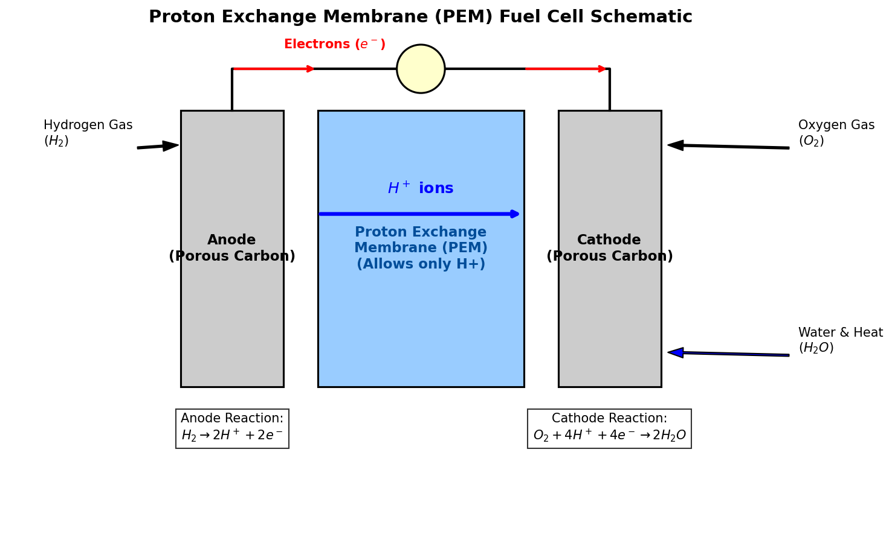

# Introduction to Hydrogen

Hydrogen (atomic symbol **H**, atomic number **1**) is the simplest, lightest, and most abundant chemical element in the universe, constituting roughly 75% of all baryonic mass. On Earth, hydrogen is rarely found in its pure diatomic elemental form ($\text{H}_2$) because it reacts readily with other elements. Instead, it is found bound in water, organic molecules, and hydrocarbons.

## Chemical & Physical Properties

* **Atomic Configuration**: Hydrogen has one proton and one electron ($1s^1$ electron configuration). It sits in Group 1 of the periodic table, though its behavior is unique compared to the alkali metals.
* **Diatomic Form**: Pure hydrogen exists as a diatomic gas ($\text{H}_2$). It is colorless, odorless, tasteless, and highly flammable at room temperature.
* **Energy Density**: By weight, hydrogen has the highest energy density of any fuel (about $120 \text{ MJ/kg}$, nearly three times that of gasoline). However, by volume, its energy density is extremely low, requiring compression (up to 700 bar) or liquefaction (at $-253^\circ\text{C}$) for storage.

---

# Isotopes of Hydrogen

Hydrogen has three primary isotopes, which are unique because they have their own names due to the significant relative mass differences between them:

1. **Protium ($^1\text{H}$)**:
   - *Composition*: 1 proton, 0 neutrons, 1 electron.
   - *Abundance*: ~99.98% of all natural hydrogen.
2. **Deuterium ($^2\text{H}$ or $\text{D}$)**:
   - *Composition*: 1 proton, 1 neutron, 1 electron.
   - *Properties*: Non-radioactive, heavier than protium. Water enriched with deuterium is called "heavy water" ($\text{D}_2\text{O}$), used as a neutron moderator in CANDU nuclear reactors.
3. **Tritium ($^3\text{H}$ or $\text{T}$)**:
   - *Composition*: 1 proton, 2 neutrons, 1 electron.
   - *Properties*: Radioactive with a half-life of 12.3 years. It undergoes beta-minus decay to Helium-3 ($^3\text{He}$). Tritium is key to D-T fusion reactors.

---

# Core Chemical Reactions

Diatomic hydrogen is highly reactive, especially at elevated temperatures or in the presence of catalysts.

## Combustion (Water Synthesis)

The oxidation of hydrogen is a highly exothermic reaction:

$$2\text{H}_2\text{(g)} + \text{O}_2\text{(g)} \rightarrow 2\text{H}_2\text{O(g)} \quad \Delta H = -286 \text{ kJ/mol (per mole of } \text{H}_2)$$

This reaction is clean, producing only water vapor as a byproduct, which makes hydrogen a promising candidate for clean combustion engines and rocket propellants.

## Synthesis of Ammonia (Haber-Bosch Process)

Hydrogen reacts with nitrogen to produce ammonia ($\text{NH}_3$), which is the backbone of global fertilizer production:

$$\text{N}_2\text{(g)} + 3\text{H}_2\text{(g)} \rightleftharpoons 2\text{NH}_3\text{(g)} \quad \Delta H = -92.4 \text{ kJ/mol}$$

---

# Proton Exchange Membrane (PEM) Fuel Cells

A fuel cell is an electrochemical device that converts the chemical energy of hydrogen and oxygen directly into electricity, with water and heat as the only byproducts. 

## How PEM Fuel Cells Work

In a PEM fuel cell, the anode and cathode are separated by a solid polymer membrane (typically Nafion) that is acidic and allows only positively charged protons ($\text{H}^+$) to pass through, blocking electrons ($e^-$).

1. **Anode Side**: Diatomic hydrogen ($\text{H}_2$) is introduced. A catalyst (usually platinum) splits the molecule into protons and electrons:
   $$\text{Anode Reaction: } \text{H}_2 \rightarrow 2\text{H}^+ + 2e^-$$
2. **Membrane Migration**: Protons travel through the PEM to the cathode.
3. **Electrical Load**: Electrons are forced around the membrane through an external circuit, creating electrical current.
4. **Cathode Side**: Oxygen ($\text{O}_2$) is introduced. The oxygen molecules react with the returning electrons and the protons that crossed the membrane to form water:
   $$\text{Cathode Reaction: } \text{O}_2 + 4\text{H}^+ + 4e^- \rightarrow 2\text{H}_2\text{O}$$

{#fig-fuel-cell width=85%}

<details>
<summary>Show Raw Diagram Generator Code</summary>
```python
# Generated using Matplotlib inside python script
import matplotlib.pyplot as plt
import matplotlib.patches as patches

fig, ax = plt.subplots(figsize=(10, 6), dpi=150)
ax.set_xlim(-1, 11)
ax.set_ylim(-1, 6)
ax.axis('off')

# Anode
ax.add_patch(patches.Rectangle((1.5, 1), 1.5, 4, facecolor='#cccccc', edgecolor='black', lw=1.5))
# Membrane
ax.add_patch(patches.Rectangle((3.5, 1), 3, 4, facecolor='#99ccff', edgecolor='black', lw=1.5))
# Cathode
ax.add_patch(patches.Rectangle((7.0, 1), 1.5, 4, facecolor='#cccccc', edgecolor='black', lw=1.5))

# Wire and bulb
ax.plot([2.25, 2.25, 5, 7.75, 7.75], [5, 5.6, 5.6, 5.6, 5], color='black', lw=2)
circle = patches.Circle((5, 5.6), 0.35, color='#ffffcc', ec='black', lw=1.5, zorder=5)
ax.add_patch(circle)
```
</details>

---

# Industrial Applications

## Metal Refining and Green Steel

In traditional metallurgy, coke (coal-derived carbon) is used as a reducing agent in blast furnaces to refine iron ore ($\text{Fe}_2\text{O}_3$), releasing massive amounts of carbon dioxide ($\text{CO}_2$):

$$\text{Fe}_2\text{O}_3 + 3\text{C} \rightarrow 2\text{Fe} + 3\text{CO}$$

By replacing carbon with hydrogen, the reduction process yields water vapor instead of carbon dioxide:

$$\text{Fe}_2\text{O}_3 + 3\text{H}_2 \rightarrow 2\text{Fe} + 3\text{H}_2\text{O}$$

This process, known as **Hydrogen Direct Reduction (H-DR)**, is the foundation of the emerging "green steel" industry. To make this process completely carbon-free, the hydrogen must be produced via **electrolysis** (splitting water into hydrogen and oxygen using renewable electricity):

$$2\text{H}_2\text{O(l)} + \text{electricity} \rightarrow 2\text{H}_2\text{(g)} + \text{O}_2\text{(g)}$$

## Industrial Ammonia Production

Over 50% of the world's industrial hydrogen is consumed in the Haber-Bosch process. Ammonia is synthesized under high pressures ($150-250 \text{ bar}$) and temperatures ($400-500^\circ\text{C}$) over an iron-based catalyst. 

Because the reaction is reversible, Le Chatelier's principle dictates that high pressures favor the forward reaction (as 4 moles of reactant gas compress to 2 moles of product gas), while high temperatures are a compromise between reaction rate and equilibrium yield.

## Other Applications

* **Rocket Propellant**: Liquid Hydrogen ($\text{LH}_2$) is used alongside liquid oxygen ($\text{LOX}$) in rocket engines (such as the Space Shuttle Main Engines or the SLS core stage) due to its high specific impulse.
* **Hydrogenation**: In the food industry, hydrogen is reacted with unsaturated vegetable oils in the presence of a nickel catalyst to create saturated fats (solidifying them into margarine).
* **Petroleum Hydrocracking**: Refineries use hydrogen to break down heavy long-chain hydrocarbons into lighter, more valuable fuels (gasoline, diesel).
