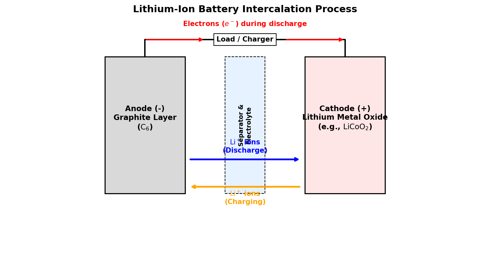

# Introduction to Lithium

Lithium (atomic symbol **Li**, atomic number **3**) is the first metal in the periodic table, located in Group 1 (the alkali metals). It is the lightest solid element under standard conditions, with a density about half that of water ($\rho \approx 0.534 \text{ g/cm}^3$).

## Chemical & Physical Properties

* **Atomic Configuration**: Lithium has three protons, four neutrons, and three electrons, with a valence configuration of $1s^2 2s^1$. Its single valence electron is easily lost to form the stable lithium cation ($\text{Li}^+$).
* **Reactivity**: Like all alkali metals, lithium is highly reactive and does not occur in its elemental form in nature. When exposed to water, it reacts vigorously (though less violently than sodium or potassium) to produce lithium hydroxide and hydrogen gas:
  $$2\text{Li(s)} + 2\text{H}_2\text{O(l)} \rightarrow 2\text{LiOH(aq)} + \text{H}_2\text{(g)}$$
* **Storage**: Because it reacts with moisture and oxygen in the air, lithium is stored immersed in mineral oil or petroleum jelly. Due to its extremely low density, it floats on top of the oil.

---

# Industrial Chemistry Applications

Beyond batteries, lithium compounds play critical roles in various traditional industrial sectors:

## Ceramics and Glass

The largest non-battery application of lithium (primarily as lithium carbonate, $\text{Li}_2\text{CO}_3$) is in glass and ceramics.
* **Thermal Expansion**: Adding lithium carbonate to ceramic glazes and glassware (such as cookware or telescope mirrors) lowers the thermal expansion coefficient. This makes the material highly resistant to thermal shock (cracking from sudden temperature changes).
* **Melting Flux**: Lithium acts as a powerful flux, lowering the melting temperature and viscosity of the glass mixture. This reduces the energy required during manufacturing.

## Lubricating Greases

Lithium hydroxide ($\text{LiOH}$) reacted with fatty acids (such as stearic acid) produces **lithium stearate** (often called "lithium soap"):

$$\text{LiOH} + \text{C}_{17}\text{H}_{35}\text{COOH} \rightarrow \text{C}_{17}\text{H}_{35}\text{COOLi} + \text{H}_2\text{O}$$

This compound is used as a thickener in lubricating greases. Lithium grease has excellent water resistance, high shear stability, and maintains its lubricating properties at high temperatures (up to $130^\circ\text{C}$), making it the standard multi-purpose grease in automotive and industrial machinery.

---

# Lithium in Medicine (Psychiatry)

Lithium compounds (primarily lithium carbonate and lithium citrate) have been used since the mid-20th century as the primary treatment for bipolar disorder (manic-depressive illness).

* **Mood Stabilization**: Lithium acts as a mood stabilizer, preventing both manic and depressive episodes.
* **Neurotransmission**: While the exact molecular mechanism is still being researched, lithium is known to:
  1. Inhibit **glycogen synthase kinase-3** (GSK-3) and **inositol monophosphatase** (IMPase), modifying intracellular signal transduction pathways.
  2. Modulate the balance of neurotransmitters, reducing excitatory signals (glutamate and dopamine) while boosting inhibitory signals (GABA).
  3. Promote neuroplasticity and cell survival factors in the brain.

---

# Battery Technology

Lithium's high electrochemical reduction potential ($-3.04 \text{ V}$, the lowest of all elements) and low atomic mass make it the ultimate anode material for high-energy-density batteries.

## Primary (Non-Rechargeable) Batteries

Lithium metal batteries use metallic lithium as the anode. A common type is the lithium-manganese dioxide ($\text{Li-MnO}_2$) button cell (used in watches and calculators):

* **Anode half-reaction**: $\text{Li} \rightarrow \text{Li}^+ + e^-$
* **Cathode half-reaction**: $\text{MnO}_2 + \text{Li}^+ + e^- \rightarrow \text{LiMnO}_2$

These batteries are non-rechargeable (primary) because recharging can cause lithium metal to plate unevenly, forming tiny metallic needles called **dendrites** that can short-circuit the cell and cause fires.

## Secondary (Rechargeable) Lithium-Ion Batteries

To make a safe, rechargeable battery, metallic lithium is replaced with **intercalation materials**. Intercalation refers to the reversible insertion of ions into a host structure without destroying the host material.

### Structure of a Lithium-Ion Cell

* **Anode (Negative Electrode)**: Typically made of graphite ($\text{C}_6$). Lithium ions fit between the sheets of carbon atoms.
* **Cathode (Positive Electrode)**: Typically made of a lithium transition metal oxide, such as lithium cobalt oxide ($\text{LiCoO}_2$).
* **Electrolyte**: A lithium salt (like $\text{LiPF}_6$) dissolved in organic solvents, separating the electrodes.

### Electrochemical Reactions

During **charging**, an external voltage forces lithium ions to leave the cathode, migrate through the electrolyte, and insert themselves (intercalate) into the graphite anode. Electrons flow through the external charger to balance the charge:

$$\text{Cathode: } \text{LiCoO}_2 \rightarrow \text{Li}_{1-x}\text{CoO}_2 + x\text{Li}^+ + xe^-$$
$$\text{Anode: } \text{C}_6 + x\text{Li}^+ + xe^- \rightarrow \text{Li}_x\text{C}_6$$
$$\text{Net Reaction (Charge): } \text{LiCoO}_2 + \text{C}_6 \rightarrow \text{Li}_{1-x}\text{CoO}_2 + \text{Li}_x\text{C}_6$$

During **discharge** (powering a load), the process reverses: lithium ions de-intercalate from the graphite anode and return to the metal oxide cathode, while electrons flow through the device.

{#fig-li-ion-battery width=85%}

<details>
<summary>Show Raw Diagram Generator Code</summary>
```python
# Generated using Matplotlib inside python script
import matplotlib.pyplot as plt
import matplotlib.patches as patches

fig, ax = plt.subplots(figsize=(10, 5.5), dpi=150)
ax.set_xlim(-1, 11)
ax.set_ylim(-1, 6)
ax.axis('off')

# Anode
ax.add_patch(patches.Rectangle((1.5, 1), 2, 4, facecolor='#d9d9d9', edgecolor='black', lw=1.5))
# Separator
ax.add_patch(patches.Rectangle((4.5, 1), 1, 4, facecolor='#e6f2ff', edgecolor='black', lw=1, linestyle='--'))
# Cathode
ax.add_patch(patches.Rectangle((6.5, 1), 2, 4, facecolor='#ffe6e6', edgecolor='black', lw=1.5))
```
</details>
