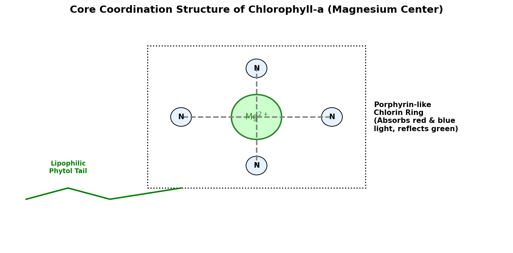

# Introduction to Magnesium

Magnesium (atomic symbol **Mg**, atomic number **12**) is an alkaline earth metal located in Group 2 of the periodic table. It is the 8th most abundant element in the Earth's crust by mass and the 3rd most abundant dissolved mineral in seawater. Magnesium is highly reactive, always found naturally bound to other elements in minerals like dolomite, magnesite, and carnallite.

## Physical & Chemical Properties

* **Atomic Configuration**: Magnesium has 12 protons, 12 neutrons, and 12 electrons, with a ground-state valence configuration of $1s^2 2s^2 2p^6 3s^2$. It readily loses two valence electrons to form the magnesium cation ($\text{Mg}^{2+}$).
* **Physical State**: Magnesium is a shiny, silver-white metal that is remarkably lightweight—possessing a density ($\rho \approx 1.74 \text{ g/cm}^3$) that is 35% lighter than aluminum.
* **Chemical Reactivity**: In air, magnesium quickly becomes coated in a thin passivating oxide layer ($\text{MgO}$) that protects it from further oxidation. However, when heated, magnesium metal reacts vigorously and exothermically with oxygen, burning with an intense, blinding white light.

---

# Biological Role: Chlorophyll Coordination Center

In biology, magnesium is an essential mineral. Its most famous biological role is serving as the central coordination ion in the **chlorophyll** molecule, which captures light energy during photosynthesis.

## Chlorophyll Structure

The chlorophyll molecule consists of:
1. A hydrophilic **chlorin ring** (a porphyrin-like structure of carbon and nitrogen atoms).
2. A lipophilic **phytol tail** (a long hydrocarbon chain that anchors the molecule inside the thylakoid membrane of chloroplasts).

At the exact center of the chlorin ring, a single **magnesium ion ($\text{Mg}^{2+}$)** is coordinated by four nitrogen atoms. 

* **Light Absorption**: The coordination of $\text{Mg}^{2+}$ alters the electron cloud of the surrounding ring, creating a highly delocalized $\pi$-electron system. This system absorbs specific wavelengths of light (primarily red and blue) and reflects green light, giving plants their green color.
* **Energy Transfer**: When light strikes chlorophyll, it excites these delocalized electrons, initiating the electron transport chain that generates ATP and NADPH, driving the synthesis of sugars.

{#fig-chlorophyll width=85%}

<details>
<summary>Show Raw Diagram Generator Code</summary>
```python
# Generated using Matplotlib inside python script
import matplotlib.pyplot as plt
import matplotlib.patches as patches

fig, ax = plt.subplots(figsize=(10, 5), dpi=150)
ax.set_xlim(-1, 11)
ax.set_ylim(-1, 5)
ax.axis('off')

# Magnesium center
mg = patches.Circle((5, 2.5), 0.6, facecolor='#ccffcc', edgecolor='#2d862d', lw=2)
ax.add_patch(mg)
# 4 Nitrogens
nitrogens = [(3.2, 2.5), (5, 3.8), (6.8, 2.5), (5, 1.2)]
for nx, ny in nitrogens:
    ax.add_patch(patches.Circle((nx, ny), 0.25, facecolor='#e6f2ff', edgecolor='black', lw=1))
```
</details>

---

# Key Applications

## Lightweight Structural Alloys

Because of its low density, magnesium is alloyed with other metals (such as aluminum, zinc, and manganese) to create structural materials with a very high strength-to-weight ratio:

* **Automotive Industry**: Used in steering wheels, seat frames, transmission casings, and engine blocks to reduce vehicle weight, improving fuel efficiency.
* **Electronics**: Used in the bodies of laptops, cameras, and smartphones due to its durability, lightweight, and electromagnetic shielding properties.
* **Aerospace**: Used in gearbox casings and structural frames for helicopters and satellites.

## Pyrotechnics and Flares

When ignited, magnesium burns in oxygen with an extremely exothermic reaction:

$$2\text{Mg(s)} + \text{O}_2\text{(g)} \rightarrow 2\text{MgO(s)} \quad \Delta H = -602 \text{ kJ/mol}$$

* **Visual Output**: The flame temperature reaches approximately $3100^\circ\text{C}$, emitting an intense white light that contains significant ultraviolet radiation.
* **Uses**: Magnesium powder or ribbon is used in military emergency flares, firework sparklers, and rescue signals.

## Cathodic Protection (Sacrificial Anodes)

Because magnesium is highly electropositive (highly active, with a standard reduction potential of $-2.37 \text{ V}$), it is used as a **sacrificial anode** to protect steel structures from corrosion:

* **Principle**: Steel pipelines, ship hulls, and water heaters are connected electrically to a block of magnesium.
* **Preferential Corrosion**: Because magnesium is more reactive than the iron in steel, it oxidizes (corrodes) preferentially, sacrificing itself to supply electrons to the steel structure and preventing the iron from rusting:
  $$\text{Mg(s)} \rightarrow \text{Mg}^{2+}\text{(aq)} + 2e^-$$
* **Replacement**: The corroded magnesium anodes are periodically replaced, keeping the primary steel structure intact indefinitely.

## Medical and Dietary Uses

* **Epsom Salt (Magnesium Sulfate, $\text{MgSO}_4 \cdot 7\text{H}_2\text{O}$)**: Used in bath salts to soothe aching muscles and as a laxative.
* **Antacids**: Magnesium hydroxide ($\text{Mg(OH)}_2$, also known as Milk of Magnesia) is used as an antacid to neutralize stomach acid:
  $$\text{Mg(OH)}_2\text{(s)} + 2\text{HCl(aq)} \rightarrow \text{MgCl}_2\text{(aq)} + 2\text{H}_2\text{O(l)}$$
* **Dietary Mineral**: Magnesium is a cofactor in over 300 enzymatic reactions in the human body, including glycolysis and protein synthesis.
