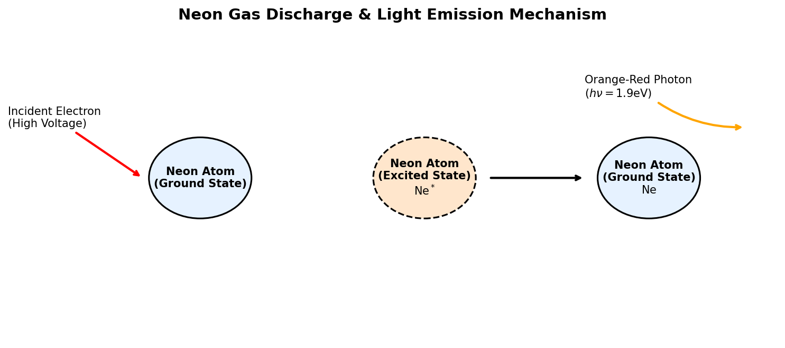

# Introduction to Neon

Neon (atomic symbol **Ne**, atomic number **10**) is the second noble gas in Group 18 of the periodic table. It is a very rare element on Earth, making up only about 18 parts per million (ppm) of the atmosphere, though it is the 5th most abundant element in the cosmos by mass (created by the alpha process in massive stars).

## Physical & Chemical Properties

* **Atomic Configuration**: Neon has ten protons, ten neutrons, and ten electrons, with a ground-state valence configuration of $1s^2 2s^2 2p^6$. This complete octet in its outer shell makes neon chemically inert. It forms no known stable neutral compounds.
* **Physical State**: Neon is a colorless, odorless, tasteless, and non-flammable gas under standard conditions.
* **Cryogenics**: Liquid neon has a boiling point of $27.07 \text{ K}$ ($-246.08^\circ\text{C}$). It is a highly effective cryogenic refrigerant, possessing over three times the cooling capacity per unit volume of liquid hydrogen and over forty times that of liquid helium.

---

# Key Applications

## Neon Lighting (Gas Discharge Tubes)

The most famous application of neon is in luminous signs.

### The Physics of Glow Discharge
A neon light consists of a sealed glass tube containing low-pressure neon gas with electrodes at both ends:

1. **Ionization**: A high voltage (typically 2,000 to 15,000 volts) is applied across the electrodes. This creates an electric field that accelerates free electrons, which collide with neon atoms. These collisions knock valence electrons free, converting the gas into a conducting **plasma**.
2. **Excitation**: High-speed electrons also collide with neon atoms without ionizing them, transferring kinetic energy to promote a valence electron to a higher energy shell:
   $$e^- + \text{Ne} \rightarrow \text{Ne}^* + e^-$$
3. **Photon Emission (De-excitation)**: The excited state $\text{Ne}^*$ is unstable. Within nanoseconds, the excited electron falls back to its lower ground-state shell. To conserve energy, the atom emits a photon of electromagnetic radiation:
   $$\text{Ne}^* \rightarrow \text{Ne} + h\nu$$
   For neon, the difference in energy levels corresponds to wavelengths in the range of 580 to 640 nanometers, emitting a bright, intense **red-orange** light.

*Note: Other colors in "neon signs" are produced by using different gases (e.g., argon for blue, helium for gold, or mercury vapor) or by coating the inside of the glass tube with fluorescent phosphors.*

{#fig-neon-discharge width=85%}

<details>
<summary>Show Raw Diagram Generator Code</summary>
```python
# Generated using Matplotlib inside python script
import matplotlib.pyplot as plt
import matplotlib.patches as patches

fig, ax = plt.subplots(figsize=(10, 4.5), dpi=150)
ax.set_xlim(-1, 11)
ax.set_ylim(-1, 5)
ax.axis('off')

# Ground state, excited state, ground state circles
ax.add_patch(patches.Circle((2, 2.2), 0.8, facecolor='#e6f2ff', edgecolor='black', lw=1.5))
ax.add_patch(patches.Circle((5.5, 2.2), 0.8, facecolor='#ffe6cc', edgecolor='black', lw=1.5, linestyle='--'))
ax.add_patch(patches.Circle((9, 2.2), 0.8, facecolor='#e6f2ff', edgecolor='black', lw=1.5))
```
</details>

## Excimer Lasers in the Semiconductor Industry

In modern semiconductor manufacturing, neon is a critical carrier gas used in excimer lasers for **deep ultraviolet (DUV) photolithography**.

* **Excimer Laser Chemistry**: An "excited dimer" (excimer) laser uses a mixture of noble gases and halogens, such as Argon-Fluoride ($\text{ArF}$) or Krypton-Fluoride ($\text{KrF}$), suspended in a neon carrier gas buffer (which constitutes over 98% of the gas volume).
* **Nanoscale Lithography**: Under electrical stimulation, the gases form transient molecular complexes ($\text{ArF}^*$). When these de-excite, they emit coherent ultraviolet light at extremely short wavelengths (e.g., $193 \text{ nm}$ for ArF). This DUV light is focused through lenses to etch microcircuit patterns onto silicon wafers, making the production of modern computer chips possible.

## Helium-Neon (HeNe) Lasers

The Helium-Neon laser was the first continuous-wave gas laser ever invented.

* **Composition**: Contains a mixture of helium and neon gases (typically in a 10:1 ratio) inside a small glass tube.
* **Mechanism**: An electric discharge excites helium atoms into a metastable state. These helium atoms then collide with neon atoms, transferring their energy to excite the neon electrons (population inversion).
* **Output**: The neon atoms then undergo stimulated emission, producing a highly stable, coherent beam of red light at a wavelength of $632.8 \text{ nm}$. These lasers are used in interferometry, barcode scanners, and laboratory optical alignment.

## High-Voltage Indicators

Because neon gas begins to glow at a very precise ionization threshold voltage (strike voltage $\approx 90 \text{ V}$), small neon glow lamps are widely used as:
* **Mains Power Indicators**: In power strips and appliances to show that electricity is active.
* **High Voltage Testers**: Handheld test lights used by electricians to safely check if a circuit is live without requiring batteries or complex circuitry.
