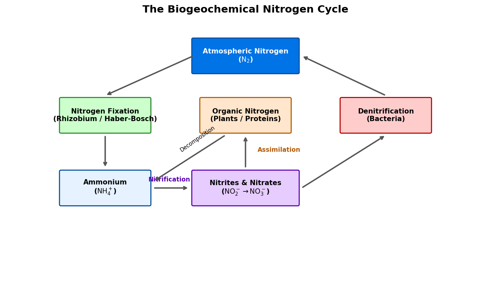

# Introduction to Nitrogen

Nitrogen (atomic symbol **N**, atomic number **7**) is a non-metallic element located in Group 15 of the periodic table. It is the most abundant uncombined element on Earth, making up approximately 78.08% of our atmosphere by volume. Despite its overwhelming presence as a gas, nitrogen is relatively rare in the Earth's crust due to its volatile nature and the extreme stability of the diatomic nitrogen molecule.

## Physical & Chemical Properties

* **Atomic Configuration**: Nitrogen has seven protons, seven neutrons, and seven electrons, with a ground-state electron configuration of $1s^2 2s^2 2p^3$. It has three unpaired electrons in its outer $2p$ shell.
* **The Triple Bond**: Pure nitrogen exists as a diatomic gas ($\text{N}_2$). The two nitrogen atoms are held together by a **triple covalent bond** ($\text{N}\equiv\text{N}$), consisting of one $\sigma$ bond and two $\pi$ bonds:
  - Bond energy: $945 \text{ kJ/mol}$ (one of the strongest bonds known in chemistry).
  - Consequently, $\text{N}_2$ is extremely stable and chemically inert at room temperature, requiring high temperatures, pressures, or specialized enzymes to react.
* **Physical State**: Diatomic nitrogen is a colorless, odorless, tasteless, and non-toxic gas under standard conditions.

---

# Nitrogen in Biology: The Nitrogen Cycle

Although nitrogen is essential for all living organisms (serving as a fundamental building block for amino acids, proteins, DNA, and RNA), plants and animals cannot absorb diatomic nitrogen ($\text{N}_2$) directly from the air because they cannot break its triple bond.

## Biogeochemical Nitrogen Cycle

To become biologically useful, atmospheric nitrogen must undergo a sequence of chemical transformations:

1. **Nitrogen Fixation**: The conversion of $\text{N}_2$ into reactive ammonia ($\text{NH}_3$). This is carried out naturally by nitrogen-fixing bacteria (such as *Rhizobium* living in the root nodules of legumes) using the **nitrogenase** enzyme, or industrially via the Haber-Bosch process.
2. **Nitrification**: Soil bacteria convert ammonia/ammonium first into nitrites ($\text{NO}_2^-$) and then into nitrates ($\text{NO}_3^-$), which are highly soluble and easily absorbed by plants:
   $$2\text{NH}_4^+ + 3\text{O}_2 \rightarrow 2\text{NO}_2^- + 4\text{H}^+ + 2\text{H}_2\text{O}$$
   $$2\text{NO}_2^- + \text{O}_2 \rightarrow 2\text{NO}_3^-$$
3. **Assimilation**: Plants absorb nitrates through their roots and incorporate the nitrogen into organic molecules (proteins and nucleic acids). Animals then consume the plants.
4. **Decomposition / Ammonification**: When plants and animals die, decomposers (fungi and bacteria) break down the organic nitrogen back into ammonia/ammonium.
5. **Denitrification**: Denitrifying bacteria in anaerobic environments (like waterlogged soils) convert soil nitrates back into gaseous $\text{N}_2$, releasing it back into the atmosphere:
   $$2\text{NO}_3^- + 10e^- + 12\text{H}^+ \rightarrow \text{N}_2 + 6\text{H}_2\text{O}$$

{#fig-nitrogen-cycle width=85%}

<details>
<summary>Show Raw Diagram Generator Code</summary>
```python
# Generated using Matplotlib inside python script
import matplotlib.pyplot as plt
import matplotlib.patches as patches

fig, ax = plt.subplots(figsize=(10, 6), dpi=150)
ax.set_xlim(-1, 11)
ax.set_ylim(-1, 7)
ax.axis('off')

# Atmospheric Nitrogen
patches.FancyBboxPatch((3.7, 5.5), 2.6, 1.0, boxstyle="round,pad=0.1", facecolor='#0073e6')
# Nitrogen Fixation
patches.FancyBboxPatch((0.4, 3.7), 2.2, 1.0, boxstyle="round,pad=0.1", facecolor='#ccffcc')
```
</details>

---

# Industrial Application: Fertilizers and Ammonia

The artificial fixation of nitrogen is one of the most important technological achievements of the 20th century.

## The Haber-Bosch Process
Developed by Fritz Haber and Carl Bosch, this process synthesizes ammonia ($\text{NH}_3$) directly from nitrogen and hydrogen:

$$\text{N}_2\text{(g)} + 3\text{H}_2\text{(g)} \rightleftharpoons 2\text{NH}_3\text{(g)} \quad \Delta H = -92.4 \text{ kJ/mol}$$

* **Operating Conditions**: High pressure ($150-250 \text{ bar}$) and moderate temperature ($400-500^\circ\text{C}$) over an iron-based catalyst.
* **Importance**: Today, Haber-Bosch ammonia is the starting point for nearly all chemical nitrogen fertilizers, sustaining food production for approximately half of the global human population.

## Common Nitrogen Fertilizers
* **Ammonium Nitrate ($\text{NH}_4\text{NO}_3$)**: Created by reacting ammonia with nitric acid. It provides plants with both immediate nitrate ($\text{NO}_3^-$) and slow-release ammonium ($\text{NH}_4^+$).
* **Urea ($\text{CO(NH}_2)_2$)**: A solid fertilizer with a very high nitrogen content (46% by weight), produced by reacting ammonia with carbon dioxide.

---

# Cryogenics and Cooling

When cooled and compressed, nitrogen gas liquefies. **Liquid Nitrogen ($\text{LN}_2$)** is a major cryogenic fluid:

* **Properties**: Boiling point of $77.36 \text{ K}$ ($-195.79^\circ\text{C}$). It is inexpensive to produce as a byproduct of fractional distillation of liquid air.
* **Biological Preservation (Cryopreservation)**: Used to freeze and store blood, sperm, eggs, embryos, and tissues at temperatures low enough to halt all biological activity.
* **Cooling and Shrink Fitting**: Used in engineering to cool metal components, causing them to shrink so they can be easily fitted inside other parts (expanding when they return to room temperature for a tight mechanical fit).
* **Cryosurgery**: Applied directly to the skin to freeze and destroy diseased tissue, such as warts or skin cancers.

---

# Food Preservation (Modified Atmosphere Packaging)

Because oxygen ($\text{O}_2$) reacts with food compounds (causing fats to turn rancid, fruits to brown, and aerobic bacteria/molds to multiply), food packaging uses nitrogen to extend shelf life:

* **Modified Atmosphere Packaging (MAP)**: Before sealing food products (such as potato chips, coffee, or fresh meat), the package is flushed with high-purity nitrogen gas. 
* **Displacement**: The nitrogen displaces the oxygen and moisture inside the package. Because nitrogen is chemically inert, it does not react with the food, preserving freshness, flavor, and texture while mechanically cushioning delicate items (like chips) during transport.

---

# Scuba Diving Physiology

Nitrogen makes up 79% of the air we breathe, which has significant physiological impacts on divers under high hydrostatic pressure (Henry's Law):

1. **Nitrogen Narcosis**: At depths exceeding 30 meters ($P_{N_2} > 3.2 \text{ ata}$), nitrogen dissolves into the lipid bilayers of nerve cells, disrupting signal transmission and causing anesthetic symptoms similar to alcohol intoxication.
2. **Decompression Sickness (DCS)**: During ascent, nitrogen dissolved in blood and tissues must be released. If the ascent is too rapid, the nitrogen comes out of solution as bubbles, blocking blood flow and causing joint pain or paralysis.
3. **Breathing Mixtures**: Divers use **Nitrox** (Enriched Air Nitrox with more oxygen and less nitrogen) to reduce nitrogen absorption, or **Trimix** (adding helium to replace nitrogen) to eliminate narcosis on deep dives.
