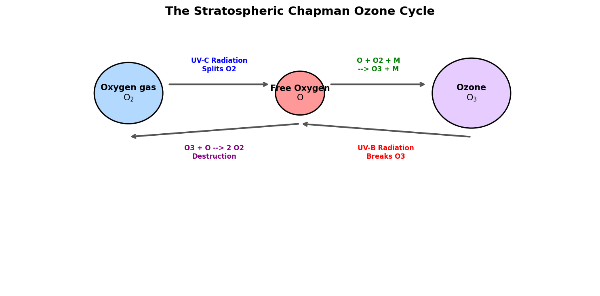

# Introduction to Oxygen

Oxygen (atomic symbol **O**, atomic number **8**) is a highly reactive non-metal located in Group 16 (the chalcogens). It is the third most abundant element in the universe by mass (after hydrogen and helium) and the most abundant element in the Earth's crust (constituting about 46% of its mass, primarily bound in silicate and oxide minerals). Diatomic oxygen gas ($\text{O}_2$) makes up 20.95% of the Earth's atmosphere.

## Physical & Chemical Properties

* **Atomic Configuration**: Oxygen has eight protons, eight neutrons, and eight electrons, with a ground-state valence electron configuration of $1s^2 2s^2 2p^4$. It has two unpaired electrons in its outer $2p$ shell.
* **Electronegativity**: Oxygen is the second most electronegative element (3.44 on the Pauling scale) after fluorine. It attracts electrons strongly, making it a powerful oxidizing agent.
* **Paramagnetism**: Because it has two unpaired electrons in its molecular orbitals ($\pi^*$ antibonding orbitals), liquid oxygen is **paramagnetic** and can be suspended between the poles of a strong magnet.
* **Allotropes**: 
  - **Diatomic Oxygen ($\text{O}_2$)**: The standard stable form.
  - **Ozone ($\text{O}_3$)**: A highly reactive triatomic gas with a characteristic pungent odor, formed primarily in the upper atmosphere.

---

# Industrial and Chemical Applications

## Basic Oxygen Steelmaking (BOS)

The largest industrial use of pure oxygen (about 55% of global production) is in the steelmaking industry.

* **Blowing Process**: In the Basic Oxygen Steelmaking (BOS) process, high-purity oxygen is blown at supersonic speeds through a water-cooled lance onto molten pig iron (which contains high amounts of carbon, silicon, manganese, and phosphorus).
* **Oxidation of Impurities**: The oxygen reacts exothermically to oxidize the impurities:
  $$\text{C(in iron)} + \text{O}_2\text{(g)} \rightarrow \text{CO}_2\text{(g)}$$
  $$\text{Si(in iron)} + \text{O}_2\text{(g)} \rightarrow \text{SiO}_2\text{(s)}$$
  The silicon and manganese oxides combine with added lime ($\text{CaO}$) to form a floating layer of slag, while carbon escapes as carbon dioxide gas, refining the crude iron into high-quality steel.

## Combustion and Oxidation Reactions

Combustion is the rapid, exothermic oxidation of a fuel in the presence of oxygen.
* **Hydrocarbon Combustion**: 
  $$\text{CH}_4\text{(g)} + 2\text{O}_2\text{(g)} \rightarrow \text{CO}_2\text{(g)} + 2\text{H}_2\text{O(g)} + \text{energy}$$
* **Corrosion (Rusting)**: Slow oxidation of iron in the presence of water, forming hydrated iron(III) oxide:
  $$4\text{Fe(s)} + 3\text{O}_2\text{(g)} + 6\text{H}_2\text{O(l)} \rightarrow 4\text{Fe(OH)}_3\text{(s)}$$

---

# Biological Respiration

Oxygen is essential for aerobic respiration in all multicellular organisms.

* **Cellular Metabolism**: Cells break down organic molecules (like glucose) to generate energy in the form of Adenosine Triphosphate (ATP).
* **Terminal Electron Acceptor**: In the mitochondria, the electron transport chain (ETC) transfers electrons through a series of proteins. Oxygen acts as the final electron acceptor at the end of the chain due to its high electronegativity:
  $$\text{O}_2 + 4\text{H}^+ + 4e^- \rightarrow 2\text{H}_2\text{O}$$
  Without oxygen, the electron transport chain halts, ATP production drops catastrophically, and the cell dies (hypoxia).

---

# Rocket Propulsion Oxidizer

In rocket science, oxygen is used in its cryogenic liquid state as **Liquid Oxygen (LOX)**.
* **Role**: Because space is a vacuum, rockets must carry both their fuel and an oxidizer to burn it. LOX (boiling point $-183^\circ\text{C}$) is combined with fuels like liquid hydrogen ($\text{LH}_2$), kerosene (RP-1), or liquid methane.
* **Example**: The Saturn V, Space Shuttle, Falcon 9, and Starship all rely on LOX as their primary oxidizer to achieve the extreme thrust required to break orbit.

---

# The Stratospheric Ozone Layer

Ozone ($\text{O}_3$) is concentrated in the stratosphere (15 to 35 km above Earth), forming the **ozone layer**. It absorbs harmful ultraviolet (UV) radiation from the Sun.

## The Chapman Cycle
Ozone is continuously created and destroyed through a photochemical cycle first explained by Sydney Chapman in 1930:

1. **Ozone Synthesis**:
   - Short-wave UV-C radiation splits an oxygen molecule:
     $$\text{O}_2 + h\nu \text{ (UV-C)} \rightarrow \text{O} + \text{O}$$
   - The free oxygen atoms rapidly combine with other $\text{O}_2$ molecules in the presence of a third body ($\text{M}$, such as nitrogen) to form ozone:
     $$\text{O} + \text{O}_2 + \text{M} \rightarrow \text{O}_3 + \text{M}$$
2. **Ozone Photolysis**:
   - Ozone absorbs mid-wavelength UV-B radiation, splitting back into oxygen gas and a free oxygen atom:
     $$\text{O}_3 + h\nu \text{ (UV-B)} \rightarrow \text{O}_2 + \text{O}$$
3. **Recombination (Destruction)**:
   - An ozone molecule reacts with a free oxygen atom to form two stable $\text{O}_2$ molecules:
     $$\text{O}_3 + \text{O} \rightarrow 2\text{O}_2$$

This cycle shields the Earth's surface from UV-B and UV-C radiation, which can cause skin cancers, cataracts, and damage agricultural crops.

{#fig-ozone-cycle width=85%}

<details>
<summary>Show Raw Diagram Generator Code</summary>
```python
# Generated using Matplotlib inside python script
import matplotlib.pyplot as plt
import matplotlib.patches as patches

fig, ax = plt.subplots(figsize=(10, 5), dpi=150)
ax.set_xlim(-1, 11)
ax.set_ylim(-1, 5)
ax.axis('off')

# O2, O, O3 circles
ax.add_patch(patches.Circle((1.5, 3.5), 0.7, color='#b3d9ff', ec='black', lw=1.5))
ax.add_patch(patches.Circle((5.0, 3.5), 0.5, color='#ff9999', ec='black', lw=1.5))
ax.add_patch(patches.Circle((8.5, 3.5), 0.8, color='#e6ccff', ec='black', lw=1.5))
```
</details>
