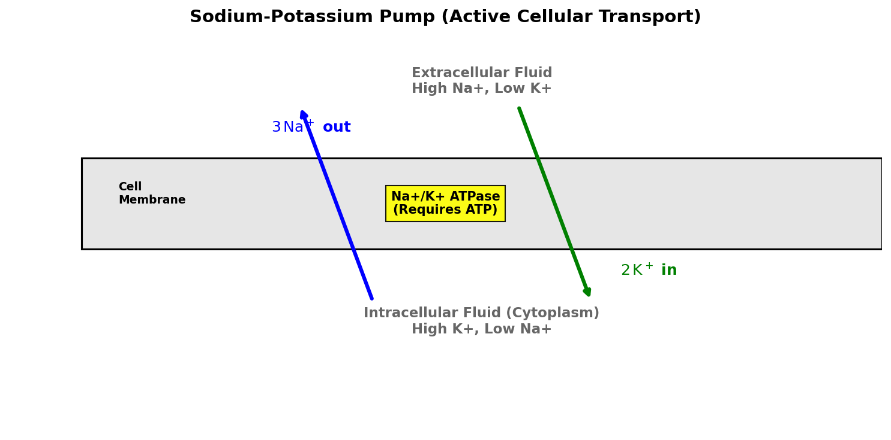

# Introduction to Sodium

Sodium (atomic symbol **Na**, atomic number **11**) is an alkali metal located in Group 1 of the periodic table. The symbol **Na** is derived from *natrium*, the Latin name for a natural mineral sodium carbonate salt. Sodium is highly abundant on Earth, primarily dissolved in the oceans as sodium chloride ($\text{NaCl}$) and bound in mineral deposits.

## Physical & Chemical Properties

* **Atomic Configuration**: Sodium has 11 protons, 12 neutrons, and 11 electrons, with a valence electron configuration of $1s^2 2s^2 2p^6 3s^1$. It readily loses its single $3s$ electron to form the stable sodium cation ($\text{Na}^+$).
* **Physical State**: At room temperature, sodium is a soft, silvery-white metal that can be easily cut with a butter knife.
* **Reactivity**: Sodium is extremely reactive. When exposed to water, it reacts violently and exothermically, producing sodium hydroxide and hydrogen gas:
  $$2\text{Na(s)} + 2\text{H}_2\text{O(l)} \rightarrow 2\text{NaOH(aq)} + \text{H}_2\text{(g)}$$
  The heat of the reaction often ignites the hydrogen gas, resulting in a yellow flame and explosion. To prevent oxidation, sodium must be stored under mineral oil.

---

# Biological Role: The Sodium-Potassium Pump

Sodium is an essential nutrient for animals, playing a vital role in maintaining fluid balance, blood pressure, and transmitting nerve impulses.

## Active Membrane Transport

In animal cells, the enzyme **$\text{Na}^+/\text{K}^+$-ATPase** (commonly called the **sodium-potassium pump**) actively transports ions across the cell membrane against their concentration gradients.

* **Mechanism**: Powered by the hydrolysis of Adenosine Triphosphate (ATP), the pump moves:
  - **Three Sodium Ions ($\text{Na}^+$)** out of the cell.
  - **Two Potassium Ions ($\text{K}^+$)** into the cell.
  $$\text{Reaction: } 3\text{Na}^+_{\text{inside}} + 2\text{K}^+_{\text{outside}} + \text{ATP} + \text{H}_2\text{O} \rightarrow 3\text{Na}^+_{\text{outside}} + 2\text{K}^+_{\text{inside}} + \text{ADP} + \text{P}_i$$
* **Membrane Potential**: Because three positive charges leave the cell for every two that enter, this process establishes an electrical gradient (resting membrane potential $\approx -70 \text{ mV}$) across the membrane.
* **Nerve Transmission**: When a nerve fires, channels open to let $\text{Na}^+$ rush into the cell, depolarizing the membrane and generating an **action potential** (the nerve signal). The pump then works to restore the resting state.

{#fig-sodium-pump width=85%}

<details>
<summary>Show Raw Diagram Generator Code</summary>
```python
# Generated using Matplotlib inside python script
import matplotlib.pyplot as plt
import matplotlib.patches as patches

fig, ax = plt.subplots(figsize=(10, 5), dpi=150)
ax.set_xlim(-1, 11)
ax.set_ylim(-1, 5)
ax.axis('off')

# Cell Membrane block
ax.add_patch(patches.Rectangle((0, 1.8), 11, 1.4, facecolor='#e6e6e6', edgecolor='black', lw=1.5))
# Arrows
ax.annotate("", xy=(3.0, 4.0), xytext=(4.0, 1.0), arrowprops=dict(arrowstyle="->", color='blue', lw=3))
ax.annotate("", xy=(7.0, 1.0), xytext=(6.0, 4.0), arrowprops=dict(arrowstyle="->", color='green', lw=3))
```
</details>

---

# Key Applications

## Sodium-Vapor Lamps (Street Lighting)

Sodium-vapor lamps are highly efficient gas-discharge lamps widely used for street lighting.

* **Working Principle**: An electric arc vaporizes metallic sodium. The excited sodium electrons emit light at very specific wavelengths: the **Sodium D-lines** at $589.0 \text{ nm}$ and $589.6 \text{ nm}$.
* **Efficiency**: These lamps emit a bright, characteristic **yellow-orange** light. Because the human eye is highly sensitive to yellow light, sodium-vapor lamps have a very high luminous efficacy (up to 150 lumens per watt), making them extremely energy-efficient for highway lighting.

## Fast Breeder Reactor Cooling

In specialized nuclear reactors (Liquid Metal Fast Breeder Reactors - LMFBR), liquid sodium is used as the primary coolant instead of water:

* **High Heat Capacity**: Liquid sodium remains liquid over a wide temperature range ($98^\circ\text{C}$ to $883^\circ\text{C}$ at 1 atm) and has excellent thermal conductivity.
* **Fast Neutrons**: Unlike water, sodium does not moderate (slow down) neutrons significantly. This allows fast neutrons to sustain fission and breed new fuel (converting Uranium-238 to Plutonium-239) inside the core.

## Industrial Chemicals

* **Sodium Hydroxide ($\text{NaOH}$)**: Also known as caustic soda or lye, it is a strong base used in soap manufacturing, paper pulp processing, and drain cleaners.
* **Sodium Carbonate ($\text{Na}_2\text{CO}_3$)**: Also known as soda ash, it is used in glassmaking and water treatment.
* **Sodium Chloride ($\text{NaCl}$)**: Table salt, used for food seasoning, food preservation, and de-icing roads in winter by lowering the freezing point of water.
