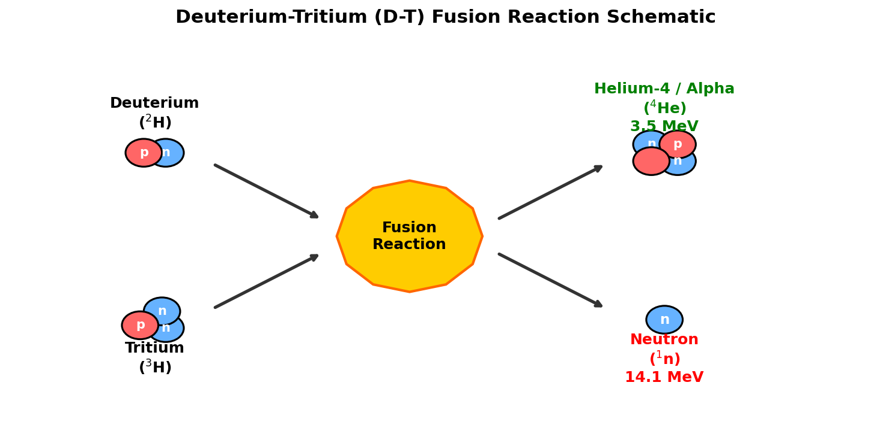
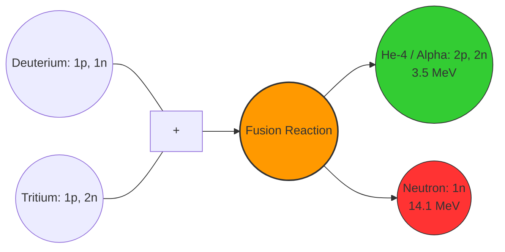
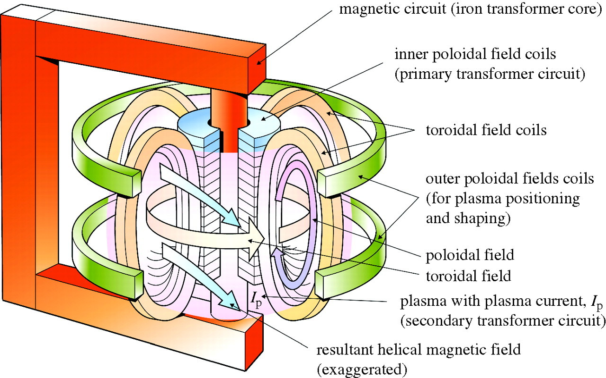
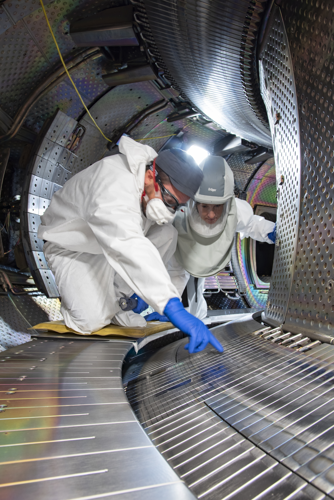
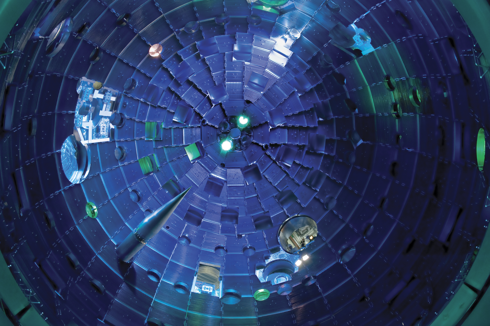

# Introduction to Nuclear Fusion

Nuclear fusion is the process that powers our Sun and the stars. At its core, fusion is the joining together of two light atomic nuclei to form a single, heavier nucleus. Because the mass of the resulting nucleus is slightly less than the sum of the masses of the original nuclei, the "missing" mass ($\Delta m$) is converted into energy according to Einstein's famous mass-energy equivalence equation:

$$E = \Delta m c^2$$

Since the speed of light ($c \approx 3 \times 10^8 \text{ m/s}$) is extremely large, even a tiny amount of mass loss yields a colossal amount of energy. 

## The Primary Fuel: Deuterium-Tritium (D-T) Fusion

While many fusion reactions are theoretically possible, terrestrial fusion research focuses primarily on the reaction between two isotopes of hydrogen: **Deuterium** ($^2\text{H}$ or $\text{D}$) and **Tritium** ($^3\text{H}$ or $\text{T}$). 

$$\text{D} + \text{T} \rightarrow \, ^4\text{He} \text{ (3.5 MeV)} + \text{n} \text{ (14.1 MeV)}$$

In this reaction:
* **Deuterium** contains one proton and one neutron (abundantly available in ocean water).
* **Tritium** contains one proton and two neutrons (radioactive, with a half-life of 12.3 years, and must be bred from lithium).
* The products are an **alpha particle** ($^4\text{He}$ nucleus) carrying $3.5 \text{ MeV}$ of kinetic energy and a **neutron** carrying $14.1 \text{ MeV}$ of kinetic energy.

::: {#fig-reaction-illustration}
{width=85%}

A conceptual diagram of the Deuterium-Tritium (D-T) fusion reaction.

Show Raw Mermaid Flowchart Code

:::

The D-T reaction is favored because it has the largest **cross-section** (probability of reaction) at the lowest temperature compared to any other fusion fuel candidate.

---

# Overcoming the Coulomb Barrier

Nuclei are positively charged due to their protons. According to classical physics, like charges repel. The electrostatic force of repulsion is governed by **Coulomb's Law**:

$$F_c = \frac{1}{4\pi\varepsilon_0} \frac{q_1 q_2}{r^2}$$

To make two nuclei fuse, they must be brought close enough ($\approx 10^{-15} \text{ m}$) for the **strong nuclear force** (which is attractive but extremely short-range) to overcome this Coulomb repulsion. The potential energy barrier that must be crossed is called the **Coulomb barrier**:

$$V_c = \frac{1}{4\pi\varepsilon_0} \frac{q_1 q_2}{r}$$

For a D-T pair, this barrier is approximately $0.1 \text{ MeV}$ (mega-electronvolts). If we equate this energy to the average thermal kinetic energy of particles in a gas ($E \approx k_B T$), we would need a temperature of:

$$T \approx 10^9 \text{ K (one billion Kelvin!)}$$

Fortunately, thanks to **quantum tunneling**, particles can cross the barrier at lower energies. Even so, the required temperature for D-T fusion is about $10-15 \text{ keV}$, which corresponds to roughly **100 to 150 million Kelvin**—about ten times hotter than the core of the Sun. At these temperatures, matter ceases to be solid, liquid, or gas; it becomes a **plasma**, a fully ionized state of matter consisting of free electrons and positive ions.

---

# The Lawson Criterion and the Triple Product

To build a useful fusion reactor, we must achieve a state called **ignition** (or at least high energy gain). Ignition occurs when the heating power produced by the fusion reaction is sufficient to maintain the plasma's temperature without any external heating. 

Let's derive the threshold for this condition using basic high-school/undergraduate physics.

## Thermal Energy and Loss Rate

Let $n$ be the total ion density of the plasma. In a 50-50 mix of Deuterium and Tritium, the density of each species is:

$$n_D = n_T = \frac{n}{2}$$

Assuming charge neutrality (quasineutrality), the electron density is also $n_e = n$. 
The total thermal energy density $W$ (energy per unit volume) stored in the plasma's ions and electrons at temperature $T$ is:

$$W = \frac{3}{2} n_i k_B T + \frac{3}{2} n_e k_B T = 3 n k_B T$$

Here, we assume the ions and electrons are in thermal equilibrium ($T_i = T_e = T$). 

If we stop heating the plasma, it will cool down due to conduction, convection, and radiation. We define the **energy confinement time** ($\tau_E$) as the characteristic time it takes for the plasma to lose its energy. The power loss rate per unit volume ($P_{\text{loss}}$) is:

$$P_{\text{loss}} = \frac{W}{\tau_E} = \frac{3 n k_B T}{\tau_E}$$

## Alpha Heating Power

In the D-T reaction, the $14.1 \text{ MeV}$ neutron has no charge, so it escapes the plasma and hits the reactor walls (where its kinetic energy is captured as heat). However, the $3.5 \text{ MeV}$ alpha particle ($^4\text{He}^{2+}$) is charged. In a magnetic confinement device, it remains trapped in the plasma, colliding with other particles and keeping the plasma hot. 

The alpha heating power density $P_\alpha$ (power per unit volume) is given by:

$$P_\alpha = n_D n_T \langle \sigma v \rangle E_\alpha = \frac{1}{4} n^2 \langle \sigma v \rangle E_\alpha$$

where:
* $\langle \sigma v \rangle$ is the reaction rate parameter (averaged product of cross-section and velocity).
* $E_\alpha = 3.5 \text{ MeV}$ is the energy of the alpha particle.

## Deriving the Lawson Criterion

For the plasma to remain at a steady temperature without external heating, the self-heating power $P_\alpha$ must balance or exceed the power loss rate $P_{\text{loss}}$:

$$P_\alpha \ge P_{\text{loss}}$$

$$\frac{1}{4} n^2 \langle \sigma v \rangle E_\alpha \ge \frac{3 n k_B T}{\tau_E}$$

Dividing both sides by $n^2$ and rearranging gives the famous **Lawson Criterion**:

$$n \tau_E \ge \frac{12 k_B T}{\langle \sigma v \rangle E_\alpha}$$

This inequality tells us that the product of the fuel density $n$ and the energy confinement time $\tau_E$ must exceed a specific value that depends only on the temperature $T$.

## The Triple Product

Because the reaction rate $\langle \sigma v \rangle$ is highly temperature-dependent, the right-hand side of the Lawson Criterion varies with $T$. If we multiply both sides by $T$, we get the **fusion triple product**:

$$n T \tau_E \ge \frac{12 k_B T^2}{\langle \sigma v \rangle E_\alpha}$$

If we plot the function $f(T) = \frac{T^2}{\langle \sigma v \rangle}$, we find that it has a minimum around $T \approx 15 \text{ keV}$ ($\approx 150 \text{ million K}$). Plugging in the values for D-T fusion at this optimal temperature, we obtain:

$$n T \tau_E \ge 3 \times 10^{21} \text{ keV s m}^{-3} \approx 10^{21} \text{ m}^{-3} \text{ s keV}$$

This fundamental equation means that to achieve fusion ignition, we need a combination of:
1. **High Density ($n$)**: Enough nuclei packed together to ensure they collide.
2. **High Temperature ($T$)**: Enough kinetic energy to overcome Coulomb repulsion.
3. **High Confinement Time ($\tau_E$)**: Keeping the heat insulated within the plasma long enough.

---

# Confinement Methods

How do we keep a 100-million-Kelvin plasma together? No physical material can withstand such temperatures. Researchers use three main confinement methods:

## Gravitational Confinement
This is nature's solution. In stars, the massive gravitational force of the star's huge mass compresses the hydrogen core to extreme pressures and densities, balancing the outward thermal pressure of the fusion reactions. This method is impossible to replicate on Earth due to the astronomical masses required.

## Magnetic Confinement Fusion (MCF)
Since a plasma consists of charged ions and electrons, their motion is dictated by the **Lorentz force**:

$$\mathbf{F} = q(\mathbf{E} + \mathbf{v} \times \mathbf{B})$$

In the presence of a strong magnetic field $\mathbf{B}$, charged particles cannot move easily across the field lines. Instead, they are forced to spiral (gyrate) around the magnetic field lines in helical orbits. 

### The Tokamak
A linear magnetic field would let particles escape from the ends, so we bend the field lines into a closed loop—a torus (doughnut shape). However, in a simple torus, the magnetic field is stronger on the inside curve than the outside curve. This gradient causes the ions and electrons to drift in opposite directions (vertical drift), building up electric fields that rapidly push the plasma outward.

To cancel this drift, the magnetic field lines must be twisted helically. The **Tokamak** (a Russian acronym for "toroidal chamber with magnetic coils") achieves this twist by combining:
1. A **toroidal magnetic field** generated by external D-shaped coils.
2. A **poloidal magnetic field** generated by a large electric current running through the plasma itself. This current is induced by a central solenoid acting as the primary winding of a transformer, with the plasma serving as the secondary winding.

{#fig-tokamak-schematic width=85%}

.jpg){#fig-tokamak-core width=85%}

{#fig-tokamak-west width=85%}

### The Stellarator
Unlike the tokamak, which relies on a pulsed plasma current to twist the magnetic field, a **Stellarator** creates the helical twist entirely using complex, twisted external coils. This design is highly challenging to manufacture but offers the advantage of continuous, steady-state operation without the risk of sudden plasma current collapses (disruptions).

## Inertial Confinement Fusion (ICF)
Instead of holding a low-density plasma for a long time (like MCF), Inertial Confinement Fusion (ICF) compresses a high-density fuel pellet so rapidly that fusion occurs before the fuel has time to fly apart. The confinement time is limited only by the *inertia* of the mass itself:

$$\tau_E \approx \frac{r_p}{c_s}$$

where $r_p$ is the compressed pellet radius and $c_s$ is the speed of sound in the hot plasma.

The process works via **ablation**:
1. High-energy drivers (like lasers) rapidly heat the outer surface of a tiny D-T fuel capsule (about 2 mm in diameter).
2. The outer shell explodes outward.
3. By Newton's third law (action-reaction), the remaining fuel implodes inward, compressing the core to over 100 times the density of lead and heating it to fusion temperatures.

{#fig-nif-chamber width=85%}

---

# Plasma Drivers and Heating Methods

To reach the extreme conditions required for the triple product, we must feed energy into the fuel. The devices that deliver this energy are called **drivers**.

## Magnetic Confinement Drivers (Plasma Heating)

In MCF, the plasma must be heated from room temperature to over 100 million Kelvin. Three primary heating methods are used:

### Ohmic Heating
Because the tokamak induces a massive electric current ($I$) through the plasma, the plasma's electrical resistance ($R$) causes it to heat up like a toaster:

$$P_{\text{ohmic}} = I^2 R$$

However, plasma resistivity is highly temperature-dependent, scaling as:

$$\eta \propto T^{-3/2}$$

As the plasma gets hotter, its resistance drops. Around $2-3 \text{ keV}$ ($\approx 30 \text{ million K}$), ohmic heating becomes too weak to overcome the radiation losses, meaning auxiliary heating methods are required to reach the fusion threshold.

### Neutral Beam Injection (NBI)
Because charged particles are deflected by magnetic fields, we cannot shoot charged ions directly into a tokamak core. Instead, NBI systems:
1. Create a beam of hydrogen/deuterium ions.
2. Accelerate them to high kinetic energies (e.g., $100 \text{ keV}$ to $1 \text{ MeV}$) using electric fields.
3. Pass them through a gas cell to neutralize their charge.
4. Inject the high-speed neutral atoms into the plasma. 
5. Once inside, the neutrals collide with plasma particles, lose their electrons (become ionized), and transfer their kinetic energy to the bulk plasma.

### Radiofrequency (RF) Heating
RF systems act like massive microwave ovens. Antennae launch high-power electromagnetic waves into the plasma. The frequency of these waves is tuned to match the natural resonance frequencies of the gyrating ions or electrons:
* **ICRH (Ion Cyclotron Resonance Heating)**: Tuned to the ion gyration frequency (tens of MHz).
* **ECRH (Electron Cyclotron Resonance Heating)**: Tuned to the electron gyration frequency (hundreds of GHz).

---

## Inertial Confinement Drivers (Implosion Drivers)

In ICF, the driver must deliver an enormous amount of power in a fraction of a nanosecond to achieve symmetric compression.

### Direct Drive
In direct drive, multiple high-power laser beams are pointed directly at the surface of the D-T pellet. While highly efficient in terms of energy transfer, it requires extreme laser symmetry; any tiny imbalance can trigger fluid instabilities (like the **Rayleigh-Taylor instability**) that disrupt the spherical compression.

### Indirect Drive (Hohlraum)
To bypass the symmetry problem, NIF uses indirect drive:
1. Laser beams are directed through holes into the ends of a **hohlraum**—a small, hollow cylinder made of a high-Z metal (like gold).
2. The lasers strike the inner walls of the hohlraum, heating them until they emit a highly uniform bath of high-energy **X-rays**.
3. These X-rays are absorbed by the fuel capsule shell, causing it to ablate and implode the D-T fuel with high spherical symmetry.

| Parameter | Magnetic Confinement (MCF) | Inertial Confinement (ICF) |
| :--- | :--- | :--- |
| **Typical Ion Density ($n$)** | $\approx 10^{20} \text{ m}^{-3}$ (100,000 times thinner than air) | $\approx 10^{31} \text{ m}^{-3}$ (100 times the density of lead) |
| **Confinement Time ($\tau_E$)** | $\approx 1 - 10 \text{ seconds}$ | $\approx 10^{-10} \text{ seconds}$ (100 picoseconds) |
| **Heating Method** | Ohmic current, NBI, RF waves | High-power Lasers (Direct/Indirect X-ray drive) |
| **Key Reactor Example** | JET (UK), ITER (France), KSTAR (South Korea) | National Ignition Facility (NIF, USA) |

: Comparison of MCF and ICF approaches. {#tbl-mcf-vs-icf}

---

# Summary and Current Status

Nuclear fusion represents the ultimate clean energy source: it is carbon-free, leaves no long-lived radioactive waste, and has an inexhaustible fuel supply. However, the engineering challenges of containing a 100-million-Kelvin plasma are immense.

In recent years, major breakthroughs have brought us closer:
* **December 2022 (NIF)**: Achieved **scientific energy breakeven** ($Q > 1$), where the fusion energy released ($3.15 \text{ MJ}$) exceeded the laser energy delivered to the target ($2.05 \text{ MJ}$).
* **ITER**: The world's largest tokamak is currently under construction in southern France. It is designed to produce $500 \text{ MW}$ of fusion power from $50 \text{ MW}$ of input heating power ($Q = 10$).

By mastering the physics of the triple product and the engineering of advanced confinement drivers, humanity is on the cusp of bringing the power of the stars down to Earth.
