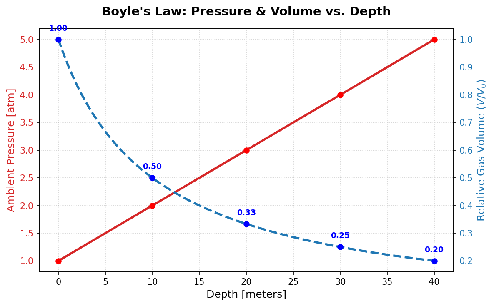
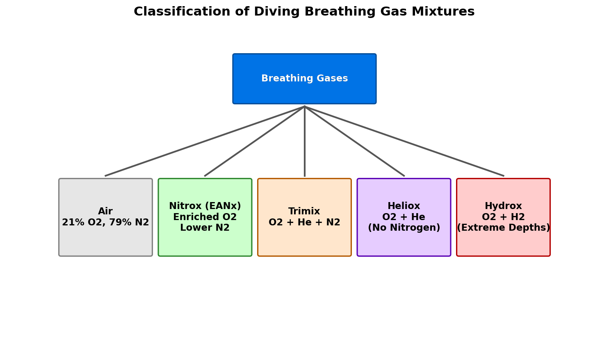
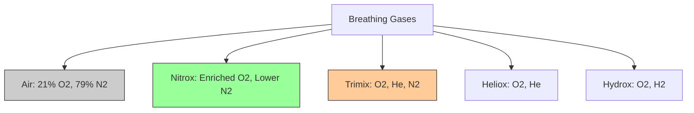
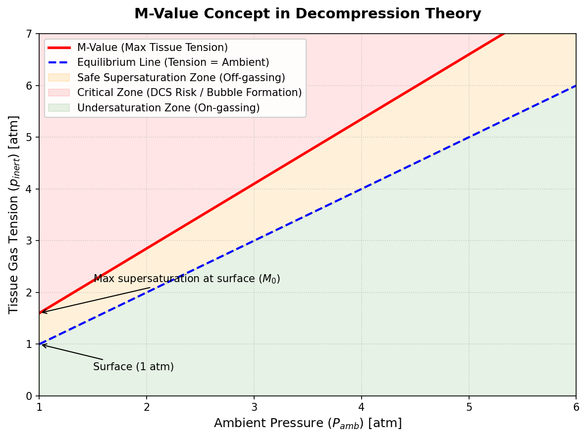

# Introduction to Diving Biophysics

Human physiology is finely tuned to survive under the thin blanket of Earth’s atmosphere at sea level. However, when we dive underwater, the surrounding environment changes dramatically. For every 10 meters of depth in saltwater, the ambient pressure increases by another full atmosphere. 

To survive and perform work in this hyperbaric (high-pressure) environment, scuba divers must breathe gases at ambient pressure. This introduces complex physical and physiological phenomena governed by the gas laws. Understanding these laws is essential for calculating dive limits, choosing breathing mixtures, and planning safe ascents to avoid decompression sickness (DCS).

---

# Core Physics Concepts

Four fundamental gas laws govern the behavior of gases under pressure and their interactions with the human body.

## Hydrostatic Pressure

Water is nearly incompressible, which means its density ($\rho$) is relatively constant. The hydrostatic pressure ($P_{\text{hydro}}$) at a depth $h$ is given by:

$$P_{\text{hydro}} = \rho g h$$

where:
* $\rho \approx 1025 \text{ kg/m}^3$ for seawater (or $1000 \text{ kg/m}^3$ for freshwater).
* $g \approx 9.81 \text{ m/s}^2$ is gravitational acceleration.
* $h$ is the depth in meters.

To find the total ambient pressure ($P_{\text{ambient}}$) acting on a diver, we must add the atmospheric pressure at the surface ($P_{\text{surface}} \approx 1 \text{ atm}$ or $1.013 \text{ bar}$):

$$P_{\text{ambient}} = P_{\text{surface}} + \rho g h$$

For practical calculations in saltwater, we use a simple rule of thumb: **every 10 meters (or 33 feet) of depth adds 1 atmosphere (atm) of pressure**:

$$P_{\text{ambient}} (d) = 1 + \frac{d}{10} \text{ atm}$$

where $d$ is the depth in meters. At 30 meters, a diver experiences $4 \text{ atm}$ of absolute pressure—four times the pressure at the surface.

## Boyle's Law: Pressure and Volume

Boyle's Law states that for a fixed mass of gas at a constant temperature, the volume ($V$) of the gas is inversely proportional to its absolute pressure ($P$):

$$P_1 V_1 = P_2 V_2 \implies V_2 = V_1 \frac{P_1}{P_2}$$

As a diver descends, the increasing pressure compresses any gas-filled spaces (like the middle ear, mask, and lungs). Conversely, during ascent, the decreasing pressure causes gases to expand.

{#fig-boyle-law width=85%}

::: {.callout-warning}
### The Golden Rule of Scuba Diving
Because gas volume expands as pressure decreases, a diver who holds their breath during ascent runs the risk of a **lung overexpansion injury** (pulmonary barotrauma). A breath held in just 10 meters of depth ($2 \text{ atm}$) will double in volume by the time the diver reaches the surface ($1 \text{ atm}$), rupturing the alveoli. **Never hold your breath.**
:::

## Dalton's Law: Partial Pressures

Dalton's Law states that the total pressure ($P_{\text{total}}$) exerted by a mixture of gases is equal to the sum of the partial pressures ($P_i$) of the individual gases:

$$P_{\text{total}} = \sum P_i = P_1 + P_2 + \dots + P_n$$

The partial pressure of a specific gas component ($i$) is calculated by multiplying its fractional concentration ($f_i$) by the total absolute pressure:

$$P_i = f_i \times P_{\text{total}}$$

### Physiological Thresholds
Breathing gases at high partial pressures can have toxic or narcotic effects on the human body:
1. **Oxygen Toxicity**: Oxygen becomes toxic to the central nervous system (CNS) when its partial pressure exceeds approximately $1.4 \text{ to } 1.6 \text{ ata}$ (atmospheres absolute). This can cause convulsions, leading to drowning.
2. **Nitrogen Narcosis**: Nitrogen acts as an anesthetic at elevated partial pressures, typically becoming noticeable at $P_{N_2} > 3.2 \text{ ata}$ ($\approx 30$ meters on air). This induces a feeling similar to alcohol intoxication.

## Henry's Law: Gas Solubility

Henry's Law states that at a constant temperature, the amount (concentration $C$) of a given gas dissolved in a given type and volume of liquid is directly proportional to the partial pressure ($P_i$) of that gas in equilibrium with the liquid:

$$C = k \cdot P_i$$

where $k$ is Henry's law constant for the specific gas-solvent pair.

When a diver descends, the partial pressure of the nitrogen (or helium) in their breathing gas increases. According to Henry's law, this forces the gas to dissolve into the diver's blood and body tissues (fat, muscle, bone). 

During ascent, the ambient pressure decreases, and the dissolved gases must come out of solution. If the ascent is slow, the gases are carried by the blood to the lungs and exhaled safely. If the ascent is too rapid, the tissue tension exceeds the ambient pressure by a critical margin, and the gas rapidly comes out of solution as physical bubbles in tissues or blood vessels, causing **Decompression Sickness (DCS)**.

---

# Breathing Gas Mixtures

Divers use different gas mixtures to manipulate partial pressures, allowing them to dive deeper or stay longer.

{width=85%}

Show Raw Mermaid Diagram Code

## Enriched Air Nitrox (EANx)

Nitrox is a blend of oxygen and nitrogen where the oxygen fraction ($f_{O_2}$) is increased above the standard $21\%$ of atmospheric air (most commonly $32\%$ or $36\%$).

By increasing $f_{O_2}$, we decrease the nitrogen fraction ($f_{N_2}$). According to Henry's Law, this reduces the rate of nitrogen absorption, which increases the **No-Decompression Limit (NDL)**—the time a diver can spend at depth without needing planned decompression stops.

### Maximum Operating Depth (MOD)
Because of the risk of CNS oxygen toxicity, Nitrox restricts how deep a diver can go. The Maximum Operating Depth (MOD) is calculated using a standard limit of $P_{O_2} = 1.4 \text{ ata}$:

$$\text{MOD (meters)} = \left( \frac{P_{O_2,\text{limit}}}{f_{O_2}} - 1 \right) \times 10$$

For example, for EAN32 ($f_{O_2} = 0.32$):

$$\text{MOD} = \left( \frac{1.4}{0.32} - 1 \right) \times 10 = (4.375 - 1) \times 10 = 33.75 \text{ meters}$$

### Equivalent Air Depth (EAD)
To calculate decompression limits on Nitrox using standard air tables, divers calculate the Equivalent Air Depth (EAD)—the depth on air that would result in the same nitrogen partial pressure:

$$\text{EAD (meters)} = \left( \frac{1 - f_{O_2}}{0.79} \right) \times (\text{Depth} + 10) - 10$$

## Trimix

Trimix contains three gases: **Oxygen**, **Helium**, and **Nitrogen**. It is labeled as $O_2/\text{He}$ (e.g., Trimix 21/35 contains $21\%$ Oxygen, $35\%$ Helium, and the remaining $44\%$ Nitrogen).

* **Helium** is added because it is extremely light, has low density (which decreases the work of breathing at high pressures), and is chemically inert and completely non-narcotic.
* By replacing some nitrogen with helium, we reduce nitrogen narcosis.
* By reducing both oxygen and nitrogen, we can dive to extreme depths without suffering from oxygen toxicity or narcosis.

::: {.callout-note}
### Hypoxic Trimix
For very deep dives (e.g., $>60$ meters), the oxygen percentage must be reduced below the normal $21\%$ to avoid toxicity. A mixture like **Trimix 10/70** (10% $O_2$, 70% $\text{He}$) is hypoxic and cannot support life at the surface, where $P_{O_2} = 0.10 \times 1 \text{ atm} = 0.10 \text{ ata}$ (the human hypoxia threshold is $\approx 0.16 \text{ ata}$). Divers must use "travel gases" to descend and ascend, switching to the hypoxic mix only at depth.
:::

## Heliox and Hydrox

* **Heliox** ($O_2$ and $\text{He}$): Used primarily in commercial saturation diving. It completely eliminates nitrogen narcosis but is expensive and can cause speech distortion ("Donald Duck voice") and rapid body heat loss due to helium's high thermal conductivity.
* **Hydrox** ($O_2$ and $\text{H}_2$): Hydrogen is the lightest element, making it ideal for lowering breathing resistance at extreme depths (greater than 300 meters). It also helps mitigate High-Pressure Nervous Syndrome (HPNS), a neurological disorder caused by extreme hydrostatic pressures. However, mixing hydrogen and oxygen is highly explosive, requiring specialized mixing systems to keep the $O_2$ fraction below $4\%$ to prevent combustion.

---

# Decompression Theory and Tissue Compartments

When a diver ascends, the dissolved inert gas in their body tissue must be released. Decompression theory uses mathematical models to track this gas exchange.

## Haldanean Models

The foundation of modern decompression theory was developed by J.S. Haldane in 1908. Haldane modeled the human body as a series of parallel, independent **tissue compartments**. These compartments do not correspond to actual anatomical organs but rather to mathematical simplifications of tissues with similar perfusion (blood flow) and diffusion rates.

Each compartment ($i$) is characterized by a **half-time** ($\tau_i$), which is the time it takes for the tissue to gain or lose half of the difference in gas tension between the tissue and the alveolar breathing gas.

The rate of change of gas tension ($P_{\text{tissue}}$) is governed by a first-order differential equation, resulting in the exponential saturation curve:

$$P_{\text{tissue}}(t) = P_{\text{tissue},0} + (P_{\text{inspired}} - P_{\text{tissue},0}) \left(1 - 2^{-t/\tau_i}\right)$$

where:
* $P_{\text{tissue},0}$ is the initial tissue gas tension.
* $P_{\text{inspired}}$ is the partial pressure of the inert gas in the lungs.
* $t$ is the exposure time.

Modern algorithms, such as the **Bühlmann ZHL-16C** model, track 16 tissue compartments with half-times ranging from 4 minutes (fast tissues like blood and brain) to 640 minutes (slow tissues like bones and cartilage joints).

---

# M-Values and Decompression Limits

How much supersaturation can a tissue tolerate before bubbles form? This threshold is defined by the **M-Value** (Maximum Value).

## The M-Value Concept

The M-Value is the maximum partial pressure of inert gas that a tissue compartment can tolerate at a given ambient pressure without presenting symptoms of DCS. Developed by Robert Workman and later refined by Albert Bühlmann, the M-value is expressed as a linear function of ambient pressure ($P_{\text{ambient}}$):

$$M = M_0 + a \cdot (P_{\text{ambient}} - 1) \quad \text{(Workman style)}$$

Or in the standard Bühlmann formulation, expressing the maximum allowed tension as:

$$M = \frac{P_{\text{ambient}}}{b} + a$$

where $a$ and $b$ are parameters unique to each tissue compartment and gas (nitrogen vs. helium). Fast tissues have higher $M_0$ values (they can tolerate higher supersaturation because they can off-gas quickly), while slow tissues have low $M_0$ values.

{#fig-m-value width=85%}

As a diver ascends, their ambient pressure drops, while their tissue gas tension remains high. The diver's tissue tension must never cross the M-value line. If it approaches the M-value, the diver must pause their ascent (perform a decompression stop) to allow the tissue tension to drop safely through off-gassing.

## Gradient Factors (GF)

To add a safety margin to the Bühlmann model, divers use **Gradient Factors (GF)**. A Gradient Factor is a percentage of the M-value limit. It is written as a dual notation, such as **GF 30/70**:

1. **GF Low (30%)**: Determines the depth of the first (deepest) decompression stop. The diver is allowed to reach only $30\%$ of the M-value supersaturation limit. This forces a deeper stop, limiting bubble growth early in the ascent.
2. **GF High (70%)**: Determines the safety margin upon surfacing. The diver surfaces with tissue tensions no higher than $70\%$ of the theoretical M-value at 1 atm.

---

# Comparison of Breathing Gases and Parameters

| Gas Mixture | Composition | Max Operating Depth (MOD) at $P_{O_2} = 1.4 \text{ ata}$ | Primary Advantage | Main Limitation |
| :--- | :--- | :--- | :--- | :--- |
| **Air** | 21% $O_2$, 79% $N_2$ | 56 meters | Cheap, accessible | Narcotic at depth, short NDLs |
| **EAN32 (Nitrox)** | 32% $O_2$, 68% $N_2$ | 33 meters | Long no-decompression limits | Shallow depth limit |
| **Trimix 21/35** | 21% $O_2$, 35% $\text{He}$, 44% $N_2$ | 56 meters | Greatly reduced narcosis | Expense, requires gas switching |
| **Trimix 10/70** | 10% $O_2$, 70% $\text{He}$, 20% $N_2$ | 130 meters | Extreme depths, low density | Hypoxic at surface, complex plan |
| **Heliox 10/90** | 10% $O_2$, 90% $\text{He}$ | 130 meters | Zero nitrogen narcosis | High heat loss, high cost |

: Comparison of common diving breathing gases. {#tbl-gas-comparison}

---

# Conclusion

Scuba diving is a remarkable application of physical and biological principles. By combining hydrostatic pressure calculations, gas partial pressures, solubility constants, and multi-compartment tissue models, modern dive computers can trace tissue tension in real-time. Whether breathing air on a shallow coral reef or hypoxic trimix in a deep cave system, a diver's safety ultimately relies on managing these biophysical limits.
